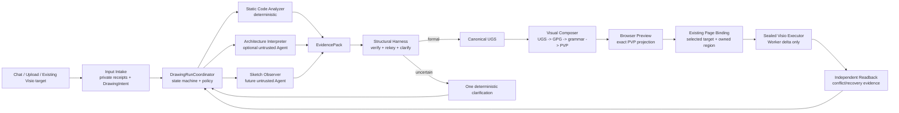

# Universal Neural Drawing Agent Platform Implementation Plan

> **For agentic workers:** REQUIRED SUB-SKILL: Use superpowers:subagent-driven-development (recommended) or superpowers:executing-plans to implement this plan task-by-task. Steps use checkbox (`- [ ]`) syntax for tracking.

**Status:** Proposed platform plan for owner review. It is not an acceptance record, it authorizes no production behavior by itself, and it does not claim that Visio drawing, a Provider, or a paid product is complete.

**Goal:** Evolve the repository into a durable, universal neural-network drawing platform where code, architecture descriptions, and later sketches enter one evidence-bound Drawing Run; only a deterministic Harness can authorize a formal graph, a publication-quality visual plan, and a bounded update to a selected existing Visio page.

**Architecture:** The platform owns a single `DrawingRunCoordinator` state machine. Input-specific analyzers produce private receipts and evidence-backed candidate artifacts; untrusted Agents can propose structure or visual diagnostics but cannot publish UGS/PVP/Visio commands. The Harness validates and rekeys every public artifact. UGS remains the structural truth, GPG/PVP remain the visual truth, and the Visio Worker receives only a sealed, owner/device/page-bound delta plus performs independent readback.

**Tech Stack:** Node.js ESM, TypeScript 5, Fastify, Zod, Vitest, PostgreSQL, Redis, Electron, C#/.NET Visio Worker, `UniversalGraphSpec` (UGS), General Publication Graph (GPG), Publication Visual Plan (PVP). Optional future integrations are OpenAI Agents SDK, LangGraph JS, LangSmith, OpenTelemetry, and an evaluation corpus; none is a current runtime dependency.

## Global Constraints

- The core product is a compact iterative workflow: user requirement/code/architecture description/future sketch -> evidence-backed neural topology -> publication-oriented preview -> controlled update of an existing selected Visio page.
- The product is universal by topology and semantic family. No model name, filename, paper name, VGG/ResNet template, or user-provided geometry may select a drawing grammar.
- User source is never executed, imported, evaluated, or returned in public DTOs. Dynamic or unprovable source must produce candidate/clarification rather than a guessed formal topology.
- Agents are untrusted proposal producers. The Harness owns validation, public projection, run-state transitions, permission checks, budgets, retries, recovery, and final status.
- No model, browser payload, Prompt, or external agent framework may issue COM, VBA, shell, filesystem, raw SVG, coordinates, Worker, page creation, save, close, or export commands.
- Existing user shapes and pages must be preserved. The normal drawing path attaches to an explicitly selected existing page and modifies only an Agent-owned region; it must never create a new document/page as fallback.
- Formal UGS, formal PVP, page binding, Worker request, and readback must be hash- and revision-bound to the authenticated owner/device/run.
- A candidate graph, unresolved topology, stale confirmation, foreign owner/device, ambiguous Visio target, or changed owned shape is a fail-closed condition.
- All public DTOs are reconstructed from allowlisted fields. Private code, images, paths, prompts, provider payloads, API keys, COM details, and raw diagnostic strings stay private.
- Preserve current accepted contracts where possible. Migration adapters may coexist temporarily, but all new capabilities use the Drawing Run contracts defined here.
- Do not stage, reset, clean, or rewrite user-owned visual-rubric drafts while implementing this plan. Use explicit Git allowlists only.

---

## 1. Product Boundary and Non-Goals

### 1.1 Product outcome

The product accepts a neural-network drawing request and makes the following user-visible promise:

```text
Understand only what is supported by evidence
→ ask a concise clarification when structural truth is incomplete
→ produce a deterministic, semantic, publication-oriented preview
→ after explicit target binding and authorization, update the current Visio page incrementally
→ independently read the result back and report exactly what was changed
```

The platform must draw unfamiliar architectures when their topology is explicit or when the user resolves a minimal set of blocking questions. It must preserve unknown operations as `custom_operator`/`custom_module`; unfamiliarity alone is not a failure.

### 1.2 Explicit non-goals for the core drawing platform

- Billing, subscriptions, entitlement pricing, marketplace policy, or broad CRM features.
- A general desktop-control Agent.
- Executing arbitrary Python, Jupyter, shell, VBA, COM, or user macros.
- Auto-learning reusable visual templates from arbitrary customer figures.
- Keras, ONNX, TensorFlow, or model-file runtime support before the PyTorch/description lane reaches visual and Visio acceptance.
- “One click without review” behavior for uncertain topology or a live user document.
- Claiming top-journal visual quality from unit tests alone; human visual review remains a separate gate.

---

## 2. Current Baseline and Required Migration Decision

### 2.1 What must be preserved

| Existing asset | Keep as | Rationale |
|---|---|---|
| `apps/api/src/static-pytorch-source-analyzer.ts` | deterministic code-analysis tool | It proves a safe subset without executing source. |
| `apps/api/src/static-pytorch-universal-graph-spec.ts` | static-code adapter | It produces evidence-bound UGS candidates/formal structures. |
| `apps/api/src/prompt-universal-graph-spec.ts` | typed-declaration adapter | It remains useful for explicit user-authored topology. |
| `apps/api/src/universal-graph-spec.ts` | canonical structural contract | UGS is the only graph truth passed into composition. |
| `apps/api/src/evidence-constrained-drawing-session.ts` | session and confirmation authority | It already binds owner, device, revision, UGS, preview, and clarification. |
| `apps/api/src/publication-visual-plan-compiler.ts` | deterministic composition primitive | It is the base for PVP generation after semantic grammar selection. |
| `apps/api/src/publication-visual-plan-native-intent.ts` | sealed native mapping basis | It remains the only PVP-to-native mapping entry. |
| Visio Worker protocol/client/readback modules | execution boundary | They must remain isolated from all raw input and model output. |
| owner/device/session/audit services | platform safety boundary | Every Drawing Run must reuse them rather than invent parallel identity. |

### 2.2 What must become compatibility-only

| Existing asset | Future role | Rule |
|---|---|---|
| `AgentService` and `agent-runtime.ts` | legacy chat compatibility adapter | It may create a `DrawingIntent`, but cannot become the structural or Visio authority. |
| legacy `NetworkIR` layout path | adapter for existing saved drafts | New features must not use it as a second canonical graph. |
| legacy VGG-specific bridge/export behavior | regression fixture only | It cannot select grammar, bypass UGS/PVP, or define generic execution. |
| M2.12 free-text interpreter (`BoundedInterpretationRequest` / provider-controlled IDs) | focused-test compatibility adapter | It may not receive new routes or capabilities, satisfy M2.12 acceptance, or emit the future canonical UGS. Replace it through the receipt-bound Structural Harness migration. |
| old Visio `OpenOrCreate` flow | isolated legacy behavior | It cannot be used by the current-page update path. |

### 2.3 Migration invariant

There is exactly one future canonical sequence:

```text
DrawingIntent
→ InputReceipt(s)
→ EvidencePack
→ StructuralAssessment
→ UGS or Clarification
→ GPG
→ PVP
→ SealedExecutionRequest
→ VisioReadback
```

No module may skip over an artifact in this sequence. Adapters translate legacy input to `DrawingIntent` or `EvidencePack`; they never inject direct PVP or Visio data.

---

## 3. Platform Architecture



### 3.1 Authority model

| Component | Authority | Cannot do |
|---|---|---|
| Browser/UI | collect request, show state, collect explicit confirmation | decide topology, mint PVP, mutate Visio |
| `DrawingRunCoordinator` | advance run only after verified artifacts | infer topology or draw geometry |
| Analyzer | produce facts/observations | publish formal UGS or issue native work |
| Interpreter Agent | propose bounded local references, labels, relations, unresolved items | choose public IDs, PVP, target page, native command |
| Structural Harness | validate evidence/topology, rekey, formalize or clarify | call Visio or change visual geometry |
| Visual Composer | choose grammar from semantic UGS/GPG and compile PVP | resolve uncertainty or accept browser geometry |
| Visual Critic Agent | issue non-authoritative diagnostics | modify PVP or override QA |
| Page Binding service | bind an explicit existing page/region/readback | create fallback documents/pages |
| Worker | execute sealed native delta and return readback | receive raw input, provider output, page names, or user code |

### 3.2 Artifact envelopes

Every stage stores/returns an envelope with a stable ID, schema version, input hashes, actor, and evidence references. Payload contents differ by stage; the outer contract does not.

```ts
export type DrawingArtifactKind =
  | "drawing_intent"
  | "input_receipt"
  | "evidence_pack"
  | "structure_proposal"
  | "structural_assessment"
  | "universal_graph_spec"
  | "clarification"
  | "publication_visual_plan"
  | "page_binding"
  | "sealed_execution_request"
  | "visio_readback";

export interface DrawingArtifactEnvelope<T> {
  version: 1;
  artifactId: string;
  runId: string;
  kind: DrawingArtifactKind;
  payload: T;
  payloadHash: string;
  parentArtifactHashes: string[];
  evidenceRefs: string[];
  actor: "user" | "analyzer" | "interpreter" | "harness" | "composer" | "worker";
  createdAt: string;
}
```

Public APIs receive a separately reconstructed projection. `payload` is never assumed public merely because it is persisted internally.

### 3.3 Private input, provider context, and public graph separation

The platform must not use one generic string validator to distinguish source text, provider context, and public graph fields. It uses three distinct contracts:

```ts
interface PrivateInputReceipt {
  receiptId: string;
  ownerId: string;
  kind: "typed_text" | "pytorch_source" | "architecture_description" | "sketch";
  sha256: string;
  byteLength: number;
  mimeType: string | null;
  retention: "ephemeral" | "owner_revision";
}

interface ProviderContextReference {
  contextId: string;
  runId: string;
  ownerId: string;
  deviceId: string;
  expectedRevision: number;
  evidencePackHash: string;
  allowedPurpose: "architecture_interpretation" | "visual_critique";
  expiresAt: string;
}

interface ProviderContextPayload {
  version: 1;
  allowedPurpose: "architecture_interpretation" | "visual_critique";
  facts: Array<{
    localFactRef: `fact:f:${number}`;
    sourceKind: "static_analysis" | "typed_declaration" | "architecture_fact" | "sketch_observation";
    summary: string;
    confidence: number | null;
  }>;
  maxCharacters: number;
}

interface PublicEvidenceReference {
  evidenceId: string;
  sourceKind: "static_analysis" | "typed_declaration" | "architecture_fact" | "sketch_observation";
  sourceHash: string;
  locatorKind: "section" | "fact" | "observation" | "derived";
  locatorOrdinal: number;
  excerptDigest: string;
}
```

`ProviderContextReference` is Coordinator-internal and never crosses the Provider or public boundary. `ProviderContextPayload` is the only Provider input; it contains bounded redacted facts under Provider-local tokens and never a receipt/context/run/owner/device ID, raw bytes, content handle, path, credential, or public UGS ID. The only public locator is structured `(locatorKind, locatorOrdinal)`, or a canonical serialized form such as `section:1`. Raw filenames, paths, source snippets, free-form provider IDs, and free-form locators do not enter UGS/PVP/readback/public DTOs.

### 3.4 Canonical identity policy

Interpreters use local references and local fact tokens only. The Harness creates public identifiers after validation. It canonicalizes evidence by `(sourceKind, sourceHash, locatorKind, locatorOrdinal, excerptDigest)` before minting IDs; duplicate keys deduplicate and conflicting digests at the same source/locator position fail closed. Node/port/edge order derives from canonical structural fingerprints, never Provider local references or input-array order. If semantic symmetry remains unresolved, the Harness returns clarification instead of arbitrarily choosing public identity.

```ts
interface InterpreterLocalNode {
  localRef: string;
  kind: "input" | "output" | "operator" | "module";
  displayLabel: string;
  inputLocalRefs: string[];
  outputLocalRefs: string[];
  evidenceIds: string[];
}

interface CanonicalIdentifierMap {
  nodeByLocalRef: Record<string, `node:n:${number}`>;
  portByLocalRef: Record<string, `port:p:${number}`>;
  edgeByLocalRef: Record<string, `edge:e:${number}`>;
}
```

The map is retained internally for the run. UGS exposes only canonical IDs. This eliminates provider-controlled filenames, drive-relative identifiers, and text-shaped IDs from public graph contracts.

---

## 4. Drawing Run State Machine

### 4.1 States

```ts
export type DrawingRunStatus =
  | "received"
  | "input_accepted"
  | "analyzing"
  | "awaiting_interpreter"
  | "candidate_structure"
  | "awaiting_clarification"
  | "formal_ugs"
  | "composing_pvp"
  | "preview_ready"
  | "awaiting_page_binding"
  | "page_bound"
  | "awaiting_apply_confirmation"
  | "applying"
  | "readback_verified"
  | "cancelled"
  | "rejected"
  | "failed"
  | "conflicted";

export type DrawingIntent = {
  action: "analyze_network" | "create_figure" | "revise_figure";
  requestedDetail: "overview" | "architecture" | "operator_detail";
  target: "browser_preview" | "existing_visio_page";
  sourceKinds: Array<"typed_text" | "pytorch_source" | "architecture_description" | "sketch">;
};

export interface DrawingRun {
  runId: string;
  ownerId: string;
  deviceId: string;
  status: DrawingRunStatus;
  revision: number;
  intent: DrawingIntent;
  artifactHashes: string[];
  privateReceiptIds: string[];
  createdAt: string;
  updatedAt: string;
}

export interface DrawingRunCommandBase {
  ownerId: string;
  deviceId: string;
  runId: string;
  expectedRevision: number;
  idempotencyKey: string;
}

export type DrawingRunCommand =
  | (DrawingRunCommandBase & { type: "accept_input"; receiptIds: string[]; artifactHash: string })
  | (DrawingRunCommandBase & { type: "begin_analysis"; policyHash: string })
  | (DrawingRunCommandBase & { type: "request_interpreter"; evidencePackHash: string })
  | (DrawingRunCommandBase & { type: "record_candidate"; candidateHash: string })
  | (DrawingRunCommandBase & { type: "formalize_ugs"; ugsHash: string })
  | (DrawingRunCommandBase & { type: "request_clarification"; clarificationHash: string })
  | (DrawingRunCommandBase & { type: "answer_clarification"; clarificationId: string; answerHash: string })
  | (DrawingRunCommandBase & { type: "compose_pvp"; ugsHash: string })
  | (DrawingRunCommandBase & { type: "publish_preview"; pvpHash: string; qaHash: string })
  | (DrawingRunCommandBase & { type: "discover_page_target"; discoveryHash: string })
  | (DrawingRunCommandBase & { type: "bind_page"; bindingHash: string })
  | (DrawingRunCommandBase & { type: "request_apply"; authorizationHash: string })
  | (DrawingRunCommandBase & { type: "verify_readback"; readbackHash: string })
  | (DrawingRunCommandBase & { type: "cancel"; reasonCategory: "user" | "timeout" | "lease_lost" })
  | (DrawingRunCommandBase & { type: "reject"; errorCategory: string })
  | (DrawingRunCommandBase & { type: "fail"; errorCategory: string })
  | (DrawingRunCommandBase & { type: "conflict"; conflictHash: string });

export interface DrawingRunTransition {
  next: DrawingRun;
  event: DrawingRunEvent;
}

export interface PublicDrawingRun {
  runId: string;
  revision: number;
  status: DrawingRunStatus;
  allowedActions: DrawingRunCommand["type"][];
  clarification: { id: string; prompt: string } | null;
  preview: { artifactId: string; hash: string } | null;
}

export type DrawingRunSnapshot = PublicDrawingRun;

export interface DrawingRunCommandInput {
  ownerId: string;
  deviceId: string;
  runId: string;
  expectedRevision: number;
  idempotencyKey: string;
}

export interface StartDrawingRunInput extends Omit<DrawingRunCommandInput, "runId"> {
  intent: DrawingIntent;
}

export type ResumeDrawingRunInput = DrawingRunCommandInput;
export interface AnswerClarificationInput extends DrawingRunCommandInput {
  clarificationId: string;
  answer: string;
}
export interface BindExistingPageInput extends DrawingRunCommandInput {
  pageTargetHandle: string;
  ownedRegionId: string;
}
export interface RequestDrawingApplyInput extends DrawingRunCommandInput {
  confirmationNonce: string;
}
export type CancelDrawingRunInput = DrawingRunCommandInput;
```

### 4.2 Allowed transitions

| From | Event | To | Required proof |
|---|---|---|---|
| `received` | intake validates | `input_accepted` | receipts, size/MIME/hash/owner checks |
| `input_accepted` | analyzer dispatch | `analyzing` | analyzer policy and bounded input |
| `analyzing` | facts/observations completed | `candidate_structure` or `awaiting_interpreter` | EvidencePack hash |
| `awaiting_interpreter` | proposal accepted | `candidate_structure` | proposal hash, timeout/error category |
| `candidate_structure` | Harness formalizes | `formal_ugs` | UGS hash, topology/evidence validation |
| `candidate_structure` | Harness finds first blocker | `awaiting_clarification` | deterministic clarification ID |
| `awaiting_clarification` | owner answers current revision | `analyzing` | owner/device/session/revision match |
| `formal_ugs` | composer starts | `composing_pvp` | formal UGS only |
| `composing_pvp` | PVP QA passes | `preview_ready` | UGS/GPG/PVP hashes and QA report |
| `preview_ready` | selected page discovered | `awaiting_page_binding` | opaque Worker targets/readback hash |
| `awaiting_page_binding` | owner selects unique target/region | `page_bound` | binding identity and ownership policy |
| `page_bound` | explicit apply confirmation | `applying` | snapshot/PVP/binding hash equality |
| `applying` | Worker readback matches | `readback_verified` | independent readback, preserved-shape proof |

Any invalid request, missing proof, stale revision, changed target, Worker mismatch, cancellation, or owner/device mismatch transitions to a terminal fail-closed state without native mutation.

### 4.3 Coordinator API

```ts
export interface DrawingRunCoordinator {
  start(input: StartDrawingRunInput): Promise<DrawingRunSnapshot>;
  resume(input: ResumeDrawingRunInput): Promise<DrawingRunSnapshot>;
  answerClarification(input: AnswerClarificationInput): Promise<DrawingRunSnapshot>;
  bindExistingPage(input: BindExistingPageInput): Promise<DrawingRunSnapshot>;
  requestApply(input: RequestDrawingApplyInput): Promise<DrawingRunSnapshot>;
  cancel(input: CancelDrawingRunInput): Promise<DrawingRunSnapshot>;
  get(ownerId: string, runId: string): Promise<DrawingRunSnapshot | null>;
}
```

Every mutating method requires `ownerId`, `deviceId`, and an idempotency key. After `start`, every mutation additionally requires `runId` and `expectedRevision`; `start` receives no client-chosen `runId` because the Coordinator creates it. `get` returns a public projection; private input receipts and internal provider trace data are not returned.

---

## 5. Framework and Technology Decisions

### 5.1 Required foundations

| Technology | Decision | Use |
|---|---|---|
| TypeScript / Node ESM | retain | API, contracts, coordinator, analyzers, composition, auth integration |
| Fastify | retain | owner/device-authenticated HTTP boundary and public DTO projection |
| Zod | retain and standardize | strict external DTO and persisted-artifact schema parsing |
| Vitest | retain | contract, negative, state-machine, regression, route, and end-to-end fake Worker tests |
| PostgreSQL | retain | durable DrawingRun, artifact, revision, confirmation, page-binding, and audit persistence |
| Redis | retain | lease/fencing, idempotency, bounded work dispatch, cancellation signals |
| Electron | retain as a later shell | authenticated UI, device identity, selected Visio target UX; not topology authority |
| .NET/C# Worker + Visio COM | retain as a narrow native boundary | opaque target discovery, attach, owned-region diff, readback, lifecycle evidence |

### 5.2 Current orchestration decision

| Technology | Decision | Why |
|---|---|---|
| LangChain as the application core | do not adopt | It would duplicate provider/tool abstractions while hiding the domain state machine and contracts that must remain explicit. |
| CrewAI, AutoGen, unrestricted multi-agent chat | do not adopt | Natural-language inter-agent collaboration is not a trustworthy graph/Visio protocol. |
| arbitrary vector database/RAG | do not adopt | The core task is structural interpretation and visual composition, not retrieval. Add retrieval only after a licensed, curated visual corpus has a demonstrated query need. |
| generic workflow engine/Temporal | defer | Use durable DrawingRun rows plus existing job/lease infrastructure until real multi-hour distributed jobs require a separate orchestration platform. |

LangGraph JS is adopted as the Drawing Run orchestration runtime in the 2026-08-22 runtime design. This does not move authority into LangGraph: the persisted DrawingRun reducer, CAS store, idempotency fence, EvidencePack, Structural Harness, PVP trust checks, and Visio authorization remain outside model-controlled nodes.

### 5.3 Conditional Agent-framework adoption

#### OpenAI Agents SDK

Use only after a compatibility spike confirms the installed Zod major version, package licensing, trace privacy, Provider configuration, and test behavior. It may host two optional untrusted actors:

```text
ArchitectureInterpreterAgent
  input: ProviderContextPayload only (redacted bounded local facts)
  output: StructureProposal

VisualCriticAgent
  input: rendered PVP metadata and a redacted visual representation
  output: VisualReviewSuggestion
```

It must not own run persistence, state transitions, UGS validation, PVP emission, page binding, Worker calls, or public responses. Function tools expose only pure proposal/diagnostic calls. Human-in-the-loop is represented by the Coordinator’s clarification/apply states, not an Agent SDK callback alone.

#### LangGraph JS

LangGraph is the implementation of the workflow orchestration port, not the source of truth. Each node invokes an existing pure service and returns only bounded hashes, phase decisions, or assessment results. The Harness remains outside and above model-controlled nodes. A production graph must receive an explicit owner/device-scoped durable checkpoint saver; `MemorySaver` is test-only.

```text
LangGraph node: intake
LangGraph node: deterministic_analysis
LangGraph node: optional_interpreter
LangGraph node: harness_assessment
LangGraph node: composition
LangGraph interrupt: clarification
LangGraph interrupt: apply confirmation
LangGraph node: worker_execution
LangGraph node: readback_verification
```

No graph node may call another model with an unrestricted transcript. No checkpoint may include raw source/image bytes, provider credentials, filesystem paths, or Visio native commands.

#### LangSmith

Introduce only after the evaluation corpus exists. It is an optional observability/evaluation sink, not the audit system of record. Before enabling it, implement:

- an explicit tenant/owner trace-consent policy;
- a redaction transformer that replaces raw code/image/prompt content with receipt IDs, hashes, dimensions, bounded labels, and error categories;
- a separate local audit record that remains authoritative;
- prompt/model/grammar/evaluation version identifiers;
- a test that proves an API key, source snippet, local path, and image bytes cannot reach the trace payload.

The first LangSmith use cases are architecture-interpreter regression evaluation and visual-critic comparison. It must not receive native Worker payloads or live Visio readback details beyond safe aggregate diagnostics.

### 5.4 Observability foundation

Implement local structured logging and trace correlation before any external tracing platform:

```ts
export interface DrawingRunEvent {
  eventId: string;
  runId: string;
  revision: number;
  status: DrawingRunStatus;
  action: "received" | "analyzed" | "proposed" | "formalized" | "clarified" | "composed" | "bound" | "applied" | "readback" | "failed";
  artifactHashes: string[];
  errorCategory: "none" | "validation" | "provider_unavailable" | "provider_timeout" | "provider_invalid" | "worker" | "conflict" | "cancelled";
  occurredAt: string;
}
```

Events contain no raw source, raw image, user prompt text, provider output, secrets, path, COM command, or full worker error.

---

## 6. Proposed Repository Structure

```text
apps/api/src/drawing-run/
  contracts.ts                 # DrawingRunStatus, inputs, public snapshots, artifact envelopes
  coordinator.ts               # transition orchestration; no Provider/COM parsing
  reducer.ts                   # pure allowed-transition reducer
  store.ts                     # DrawingRun durable contract and repository adapter
  artifact-store.ts            # hash-addressed internal artifact persistence
  public-projection.ts         # allowlisted public run/artifact response DTOs
  idempotency.ts               # owner/device/run/revision/idempotency validation
  event-log.ts                 # safe local run events
  policy.ts                    # budgets, timeouts, retry eligibility, capability gates
  errors.ts                    # typed error categories and HTTP mapping

apps/api/src/drawing-input/
  intent.ts                    # request classification and DrawingIntent parser
  private-receipt.ts           # private receipt validation and retention policy
  typed-declaration-adapter.ts # current prompt/typed graph adapter boundary
  static-pytorch-adapter.ts    # wraps accepted static analyzer/UGS compiler
  architecture-description.ts  # declaration facts and provider-context reference builder
  sketch-intake.ts             # future bounded image receipt only

apps/api/src/drawing-structure/
  evidence-pack.ts             # normalized, source-safe facts and PublicEvidenceReference
  interpreter-contract.ts      # local-ref proposal schema, no public IDs
  interpreter-service.ts       # optional Provider invocation and timeout categorization
  structural-harness.ts        # rekeying, UGS validation, formal/clarification result
  clarification-policy.ts      # deterministic first blocking question selection

apps/api/src/drawing-visual/
  semantic-family.ts           # family selection from UGS/GPG semantics
  grammar-registry.ts          # versioned visual recipes
  composer.ts                  # UGS -> GPG -> PVP
  qa.ts                        # topology, geometry, labels, grayscale, route checks
  critic-contract.ts           # optional non-authoritative visual diagnostics
  acceptance-corpus.ts         # cross-family fixture manifest and review status

apps/api/src/drawing-visio/
  existing-page-discovery.ts   # Worker-issued opaque page targets only
  page-binding.ts              # selected target and Agent-owned region binding
  execution-authorization.ts   # sealed PVP/snapshot/revision/owner capability
  owned-region-diff.ts         # PVP delta to native intent, no arbitrary geometry
  readback-verification.ts     # independent native readback and conflict result
  lifecycle-acceptance.ts      # explicit test-document save/close/reopen only

apps/api/tests/drawing-run/
  coordinator.test.ts
  reducer.test.ts
  public-projection.test.ts
  idempotency.test.ts
  event-log.test.ts

apps/api/tests/drawing-structure/
  structural-harness.test.ts
  interpreter-service.test.ts
  clarification-policy.test.ts

apps/api/tests/drawing-visual/
  semantic-family.test.ts
  grammar-registry.test.ts
  acceptance-corpus.test.ts

apps/api/tests/drawing-visio/
  existing-page-binding.test.ts
  execution-authorization.test.ts
  readback-verification.test.ts
```

Existing modules are migrated by adapters during the transition. Do not copy large existing implementations into the new folders; extract pure contracts first, then make old routes call the Coordinator.

---

## 7. Phase Plan

### Phase 0: Platform Baseline and Compatibility Map

**Outcome:** The repository has one approved migration map, one master platform design, a change freeze around canonical graph contracts, and no ambiguity about what is legacy versus canonical.

**Files:**

- Create: `docs/superpowers/specs/2026-08-21-universal-neural-drawing-agent-runtime-design.md`
- Create: `docs/agent-governance/design-baselines/DB-2026-08-21-drawing-run-runtime.md`
- Create: `docs/evidence/2026-08-21-drawing-run-migration-inventory.md`
- Modify: `docs/agent-program-state.json`
- Modify: `docs/agent-governance/implementation-records/current-roadmap.md`
- Modify: `docs/agent-governance/implementation-records/operation-history.md`

- [ ] **Step 1: Record every current graph, preview, session, and Visio entrypoint.**

Create a table with module, incoming DTO, emitted artifact, authority level, public/private data classification, tests, successor module, and retirement condition. Include `AgentService`, `NetworkIR`, FigureAnalysis, UGS adapters, evidence-constrained session, PVP compiler, Snapshot, export route, Visio worker client, and old `OpenOrCreate` behavior.

- [ ] **Step 2: Write failing roadmap-governance tests for canonical-chain claims.**

Add assertions that a new roadmap node cannot claim current-page Visio capability before it depends on formal PVP, sealed binding, Worker, readback, and real-host evidence. Add assertions that M2.12/M2.13 acceptance cannot be inferred from test-only evidence.

Run: `npx vitest run apps/api/tests/agent-roadmap.test.ts apps/api/tests/agent-roadmap-cli.test.ts`

Expected: initially fail if the new runtime milestones/evidence rules are absent.

- [ ] **Step 3: Add only the required governance records.**

Create planned nodes for the Drawing Run runtime, input receipts/evidence pack, structural Harness rekeying, semantic visual corpus, existing-page binding, and real-host acceptance. Keep the active focus on the first unaccepted dependency and do not mark any future node accepted.

- [ ] **Step 4: Verify governance and source scope.**

Run:

```text
npm run agent:verify-roadmap
npx vitest run apps/api/tests/agent-roadmap.test.ts apps/api/tests/agent-roadmap-cli.test.ts
git diff --check
```

- [ ] **Step 5: Commit only governance and design artifacts.**

```text
git add docs/superpowers/specs/2026-08-21-universal-neural-drawing-agent-runtime-design.md docs/agent-governance/design-baselines/DB-2026-08-21-drawing-run-runtime.md docs/evidence/2026-08-21-drawing-run-migration-inventory.md docs/agent-program-state.json docs/agent-governance/implementation-records/current-roadmap.md docs/agent-governance/implementation-records/operation-history.md
git commit -m "docs(agent): define drawing run platform baseline"
```

### Phase 1: Drawing Run Contracts, Reducer, and Safe Event Log

**Outcome:** Every new drawing request becomes a versioned `DrawingRun`; status changes are pure, owner/device/revision-bound, idempotent, and observable without exposing private input.

**Files:**

- Create: `apps/api/src/drawing-run/contracts.ts`
- Create: `apps/api/src/drawing-run/reducer.ts`
- Create: `apps/api/src/drawing-run/errors.ts`
- Create: `apps/api/src/drawing-run/event-log.ts`
- Create: `apps/api/src/drawing-run/public-projection.ts`
- Create: `apps/api/tests/drawing-run/reducer.test.ts`
- Create: `apps/api/tests/drawing-run/event-log.test.ts`
- Create: `apps/api/tests/drawing-run/public-projection.test.ts`

**Interfaces:**

```ts
export function createDrawingRun(input: {
  runId: string;
  ownerId: string;
  deviceId: string;
  intent: DrawingIntent;
  now: string;
}): DrawingRun;

export function reduceDrawingRun(
  state: DrawingRun,
  event: DrawingRunCommand,
): DrawingRunTransition;

export function projectPublicDrawingRun(state: DrawingRun): PublicDrawingRun;
```

- [ ] **Step 1: Write reducer failures before implementation.**

Cover at minimum:

```ts
expect(() => reduceDrawingRun(receivedRun, {
  type: "compose_pvp", ownerId: "owner-1", deviceId: "device-1", runId: "run-1",
  expectedRevision: 0, idempotencyKey: "key-1", ugsHash: "a".repeat(64),
})).toThrow(/transition/i);
expect(() => reduceDrawingRun(formalRun, foreignDeviceCommand)).toThrow(/device/i);
expect(() => reduceDrawingRun(clarificationRun, staleAnswer)).toThrow(/revision/i);
expect(projectPublicDrawingRun(privateRun)).not.toHaveProperty("privateReceipts");
expect(JSON.stringify(projectPublicDrawingRun(privateRun))).not.toContain("C:\\private\\model.py");
```

- [ ] **Step 2: Run RED tests.**

Run: `npx vitest run apps/api/tests/drawing-run/reducer.test.ts apps/api/tests/drawing-run/event-log.test.ts apps/api/tests/drawing-run/public-projection.test.ts`

Expected: failure because the Drawing Run contracts do not yet exist.

- [ ] **Step 3: Implement the pure reducer and projections.**

The reducer must use an exhaustive discriminated union, reject every unspecified transition, increment revision only after accepted commands, and create safe error categories. Public projection must rebuild fields rather than spread internal objects.

- [ ] **Step 4: Run GREEN and type checks.**

Run:

```text
npx vitest run apps/api/tests/drawing-run/reducer.test.ts apps/api/tests/drawing-run/event-log.test.ts apps/api/tests/drawing-run/public-projection.test.ts
npx tsc --noEmit
```

- [ ] **Step 5: Commit the runtime contract slice.**

```text
git add apps/api/src/drawing-run apps/api/tests/drawing-run
git commit -m "feat(agent): add drawing run state contracts"
```

### Phase 2: Durable Coordinator, Store, Idempotency, and Cancellation

**Outcome:** A coordinator starts, resumes, cancels, and reads Drawing Runs with owner/device fencing; duplicate commands are idempotent and no asynchronous work can advance a stale revision.

**Files:**

- Create: `apps/api/src/drawing-run/store.ts`
- Create: `apps/api/src/drawing-run/artifact-store.ts`
- Create: `apps/api/src/drawing-run/idempotency.ts`
- Create: `apps/api/src/drawing-run/coordinator.ts`
- Create: `apps/api/tests/drawing-run/coordinator.test.ts`
- Create: `apps/api/tests/drawing-run/idempotency.test.ts`
- Create: `apps/api/sql/010_drawing_runs.sql`
- Modify: `apps/api/src/store.ts`
- Modify: `apps/api/src/store-factory.ts`
- Modify: `apps/api/src/postgres-store.ts`
- Modify: `apps/api/tests/postgres-store.test.ts`
- Modify: `apps/api/tests/production-boundary.test.ts`
- Modify: `scripts/postgres-smoke.mjs`

**Interfaces:**

```ts
export interface DrawingRunStore {
  create(run: DrawingRun): Promise<void>;
  get(ownerId: string, runId: string): Promise<DrawingRun | null>;
  compareAndSet(input: { ownerId: string; runId: string; expectedRevision: number; next: DrawingRun }): Promise<"updated" | "conflict">;
  appendArtifact(envelope: DrawingArtifactEnvelope<unknown>): Promise<void>;
  appendEvent(event: DrawingRunEvent): Promise<void>;
}
```

- [ ] **Step 1: Write failing concurrency and cancellation tests.**

Test same idempotency key replay, different key with stale revision, concurrent compare-and-set, cancellation before interpreter completion, cancellation during Worker execution, and owner/device mismatch.

- [ ] **Step 2: Run RED tests against the in-memory store.**

Run: `npx vitest run apps/api/tests/drawing-run/coordinator.test.ts apps/api/tests/drawing-run/idempotency.test.ts`

- [ ] **Step 3: Implement store contracts and coordinator command gates.**

Use the existing owner/device/session/lease model. The coordinator must pass a run revision/fencing token into every asynchronous analyzer, Provider, and Worker operation; late results are discarded and logged as stale rather than applied.

- [ ] **Step 4: Add the numbered PostgreSQL schema migration and durable-store contract tests.**

Create `apps/api/sql/010_drawing_runs.sql` and update `scripts/postgres-smoke.mjs` to load both the existing `009_figure_analyses.sql` and the new `010_drawing_runs.sql` in numeric order, following the repository’s numbered-SQL convention. The migration creates owner-scoped `drawing_runs`, append-only `drawing_run_events`, and hash-addressed `drawing_run_artifacts` tables; it adds a unique `(owner_id, run_id)` key, a revision-aware update index, and foreign keys to `users`/`devices`. The persistent schema stores hashes, safe public metadata, status, revision, actor, timestamps, and sealed artifact references. It does not store raw code/image bytes in event rows. Extend `apps/api/tests/production-boundary.test.ts` so a fresh deployment cannot omit either numbered migration; extend the smoke script to prove owner-scoped readback, compare-and-set conflict rejection, idempotency replay, and event/artifact persistence.

- [ ] **Step 5: Verify the durable matrix.**

Run:

```text
npx vitest run apps/api/tests/drawing-run apps/api/tests/postgres-store.test.ts apps/api/tests/production-boundary.test.ts apps/api/tests/redis-lease-coordinator.test.ts
npm run api:smoke:postgres
npm run api:smoke:redis
npx tsc --noEmit
```

- [ ] **Step 6: Commit the durable coordinator slice.**

```text
git add apps/api/src/drawing-run apps/api/src/store.ts apps/api/src/store-factory.ts apps/api/src/postgres-store.ts apps/api/sql/010_drawing_runs.sql apps/api/tests/drawing-run apps/api/tests/postgres-store.test.ts apps/api/tests/production-boundary.test.ts scripts/postgres-smoke.mjs
git commit -m "feat(agent): coordinate durable drawing runs"
```

### Phase 3: Input Receipts and Evidence Pack

**Outcome:** Text, static PyTorch, architecture descriptions, and future sketches share one intake model while retaining private input boundaries, Coordinator-owned retention, deterministic evidence lineage, and a distinct internal Provider context / transmitted Provider payload boundary.

**Files:**

- Create: `apps/api/src/drawing-input/intent.ts`
- Create: `apps/api/src/drawing-input/private-receipt.ts`
- Create: `apps/api/src/drawing-input/static-pytorch-adapter.ts`
- Create: `apps/api/src/drawing-input/typed-declaration-adapter.ts`
- Create: `apps/api/src/drawing-input/architecture-description.ts`
- Create: `apps/api/src/drawing-structure/evidence-pack.ts`
- Create: `apps/api/src/drawing-structure/provider-context.ts`
- Create: `apps/api/tests/drawing-input/private-receipt.test.ts`
- Create: `apps/api/tests/drawing-input/intent.test.ts`
- Create: `apps/api/tests/drawing-structure/evidence-pack.test.ts`
- Create: `apps/api/tests/drawing-structure/provider-context.test.ts`
- Modify: `apps/api/src/static-pytorch-source-analyzer.ts`
- Modify: `apps/api/src/static-pytorch-universal-graph-spec.ts`
- Modify: `apps/api/src/prompt-universal-graph-spec.ts`

**Interfaces:**

```ts
export function createPrivateInputReceipt(input: unknown): PrivateInputReceipt;
export function buildEvidencePack(input: EvidencePackBuildInput): EvidencePack;
export function createProviderContext(input: ProviderContextBuildInput): {
  reference: ProviderContextReference;
  payload: ProviderContextPayload;
};
```

- [ ] **Step 1: Write receipts/evidence RED cases.**

Reject executable MIME types, oversize payloads, digest mismatch, raw source in public evidence, public file paths, provider keys, unrecognized source kinds, duplicate evidence facts, conflicting evidence at the same source/locator position, ambiguous evidence lineage, a context payload containing receipt/context/run/owner/device IDs, and a sketch payload attempting to include UGS/PVP/Visio fields.

- [ ] **Step 2: Run focused RED tests.**

Run: `npx vitest run apps/api/tests/drawing-input/private-receipt.test.ts apps/api/tests/drawing-input/intent.test.ts apps/api/tests/drawing-structure/evidence-pack.test.ts`

- [ ] **Step 3: Implement receipts and adapters.**

Keep raw source/image bytes behind a Coordinator-owned receipt content handle. Static PyTorch adapter invokes the existing non-executing analyzer. Prompt adapter invokes the existing typed declaration compiler. Architecture description adapter creates declaration facts and asks the Coordinator to produce an internal `ProviderContextReference` plus a separate bounded `ProviderContextPayload` only after owner/device/run/revision validation. The payload uses local fact tokens and is the only object sent to the Provider.

- [ ] **Step 4: Prove existing adapters preserve behavior.**

Run:

```text
npx vitest run apps/api/tests/static-pytorch-source-analyzer.test.ts apps/api/tests/static-pytorch-universal-graph-spec.test.ts apps/api/tests/prompt-universal-graph-spec.test.ts apps/api/tests/drawing-input apps/api/tests/drawing-structure/evidence-pack.test.ts apps/api/tests/drawing-structure/provider-context.test.ts
```

- [ ] **Step 5: Commit the input/evidence slice.**

```text
git add apps/api/src/drawing-input apps/api/src/drawing-structure/evidence-pack.ts apps/api/src/drawing-structure/provider-context.ts apps/api/tests/drawing-input apps/api/tests/drawing-structure/evidence-pack.test.ts apps/api/tests/drawing-structure/provider-context.test.ts apps/api/src/static-pytorch-source-analyzer.ts apps/api/src/static-pytorch-universal-graph-spec.ts apps/api/src/prompt-universal-graph-spec.ts
git commit -m "feat(agent): unify drawing input evidence"
```

### Phase 4: Structural Harness and Optional Architecture Interpreter

**Outcome:** All structural sources produce evidence-backed candidate artifacts. The Harness rekeys local identifiers, validates topology, returns exactly one deterministic clarification when needed, and is the only component allowed to emit formal UGS.

**M2.12 disposition:** The existing free-text interpreter is a compatibility prototype, not an accepted implementation of this phase. Its negative tests remain required regressions, but no further deny-list or public-identifier patch may extend it. This phase replaces its caller-controlled `sourceId`/`locator` and Provider-controlled graph IDs with receipt-bound evidence and Harness-minted canonical IDs.

**Files:**

- Create: `apps/api/src/drawing-structure/interpreter-contract.ts`
- Create: `apps/api/src/drawing-structure/interpreter-service.ts`
- Create: `apps/api/src/drawing-structure/structural-harness.ts`
- Create: `apps/api/src/drawing-structure/clarification-policy.ts`
- Create: `apps/api/tests/drawing-structure/interpreter-service.test.ts`
- Create: `apps/api/tests/drawing-structure/structural-harness.test.ts`
- Create: `apps/api/tests/drawing-structure/clarification-policy.test.ts`
- Modify: `apps/api/src/architecture-interpretation-contract.ts`
- Modify: `apps/api/src/evidence-augmented-ugs-interpreter.ts`
- Modify: `apps/api/src/evidence-augmented-ugs-harness.ts`
- Modify: `apps/api/src/universal-input-compilation-service.ts`

**Interfaces:**

```ts
export interface ArchitectureInterpreter {
  propose(input: ProviderContextPayload): Promise<InterpreterLocalProposal>;
}

export type StructuralAssessment =
  | { kind: "formal"; ugs: UniversalGraphSpec; ugsHash: string; evidencePackHash: string }
  | { kind: "clarification"; candidateUgs: UniversalGraphSpec; candidateUgsHash: string; clarification: DrawingClarification; evidencePackHash: string }
  | { kind: "rejected"; errorCategory: StructuralErrorCategory };

export function assessStructure(input: {
  evidence: EvidencePack;
  proposal?: InterpreterLocalProposal;
  detail: DrawingIntent["requestedDetail"];
}): StructuralAssessment;
```

- [ ] **Step 1: Write failing structural safety tests.**

Include all of the following as independent cases:

```text
Provider returns unknown field -> rejected before projection
Provider uses local filename/path-like reference -> rekey or rejected; never public UGS text
Provider context payload includes receipt/context/run/owner/device ID -> rejected before Provider invocation
Provider returns an unconnected port -> clarification
input has incoming edge -> clarification
output lacks connected input -> clarification
add/concat lacks two distinct source nodes -> clarification
residual lacks data + skip relation -> clarification
cross-attention lacks query + context/key/value -> clarification
provider timeout -> deterministic unavailable/timeout clarification
provider error with timeout-like text -> invalid, not timeout
same evidence/proposal in different order -> same canonical UGS hash
same graph with every Provider local reference renamed -> same canonical UGS hash
isomorphic parallel branches -> stable canonical hash or deterministic clarification; no local-ref tie-break
conflicting facts at one evidence location -> rejected or clarification, never order-dependent evidence IDs
candidate/blocking/rejected assessment -> zero PVP/Snapshot/export/Worker/COM/Visio calls
```

- [ ] **Step 2: Run RED tests.**

Run: `npx vitest run apps/api/tests/drawing-structure/interpreter-service.test.ts apps/api/tests/drawing-structure/structural-harness.test.ts apps/api/tests/drawing-structure/clarification-policy.test.ts`

- [ ] **Step 3: Implement the local-reference/rekeying contract.**

Provider-local refs and local fact tokens never appear in UGS. The Harness first canonicalizes/deduplicates evidence, rejects conflicts, computes semantic/evidence/port/relation neighbourhood fingerprints to a fixed point, then assigns canonical IDs in that structural order and rewrites all port/edge references. Local references and request array positions cannot participate in ordering. It projects only Harness-owned public display text, performs UGS validation, and emits only formal UGS, one run/revision-bound blocking clarification, or safe rejection. Only the formal branch may invoke later PVP composition.

- [ ] **Step 4: Preserve existing M2.12 behavior through migration adapters.**

Move tests from `evidence-augmented-ugs-interpreter.test.ts` into the new tests without weakening them. Keep compatibility exports only until all routes/session callers use `assessStructure`; add a static/integration assertion that no new vNext route imports the compatibility interpreter or Harness.

- [ ] **Step 5: Optional OpenAI Agents SDK compatibility spike.**

Create an isolated, non-production test package only after verifying dependency compatibility. Prove that the framework can call a strict function tool that returns `InterpreterLocalProposal`, that a Provider cannot access native tools, and that raw receipt bytes do not appear in trace/result objects. If any condition fails, retain the existing narrow Provider adapter and do not add the dependency.

- [ ] **Step 6: Verify and commit.**

Run:

```text
npx vitest run apps/api/tests/drawing-structure apps/api/tests/evidence-augmented-ugs-interpreter.test.ts apps/api/tests/universal-input-compilation-service.test.ts apps/api/tests/static-pytorch-universal-graph-spec.test.ts
npx tsc --noEmit
git diff --check
```

Commit:

```text
git add apps/api/src/drawing-structure apps/api/src/architecture-interpretation-contract.ts apps/api/src/evidence-augmented-ugs-interpreter.ts apps/api/src/evidence-augmented-ugs-harness.ts apps/api/src/universal-input-compilation-service.ts apps/api/tests/drawing-structure apps/api/tests/evidence-augmented-ugs-interpreter.test.ts
git commit -m "feat(agent): make structural harness the UGS authority"
```

### Phase 5: Coordinator Integration and Legacy Compatibility Adapter

**Outcome:** New requests use Drawing Runs end to end through analysis, structural assessment, session/clarification, and preview. Legacy chat/NetworkIR remains compatible but is no longer a canonical decision path.

**Files:**

- Create: `apps/api/src/drawing-run/legacy-agent-adapter.ts`
- Create: `apps/api/src/drawing-run/session-adapter.ts`
- Create: `apps/api/tests/drawing-run/legacy-agent-adapter.test.ts`
- Create: `apps/api/tests/drawing-run/session-adapter.test.ts`
- Modify: `apps/api/src/evidence-constrained-drawing-session.ts`
- Modify: `apps/api/src/routes.ts`
- Modify: `apps/api/src/agent-runtime.ts`
- Modify: `apps/api/src/agent-service.ts`

- [ ] **Step 1: Write failing route and compatibility tests.**

Prove that a new vNext route creates a Drawing Run; `AgentService` can produce only a `DrawingIntent`/compatibility artifact; raw NetworkIR cannot bypass the structural Harness; a blocking structure returns HTTP 200 with a safe clarification and no PVP/native authorization; clarification answers reject foreign owner/device, stale revision, cancelled run, and EvidencePack/candidate-UGS-hash mismatch; a formal run produces the same PVP identity as the session adapter; and the vNext route cannot import the compatibility interpreter/Harness.

- [ ] **Step 2: Run RED tests.**

Run: `npx vitest run apps/api/tests/drawing-run/legacy-agent-adapter.test.ts apps/api/tests/drawing-run/session-adapter.test.ts apps/api/tests/universal-pvp-preview-routes.test.ts apps/api/tests/agent-routes.test.ts`

- [ ] **Step 3: Implement coordinator-backed routes.**

Add versioned routes rather than changing legacy route response semantics in place. Authenticate owner/device before receipt creation. Return `runId`, `revision`, `status`, safe clarification/public preview, and allowed next actions. The route accepts clarification answers only through a token bound to `{ runId, ownerId, deviceId, expectedRevision, evidencePackHash, candidateUgsHash, clarificationId }`. Do not return internal envelope payloads and never accept a caller-provided receipt, context reference, or Provider proposal.

- [ ] **Step 4: Integrate evidence-constrained session as a presentation adapter.**

The session consumes the run’s formal UGS/clarification and emits the existing preview/delta surface. It cannot compile a separate graph from raw input.

- [ ] **Step 5: Verify API compatibility and complete suite.**

Run:

```text
npx vitest run apps/api/tests/drawing-run apps/api/tests/evidence-constrained-drawing-session.test.ts apps/api/tests/universal-pvp-preview-routes.test.ts apps/api/tests/agent-routes.test.ts
npm run api:test
npx tsc --noEmit
npm run api:check
```

- [ ] **Step 6: Commit the integration slice.**

```text
git add apps/api/src/drawing-run apps/api/src/evidence-constrained-drawing-session.ts apps/api/src/routes.ts apps/api/src/agent-runtime.ts apps/api/src/agent-service.ts apps/api/tests/drawing-run
git commit -m "feat(agent): route drawing through the coordinator"
```

### Phase 6: Publication Visual Grammar and Acceptance Corpus

**Outcome:** Every formal UGS selects visual treatment from semantic structure, not name templates. The platform has a cross-family corpus with deterministic browser artifacts and recorded human review.

**Files:**

- Create: `apps/api/src/drawing-visual/semantic-family.ts`
- Create: `apps/api/src/drawing-visual/grammar-registry.ts`
- Create: `apps/api/src/drawing-visual/composer.ts`
- Create: `apps/api/src/drawing-visual/qa.ts`
- Create: `apps/api/src/drawing-visual/acceptance-corpus.ts`
- Create: `apps/api/tests/drawing-visual/semantic-family.test.ts`
- Create: `apps/api/tests/drawing-visual/grammar-registry.test.ts`
- Create: `apps/api/tests/drawing-visual/acceptance-corpus.test.ts`
- Create: `apps/api/tests/fixtures/drawing-visual-corpus.ts`
- Create: `docs/evidence/2026-08-21-publication-visual-corpus-review.md`
- Modify: `apps/api/src/publication-visual-plan-compiler.ts`
- Modify: `apps/api/src/publication-visual-plan-qa.ts`
- Modify: `apps/api/src/publication-visual-preview-service.ts`

**Semantic families:**

```ts
export type PublicationGrammarFamily =
  | "convolutional_hierarchy"
  | "residual_backbone"
  | "multi_branch_fusion"
  | "encoder_decoder"
  | "token_attention"
  | "dual_tower"
  | "custom_module";
```

- [ ] **Step 1: Write family-selection RED tests.**

Each family fixture must use UGS semantics only. Include an explicit test that `modelName: "VGG16"`, paper title, filename, or user coordinate payload causes rejection/has no effect on grammar selection.

- [ ] **Step 2: Write corpus-completeness RED tests.**

Require at least thirteen formal fixtures: two each for convolutional hierarchy, residual, multi-branch fusion, encoder-decoder, token/attention, custom module; one dual tower. Require overview and architecture-detail rendered identities and a human-review record for every fixture.

- [ ] **Step 3: Implement deterministic grammar recipes.**

Recipes use PVP primitives only. They encode tensor/trapezoid hierarchy, residual skip lanes and merge markers, branch alignment, mirrored encoder-decoder scales, Q/K/V/sequence notation, dual towers, and neutral custom modules. They cannot create native geometry or mutate a browser canvas.

- [ ] **Step 4: Implement deterministic QA.**

Require topology mapping, route endpoints, connector direction, page bounds, collision detection, annotation density, source mapping, style-token consistency, grayscale contrast, and formal/candidate identity. A candidate graph never becomes export-eligible.

- [ ] **Step 5: Record human visual review.**

For each fixture record UGS/GPG/PVP/render hashes, family, reviewer, review date, readability, topology legibility, semantic treatment, label density, grayscale result, and accepted deviations. Missing review leaves the fixture incomplete.

- [ ] **Step 6: Verify and commit.**

Run:

```text
npx vitest run apps/api/tests/drawing-visual apps/api/tests/publication-visual-plan-compiler.test.ts apps/api/tests/publication-visual-plan-qa.test.ts apps/client/publication-visual-plan-preview.test.js
npm run api:test
```

Commit:

```text
git add apps/api/src/drawing-visual apps/api/tests/drawing-visual apps/api/tests/fixtures/drawing-visual-corpus.ts apps/api/src/publication-visual-plan-compiler.ts apps/api/src/publication-visual-plan-qa.ts apps/api/src/publication-visual-preview-service.ts docs/evidence/2026-08-21-publication-visual-corpus-review.md
git commit -m "feat(agent): add semantic publication visual corpus"
```

### Phase 7: Sketch Intake as Candidate-Only Evidence

**Outcome:** Sketches can contribute bounded visual observations but cannot autonomously create formal topology or native work.

**Files:**

- Create: `apps/api/src/drawing-input/sketch-intake.ts`
- Create: `apps/api/src/drawing-input/sketch-observation-contract.ts`
- Create: `apps/api/src/drawing-input/sketch-observer.ts`
- Create: `apps/api/tests/drawing-input/sketch-intake.test.ts`
- Create: `apps/api/tests/drawing-input/sketch-observer.test.ts`
- Modify: `apps/api/src/drawing-structure/evidence-pack.ts`
- Modify: `apps/api/src/drawing-run/coordinator.ts`

- [ ] **Step 1: Write candidate-only RED tests.**

Reject SVG/PDF/unknown MIME, oversized image, invalid digest/dimensions, raw bytes in public DTO, provider/native fields in an observation, and sketch observations that attempt to set a formal topology or PVP.

- [ ] **Step 2: Implement receipt and observer contracts.**

Allowed receipt MIME is `image/png` or `image/jpeg`; it contains byte length, dimensions, hash, owner, and ephemeral retention. The observer receives only a receipt reference and returns labels/blocks/arrows with confidence and evidence references.

- [ ] **Step 3: Project observations to candidate structure.**

Every unobserved direction, merge relation, repetition count, identity, or port relation becomes a blocking clarification. No sketch path reaches Worker/PVP/native intent before formalization.

- [ ] **Step 4: Verify and commit.**

Run:

```text
npx vitest run apps/api/tests/drawing-input/sketch-intake.test.ts apps/api/tests/drawing-input/sketch-observer.test.ts apps/api/tests/drawing-structure apps/api/tests/drawing-run/coordinator.test.ts
git add apps/api/src/drawing-input/sketch-intake.ts apps/api/src/drawing-input/sketch-observation-contract.ts apps/api/src/drawing-input/sketch-observer.ts apps/api/tests/drawing-input/sketch-intake.test.ts apps/api/tests/drawing-input/sketch-observer.test.ts apps/api/src/drawing-structure/evidence-pack.ts apps/api/src/drawing-run/coordinator.ts
git commit -m "feat(agent): add candidate-only sketch observations"
```

### Phase 8: Existing-Page Visio Binding and Sealed Incremental Execution

**Outcome:** A formal PVP updates only an explicitly selected existing Visio page inside an Agent-owned region, preserves user shapes, and fails closed on stale/ambiguous/conflicting readback.

**Files:**

- Create: `apps/api/src/drawing-visio/existing-page-discovery.ts`
- Create: `apps/api/src/drawing-visio/page-binding.ts`
- Create: `apps/api/src/drawing-visio/execution-authorization.ts`
- Create: `apps/api/src/drawing-visio/owned-region-diff.ts`
- Create: `apps/api/src/drawing-visio/readback-verification.ts`
- Create: `apps/api/tests/drawing-visio/existing-page-binding.test.ts`
- Create: `apps/api/tests/drawing-visio/execution-authorization.test.ts`
- Create: `apps/api/tests/drawing-visio/readback-verification.test.ts`
- Modify: `apps/api/src/visio-session-protocol.ts`
- Modify: `apps/api/src/visio-worker-client.ts`
- Modify: `apps/api/src/visio-readback.ts`
- Modify: `apps/api/src/publication-visual-plan-native-intent.ts`
- Modify: `workers/visio-worker/src/VisioWorker.Core/VisioSessionModel.cs`
- Modify: `workers/visio-worker/src/VisioWorker.Core/VisioSessionManager.cs`
- Modify: `workers/visio-worker/src/VisioWorker.Live/VisioComSessionBackend.cs`
- Modify: `workers/visio-worker/src/VisioWorker.Host/WorkerV2Protocol.cs`

**Interfaces:**

```ts
export interface ExistingVisioPageBinding {
  bindingId: string;
  ownerId: string;
  deviceId: string;
  runId: string;
  documentHandle: string;
  pageHandle: string;
  readbackHash: string;
  ownedRegionId: string;
  revision: number;
}

export async function applySealedPvpDelta(input: {
  binding: ExistingVisioPageBinding;
  snapshotHash: string;
  pvpHash: string;
  expectedReadbackHash: string;
}): Promise<VisioReadback>;
```

- [ ] **Step 1: Write discovery/binding RED tests.**

No target, ambiguous target, stale opaque handle, foreign owner/device, changed page readback, missing Agent region confirmation, and `OpenOrCreate` invocation must all fail before mutation. Assert native create-document/page counters are zero.

- [ ] **Step 2: Add opaque Worker discovery/attach/read commands.**

Worker discovery returns opaque handles, display-safe metadata, and measured page bounds. It never returns file paths or accepts client-supplied document/page identifiers. Attach rejects stale/unknown handles.

- [ ] **Step 3: Implement owned-region diff and conflict policy.**

Every Agent-owned shape/connector stores region ID, semantic ID, plan ID/hash, ownership version, and PVP marker. Before mutation compare owner/device/run, document/page identity, readback hash/revision, and all owned objects. Return `PAGE_CHANGED`, `OWNED_SHAPE_MISSING`, `OWNED_SHAPE_MODIFIED`, or `REGION_CONFLICT` without mutation on mismatch.

- [ ] **Step 4: Add independent readback verification.**

Verify expected text, shape IDs, connector endpoints, ownership tags, and preservation of unrelated user shapes. Readback must occur after Worker completion and not reuse the Worker’s request intent as evidence.

- [ ] **Step 5: Verify API/Worker contracts.**

Run:

```text
npx vitest run apps/api/tests/drawing-visio apps/api/tests/visio-worker-client.test.ts apps/api/tests/publication-visual-plan-native-intent.test.ts
dotnet test workers/visio-worker/VisioWorker.sln --no-restore --filter "FullyQualifiedName~VisioSessionManagerTests|FullyQualifiedName~WorkerV2ProtocolTests|FullyQualifiedName~VisioComSessionOperationsTests"
```

- [ ] **Step 6: Commit the sealed execution slice.**

```text
git add apps/api/src/drawing-visio apps/api/tests/drawing-visio apps/api/src/visio-session-protocol.ts apps/api/src/visio-worker-client.ts apps/api/src/visio-readback.ts apps/api/src/publication-visual-plan-native-intent.ts workers/visio-worker/src/VisioWorker.Core/VisioSessionModel.cs workers/visio-worker/src/VisioWorker.Core/VisioSessionManager.cs workers/visio-worker/src/VisioWorker.Live/VisioComSessionBackend.cs workers/visio-worker/src/VisioWorker.Host/WorkerV2Protocol.cs
git commit -m "feat(agent): update bound Visio pages from sealed PVP"
```

### Phase 9: Real-Host Acceptance, Evaluation Corpus, and Optional Observability

**Outcome:** The platform has real Windows/Visio evidence across semantic families, durable evaluation fixtures, and safe run tracing. LangGraph orchestration is already adopted; LangSmith remains optional.

**Files:**

- Create: `docs/evidence/2026-08-21-drawing-run-real-host-acceptance.md`
- Create: `docs/evidence/2026-08-21-architecture-interpreter-evaluation-corpus.md`
- Create: `docs/agent-governance/design-baselines/DB-2026-08-21-agent-framework-adoption.md`
- Create: `apps/api/src/drawing-run/trace-redaction.ts`
- Create: `apps/api/tests/drawing-run/trace-redaction.test.ts`
- Modify: `docs/agent-governance/implementation-records/current-roadmap.md`
- Modify: `docs/agent-governance/implementation-records/operation-history.md`
- Modify: `docs/agent-program-state.json`

- [ ] **Step 1: Build the architecture evaluation corpus.**

For each semantic family include input type, permitted facts, expected formal/candidate result, expected clarification if any, canonical UGS hash, forbidden false-ready outcomes, grammar family, and reviewed PVP identity. Include unfamiliar custom modules and intentionally ambiguous examples.

- [ ] **Step 2: Prove the real-host Visio matrix.**

For every family: select an explicit non-production test document/page; record pre-readback; bind region; apply formal PVP; make a semantic update; read back. Also prove no-target/ambiguous-target creates nothing, user shapes survive, owned-shape manual edits conflict, cancellation leaves no partial mutation, and explicit test document save/close/reopen remains editable.

- [ ] **Step 3: Write trace-redaction RED tests.**

Assert that source snippets, API keys, bearer tokens, local/UNC paths, image base64, provider payloads, COM strings, and page file paths cannot appear in a trace event. Assert artifact hash, safe error category, grammar version, and evaluation version remain observable.

- [ ] **Step 4: Implement local trace redaction.**

Use local structured events as the authoritative trace. Add an optional sink interface; it receives only `RedactedDrawingTraceEvent` after unit tests prove redaction.

- [ ] **Step 5: Review the LangGraph runtime and decide on LangSmith.**

Review the LangGraph runtime against stable state schema, safe checkpoint/trace redaction, provider compatibility, owner/device isolation, no Worker/native tool exposure, and measured operational behavior. LangSmith remains disabled until the evaluation corpus, consent policy, and redaction evidence exist. Record the review and exact evidence.

- [ ] **Step 6: Run final delivery matrix.**

Run:

```text
npm run api:test
npx tsc --noEmit
npm run api:check
npm run agent:verify-roadmap
dotnet test workers/visio-worker/VisioWorker.sln --no-restore
git diff --check
```

- [ ] **Step 7: Commit only verified evidence and governance changes.**

```text
git add docs/evidence/2026-08-21-drawing-run-real-host-acceptance.md docs/evidence/2026-08-21-architecture-interpreter-evaluation-corpus.md docs/agent-governance/design-baselines/DB-2026-08-21-agent-framework-adoption.md apps/api/src/drawing-run/trace-redaction.ts apps/api/tests/drawing-run/trace-redaction.test.ts docs/agent-governance/implementation-records/current-roadmap.md docs/agent-governance/implementation-records/operation-history.md docs/agent-program-state.json
git commit -m "docs(agent): record drawing platform acceptance"
```

---

## 8. Framework Adoption Gates

| Framework | Earliest phase | Required evidence before adoption | Explicit rejection trigger |
|---|---:|---|---|
| OpenAI Agents SDK | Phase 4 | dependency compatibility; strict proposal tool schema; provider redaction; test proving no native tool access | Provider can see raw private receipt bytes or invoke non-proposal tool |
| LangGraph JS | current runtime slice | durable run schema; owner/device checkpoint isolation; resume/cancel/idempotency tests; graph nodes remain bounded service adapters | graph duplicates/replaces Harness validation or stores private input in checkpoint |
| LangSmith | after Phase 9 | evaluation corpus; consent policy; redaction tests; local audit authoritative; trace payload review | raw source/image/path/key/provider/native details reach trace sink |
| LangChain | only as a private Provider adapter | concrete adapter requirement that existing narrow interface cannot meet | it becomes the canonical state/graph/Visio authority |

---

## 9. Test and Acceptance Strategy

### 9.1 Required test layers

| Layer | Proof | Failure examples |
|---|---|---|
| Contract parsing | malformed inputs fail before side effects | unknown fields, oversized payload, unsafe MIME, stale revision |
| Structural truth | UGS is formal only when topology/evidence are complete | disconnected port, merge ambiguity, cycle, unsupported evidence |
| State machine | only legal run transitions advance revision | compose before formal UGS, answer stale clarification, apply after cancel |
| Security/projection | public DTO and trace are allowlisted | source/path/key/image/provider/COM leakage |
| Visual correctness | PVP matches semantic family and QA | template name routing, collision, connector error, unreadable grayscale |
| Worker contract | sealed binding only and no unintended creation | no target, ambiguous page, stale handle, raw model text |
| Readback/lifecycle | actual Visio result survives and is editable | missing connector, changed user shape, close/reopen failure |

### 9.2 Quality gates

No component may be called “complete” merely because a unit test passes. Use these separate labels:

```text
implemented
focused-contract-verified
full-suite-verified
independently-reviewed
deployed
real-host-accepted
commercially-ready
```

M2.12 does not become accepted until its replacement Harness contract has focused tests, full suite evidence, independent review, implementation record, and an accepted successor boundary. M2.13 does not become accepted until every corpus fixture has deterministic artifacts and recorded human visual review. Visio functionality does not become accepted until real-host lifecycle/readback evidence exists.

---

## 10. Parallelization Rules

| Lane | May start after | Owns | Cannot modify |
|---|---|---|---|
| Drawing Run runtime | Phase 0 | coordinator, reducer, artifacts, store, events | UGS parser internals, PVP recipes, Worker |
| Input/evidence | Phase 1 contracts | receipts, adapters, EvidencePack | PVP, Worker, page binding |
| Structural Harness | EvidencePack contract | interpreter, rekeying, clarification | visual recipes, native execution |
| Visual grammar | formal UGS contract | grammar registry, corpus, PVP QA | interpreter/Worker internals |
| Sketch | EvidencePack + Harness | observation receipt/projection | PVP/native execution |
| Existing-page Visio | formal PVP + snapshot | binding, Worker protocol, readback | input/interpreter/grammar contracts |
| Real-host/evaluation | visual + Visio contracts | evidence records, safe trace sink | product behavior unless a defect is found |

Parallel branches must use disjoint write sets. Every branch is independently reviewed before merging; do not use parallel work to bypass dependencies or acceptance gates.

---

## 11. Immediate First Delivery

The first implementation cycle after owner approval is deliberately narrow:

```text
Phase 0 + Phase 1 only
```

It produces a tested Drawing Run state machine and safe artifact/event contracts without changing the public drawing behavior, installing any Agent framework, invoking a Provider, changing Visio, or altering user visual-rubric work.

Success criteria for that first cycle:

- one canonical DrawingRun schema exists;
- illegal transitions are impossible by reducer tests;
- public projections cannot leak private receipts or unsafe fields;
- owner/device/revision/idempotency semantics are defined;
- local event trace uses hashes/categories only;
- existing routes remain behaviorally compatible;
- a reviewer can inspect exactly which artifact permits each transition.

Only after this spine is accepted should the project implement the new EvidencePack/Structural Harness migration. This order prevents a new orchestration framework from becoming another parallel drawing pipeline.

---

## 12. Owner Decisions Required Before Execution

1. Approve `DrawingRunCoordinator` as the only future orchestration authority.
2. Approve UGS as structural truth and PVP as visual truth; legacy NetworkIR remains compatibility-only.
3. Approve private receipt / Provider context / public artifact separation and Harness-generated public IDs.
4. Approve no immediate LangChain/LangGraph/LangSmith installation; each is evaluated only at its documented adoption gate.
5. Approve the phase order: runtime spine -> evidence/structure -> visual corpus -> sketch -> existing-page Visio -> real-host/evaluation.
6. Approve that M2.12 local work is not pushed as accepted platform behavior until it is reconciled into the new structural Harness migration.
