# Publication Figure Grammar Engine 设计规格

**状态：** 待实现设计稿
**日期：** 2026-08-13
**适用工作树：** `C:\项目\code\Draw_a_neural_network\.worktrees\commercial-foundation`，分支 `codex/commercial-foundation`

## 1. 目标与非目标

### 1.1 产品目标

Synapse Agent 的目标不是生成某一张 VGG16 图，也不是允许模型自由操纵 Visio。产品要实现的是一个可追溯的神经网络论文图编译器：用户提供代码、模型、草图、截图或自然语言说明后，Agent 恢复网络结构，选择适合该结构及用途的论文图形语法，生成可审阅预览，并在 Microsoft Visio 中创建原生、可编辑、可重开验证的 `.vsdx`。

```text
用户材料
  → 证据提取
  → Canonical NetworkIR
  → 图意(FigureIntent)与语法选择
  → FigureSemanticModel
  → PublicationFigurePlan
  → 视觉 QA
  → 受约束 Visio Worker
  → 原生 Shapes + VSDX 关闭/重开读回
```

VGG16 只作为 `cnn-classifier` 语法的 golden fixture。它不能决定全局默认图形、字段名、节点命名、布局方向或渲染器行为。

### 1.2 成功标准

1. 同一份结构语义可用不同的图意生成不同图：论文总图、架构细节、模块 inset、答辩版、黑白打印版。
2. 不同网络家族不会被强制套进 VGG 横向张量链：至少能区分 CNN、残差主干、encoder-decoder、token/Transformer、多分支融合、图/坐标/迭代过程。
3. 每个展示对象、连线、标签和关系都能回溯到 NetworkIR 节点、张量、边或用户确认的推断。
4. 图形语法、布局和 Visio 输出由确定性程序产生；模型不产生 SVG、COM、VBA、PowerShell、Python、任意 Shape 坐标或任意几何脚本。
5. VSDX 中的关键元素是命名的原生 Visio Shapes，并拥有 Shape Data；保存后关闭/重开可验证图元、连线、来源映射和关键语义。
6. 除结构检查外，系统还会拒绝标签遮挡、无主叙事、未区分的关系类型、灰度不可辨、图元密度超标等可程序化识别的视觉缺陷。

### 1.3 明确非目标

- 不在本阶段执行任意用户代码、任意 Python 运行时或任意模型插件。
- 不以截图作为最终图；PNG/PDF 仅用于预览与 QA，交付物是原生 Shape 的 VSDX。
- 不承诺从任意动态 Python 控制流、手写草图或论文截图中零误差恢复网络；低置信度结构必须被标明或请求确认。
- 不在首期一次支持所有网络图。首期建立通用边界、注册表和三个 fixture 家族；复杂模型通过后续 grammar 插件扩展。
- 不让 Agent 直接修改用户已有 VSDX。默认创建新文档；只有用户明确选择目标文件并获得前端确认令牌时才能应用受限差异。

---

## 2. 当前实现审计与必须消除的耦合

当前项目已具备正确且应保留的底座：

- `apps/api/src/network-ir.ts`：有 Zod schema、节点/边证据、重复次数与图结构校验。
- `apps/api/src/agent-service.ts`：已有受鉴权 Agent 请求、附件归一化、结构草稿、画布动作和 staged response。
- `publication-layout.js`：已有通用拓扑布局、跳连 lane、碰撞/边界/可读性基础验证。
- `workers/visio-worker/`：已有协议、原生 Shape 渲染、VSDX 保存、读回验证和可见/隐藏生命周期隔离。
- `publication-figure-plan.js`：证明了结构化 Figure Plan 到原生 Visio Shape 的路线可行。

但当前边界仍有以下 VGG 泄漏，不能成为通用产品设计：

| 当前位置 | 当前耦合 | 设计修正 |
|---|---|---|
| `apps/api/src/network-ir.ts` | `visualRole`、`visualEncoding`、`color`、`perspective` 与结构事实混在节点 schema | 迁移到图形层；Canonical NetworkIR 只表达网络与证据 |
| `publication-layout.js` | `isVgg16Figure()` 为 VGG 自动注入 FigurePlan；固定 dopamine 配色与 stage column 思路 | 保留为 legacy canvas layout；新论文流水线仅经过 Grammar Registry |
| `publication-figure-plan.js` | 默认 `vgg-tensor-plate-v3`，线性排序，`input`/FC6/FC7/FC8/Flatten 特判 | 改为通用 Plan 校验器；VGG 行为迁入 `grammars/cnn-classifier/` |
| `apps/api/src/agent-service.ts` | 先 layout 再验证 NetworkIR | 先规范化、验证、证据分级，再进行语法选择和布局 |
| `apps/api/src/visio-worker-client.ts` | 仅接受 Figure Plan v1，标准化时未传递 labels/regions/source mappings | 采用可版本协商的 Plan v2；完整转发受验证字段 |
| Worker C# 模型 | 语义图元组足以支持 VGG，但没有 region/relation/source mapping 的正式合约 | 扩展为 Plan v2 DTO；仍只渲染白名单 primitive |

本设计不废弃旧路径。旧 `NetworkIR v1 → publication-layout.js` 继续用于已有 canvas 与兼容测试；新论文图请求显式进入 v2 编译管线。待迁移完成和回归通过后，才删除 VGG 自动注入与视觉字段的写入路径。

---

## 3. 总体边界与信任模型

```mermaid
flowchart LR
  A["用户输入\n代码、模型、草图、截图、文本"] --> B["Evidence Extractors\n只提取可引用事实"]
  B --> C["Canonical NetworkIR\n结构与证据"]
  C --> D["IR Validator + Confidence Gate"]
  D --> E["FigureIntent\n用途、密度、印刷模式"]
  E --> F["Grammar Registry\n确定性选择与组合"]
  F --> G["FigureSemantic Compiler\n论文叙事单元"]
  G --> H["PublicationFigurePlan v2\n白名单图元、关系、注释"]
  H --> I["Visual QA + Plan Validator"]
  I --> J["Constrained Visio Worker\n原生 Shape 仅"]
  J --> K["VSDX save/reopen readback"]
  K --> L["预览、下载、继续对话修改"]
```



### 3.1 模型可做与不可做的事

模型可以：

- 从材料中提出带证据位置与置信度的结构候选；
- 生成/补充 Canonical NetworkIR 草稿；
- 解释选择某种 grammar 的理由；
- 根据用户要求修改 `FigureIntent`，例如“黑白版”“展开 Decoder”“强调 skip”。

模型不可以：

- 生成 Visio COM、VBA、Shell、Python、SVG、任意 XML 或未经限制的坐标/路径；
- 绕过 IR 校验、Grammar Registry、Plan 验证或用户确认边界；
- 访问或修改任意已打开的 Visio 文档；
- 因材料不完整而静默伪造张量尺寸、Add/Concat 类型或关键网络连接。

### 3.2 确定性边界

| 层 | 输入 | 输出 | 允许的决策 |
|---|---|---|---|
| Evidence | 用户材料 | 可引用事实及置信度 | 提取，不决定图形 |
| NetworkIR | Evidence | 真实结构图 | 结构校验与冲突标记 |
| Grammar Selector | 已验证 IR + Intent | grammar 选择/组合 | 在注册表评分，不自由绘图 |
| Semantic Compiler | IR + grammar | 论文展示单元 | 折叠、重复、区域和叙事 |
| Plan Compiler | Semantic Model | FigurePlan v2 | 坐标、图元、关系、注释 |
| Visual QA | FigurePlan | 通过/警告/阻断问题 | 几何和可读性规则 |
| Visio Worker | 已验证 Plan | 原生 Shapes/VSDX/读回 | 白名单 Shape 执行 |

---

## 4. 数据契约

以下为设计接口。实现使用 TypeScript/Zod 作为 API 侧运行时校验来源；Worker 使用对应 C# DTO。字段可增加兼容性元数据，但不能放宽本节的安全约束。

### 4.1 EvidenceBundle：输入证据而非绘图命令

```ts
type EvidenceKind = "code" | "model" | "sketch" | "image" | "text";
type Confidence = number; // [0, 1]

interface EvidenceRef {
  sourceId: string;
  kind: EvidenceKind;
  locator: string | null;       // code line span, model path, image region, or text offset
  excerpt: string | null;
  confidence: Confidence;
}

interface ExtractedFact {
  id: string;
  subject: string;
  predicate: string;
  value: unknown;
  evidence: EvidenceRef[];
  confidence: Confidence;
}

interface EvidenceBundle {
  version: 1;
  requestId: string;
  sources: Array<{ id: string; kind: EvidenceKind; name: string; contentRef: string }>;
  facts: ExtractedFact[];
  userIntentText: string;
}
```

`contentRef` 指向受权限控制的附件记录，不把附件字节复制到 FigurePlan 或 Visio Worker。草图和截图事实必须带 image region；代码事实必须带行号或 AST 路径；无法定位的事实不得成为阻断性网络边的唯一依据。

### 4.2 Canonical NetworkIR v2：只表达网络事实

```ts
type TensorAxis =
  | "batch" | "height" | "width" | "channel" | "depth"
  | "token" | "feature" | "query" | "node" | "coordinate" | "unknown";

type NodeOp =
  | "input" | "output" | "conv2d" | "depthwise_conv2d" | "pool2d"
  | "upsample" | "normalization" | "activation" | "add" | "concat"
  | "flatten" | "linear" | "embedding" | "attention" | "transformer_block"
  | "message_passing" | "readout" | "coordinate_encoding" | "renderer" | "custom";

interface TensorSpec {
  id: string;
  axes: TensorAxis[];
  shape: Array<number | "unknown">;
  dtype: string | null;
  semanticRole: "image" | "feature_map" | "token_sequence" | "embedding" | "query_set" | "logits" | "graph" | "field" | "unknown";
  evidence: EvidenceRef[];
}

interface NetworkNode {
  id: string;
  op: NodeOp;
  label: string;
  modulePath: string | null;
  inputTensorIds: string[];
  outputTensorIds: string[];
  parameters: Record<string, string | number | boolean | null>;
  repeats: { count: number; unitNodeIds: string[] } | null;
  evidence: EvidenceRef[];
  confidence: Confidence;
}

interface NetworkEdge {
  id: string;
  sourceNodeId: string;
  targetNodeId: string;
  tensorId: string | null;
  relation: "data" | "residual" | "concat" | "cross_attention" | "condition" | "iteration";
  evidence: EvidenceRef[];
  confidence: Confidence;
}

interface NetworkIRv2 {
  version: 2;
  figure: { id: string; title: string; description: string | null };
  nodes: NetworkNode[];
  edges: NetworkEdge[];
  tensors: TensorSpec[];
  groups: Array<{ id: string; label: string; nodeIds: string[]; evidence: EvidenceRef[] }>;
  unresolved: Array<{
    id: string;
    severity: "blocking" | "warning";
    question: string;
    candidateValues: string[];
    evidence: EvidenceRef[];
  }>;
}
```

禁止在 v2 节点中出现 `color`、`perspective`、`visiblePlaneCount`、`extrusionDepthFu`、`visualRole`、`layout` 或任意 Shape 坐标。它们是图形决策，必须属于 grammar/plan 层。

### 4.3 FigureIntent：相同网络的不同论文表达

```ts
interface FigureIntent {
  version: 1;
  purpose: "paper_overview" | "architecture_detail" | "module_detail" | "presentation";
  density: "compact" | "standard" | "detailed";
  orientation: "auto" | "landscape" | "portrait";
  printMode: "color" | "grayscale";
  emphasis: Array<"tensor_scale" | "repetition" | "branching" | "skip" | "attention" | "fusion" | "outputs">;
  target: "preview" | "new_visio_document";
  stylePreset: "publication_neutral" | "publication_monochrome";
}
```

`FigureIntent` 由用户请求、产品默认值和明确确认组成；模型只能建议值。它不能要求未注册 renderer、未注册图元或自定义脚本。

### 4.4 Grammar Registry：选择规则和组合规则

```ts
type GrammarId =
  | "cnn-classifier"
  | "residual-backbone"
  | "encoder-decoder"
  | "token-transformer"
  | "multi-branch-fusion"
  | "graph-coordinate-process";

interface GrammarScore {
  grammarId: GrammarId;
  score: number;              // [0, 1]
  reasons: string[];
  blockers: string[];
}

interface FigureGrammar {
  id: GrammarId;
  version: number;
  supportedPrimitiveKinds: PrimitiveKind[];
  evaluate(ir: NetworkIRv2, intent: FigureIntent): GrammarScore;
  compileSemanticModel(ir: NetworkIRv2, intent: FigureIntent): FigureSemanticModel;
  compilePlan(model: FigureSemanticModel, intent: FigureIntent): PublicationFigurePlanV2;
  qaRules: VisualQaRule[];
}
```

选择策略必须是可解释、可复现的：按 grammar 注册顺序稳定排序，首先排除 blocker，再按 score，再以 grammar ID 作为稳定 tie-break。没有 grammar 达到 `0.70` 或存在 blocking unresolved 时，不创建最终 VSDX；返回候选和最小确认问题。

首期注册表及选择语义：

| Grammar | 高分结构特征 | 主要图形叙事 |
|---|---|---|
| `cnn-classifier` | `height/width/channel` 张量，单主干，下采样与 linear/classifier 输出 | 分辨率缩小、通道增长、分类头 |
| `residual-backbone` | `add/residual`、重复 stage、主干特征图 | 主干张量与可读的 residual shortcut |
| `encoder-decoder` | 下采样与上采样、尺度对齐 skip/concat | 编码器、解码器、跨尺度桥接 |
| `token-transformer` | token/embedding/attention/transformer block | token 变换、重复 block、query/class token |
| `multi-branch-fusion` | 多输入、多输出、concat/cross-attention/对齐 | 并行编码、融合与任务 head |
| `graph-coordinate-process` | graph/message passing 或 coordinate encoding/renderer/iteration | 图拓扑、坐标场或过程循环 |

复合网络先选择一个主 grammar，再通过注册的 `GrammarExtension` 追加受限子语法。例：DETR 使用 `residual-backbone + token-transformer + multi-branch-fusion`；不得创建一个未注册的临时“大杂烩模板”。

### 4.5 FigureSemanticModel：从算子图到论文叙事

```ts
interface SourceMapping {
  displayId: string;
  networkNodeIds: string[];
  tensorIds: string[];
  evidence: EvidenceRef[];
}

interface DisplayNode {
  id: string;
  role: "input" | "tensor_stage" | "operator_block" | "vector" | "token" | "head" | "output" | "inset";
  label: string;
  summary: string | null;
  semantic: Record<string, string | number | boolean | null>;
}

interface DisplayRelation {
  id: string;
  role: "flow" | "downsample" | "upsample" | "flatten" | "residual" | "concat" | "split" | "attention" | "alignment" | "iteration";
  sourceDisplayId: string;
  targetDisplayId: string;
  label: string | null;
  semantic: Record<string, string | number | boolean | null>;
}

interface FigureSemanticModel {
  version: 1;
  grammar: { id: GrammarId; version: number };
  regions: Array<{ id: string; label: string; role: string; displayIds: string[] }>;
  displayNodes: DisplayNode[];
  displayRelations: DisplayRelation[];
  sourceMappings: SourceMapping[];
  narrative: { title: string; summary: string; stageSummaries: string[] };
}
```

此层可折叠连续算子、收敛重复 block、分离 region、创建局部 inset，但每一个展示对象都必须有 `SourceMapping`。例如 `Conv + BatchNorm + ReLU` 可折叠成一个 `Conv Block ×3`，但不能丢失其对应的三个 NetworkIR 节点和证据。

### 4.6 PublicationFigurePlan v2：唯一允许进入 Worker 的图形语言

```ts
type PrimitiveKind =
  | "tensor_volume" | "tensor_slice_stack" | "tensor_activation_grid"
  | "vector_array" | "score_bars" | "token_strip" | "query_set"
  | "block_frame" | "repeat_bracket" | "merge_marker" | "split_marker"
  | "semantic_region" | "annotation_track" | "legend";

type RelationKind =
  | "flow_arrow" | "scale_transition" | "flatten_transform"
  | "residual_skip" | "concat_merge" | "split_branch"
  | "encoder_decoder_bridge" | "attention_link" | "alignment_link" | "iteration_loop";

interface FigureBounds { x: number; y: number; width: number; height: number; }

interface PrimitivePlan {
  id: string;
  kind: PrimitiveKind;
  bounds: FigureBounds;
  semantic: Record<string, string | number | boolean | null>;
  sourceDisplayId: string | null;
}

interface RelationPlan {
  id: string;
  kind: RelationKind;
  sourcePrimitiveId: string;
  targetPrimitiveId: string;
  route: Array<{ x: number; y: number }>;
  semantic: Record<string, string | number | boolean | null>;
  sourceDisplayId: string | null;
}

interface AnnotationPlan {
  id: string;
  targetId: string;
  role: "heading" | "detail" | "relation_label" | "region_label" | "legend";
  text: string;
  bounds: FigureBounds;
  fontSizePt: number;
}

// FigurePlan/VSDX may carry stable identifiers only. It must not copy
// EvidenceRef.locator, EvidenceRef.excerpt, attachment bytes, or source text.
interface PlanSourceMapping {
  displayId: string;
  networkNodeIds: string[];
  tensorIds: string[];
  mappingId: string;
}

interface PublicationFigurePlanV2 {
  version: 2;
  grammar: { id: GrammarId; version: number };
  coordinateSpace: { unit: "figure-unit"; figureUnitInches: 0.01; origin: "top-left"; width: number; height: number };
  regions: Array<{ id: string; label: string; bounds: FigureBounds; role: string }>;
  primitives: PrimitivePlan[];
  relations: RelationPlan[];
  annotations: AnnotationPlan[];
  sourceMappings: PlanSourceMapping[];
  qaContract: { minFontSizePt: number; printMode: FigureIntent["printMode"]; maxPrimitiveCount: number };
}
```

Plan 中的 bounds 必须由 grammar 编译器决定。Agent/模型输入最多影响 `FigureIntent` 和经过验证的结构语义，不能携带 `PrimitivePlan`。

---

## 5. 图元、关系与 Visio 映射

### 5.1 语义不等于图元

NetworkIR 的一个 node 可以变为多个原生 Shape；反之，多个 node 可以折叠为一个展示模块。关键是 source mapping 完整。

| NetworkIR 事实 | FigureSemanticModel | FigurePlan/Visio 原生 Shapes |
|---|---|---|
| `pool2d` 导致 `224×224 → 112×112` | 下采样关系 | `scale_transition` relation 附着在前后 tensor，不作为独立白色卡片 |
| 连续 Conv/BN/ReLU 三次 | Conv stage `×3` | tensor front/side/depth cue + repeat bracket + annotation |
| `add` residual edge | residual relation | 上方/下方可路由 shortcut + Add marker，非普通箭头 |
| `concat` | merge relation | 多入单出的 merge marker + 可读标签 |
| `flatten` | tensor-to-vector transform | feature grid 到 vector strip 的连续原生 Shape 关系 |
| `linear(4096)` | dense vector stage | representative vector array、ellipsis、`4096` 说明，不画 4096 个圆 |
| attention / query | token/query relation | token strip、block frame、attention link/query set |

### 5.2 Worker 白名单

Worker 为每一种 `PrimitiveKind`/`RelationKind` 实现固定 renderer。每个 renderer：

1. 检查所需 semantic 字段和边界；
2. 用有限数量的 Visio `DrawRectangle`、`DrawOval`、`DrawLine`、`DrawPolyline`、Connector 等原生操作创建 Shape；
3. 写入 `synapse.primitiveId`、`synapse.planId`、`synapse.kind`、`synapse.sourceDisplayId`、`synapse.sourceNodeIds`、`synapse.grammarId` 等 Shape Data；
4. 返回实际 Shape 名称给读回验证。

VSDX 只保存 `PlanSourceMapping` 中的稳定 ID；不得保存 EvidenceRef 的 `locator`、`excerpt`、任何附件字节、原始代码或模型输入。完整证据仅保留在受授权控制的 API/会话存储中。禁止将模型提供的 text、path、style、color 或 Visio Formula 原样执行。文本须经过长度、控制字符和允许字符检查；颜色来自 `publication_neutral` 或 `publication_monochrome` 受控 palette；geometry 只来自 Plan 经过的范围/数量检查。

### 5.3 Region 渲染规则

`semantic_region` 不是默认的大色块或 PPT 泳道。它只允许用轻量标题、细分隔线、留白引导或极浅无边框底色表达论文叙事区，例如 `Feature extractor`、`Decoder`、`Prediction head`。如果 region 让核心张量对比度下降，Visual QA 必须拒绝它。

---

## 6. 置信度与交互策略

系统分为三种可执行状态：

| 状态 | 判定 | 预览 | Visio 绘制 |
|---|---|---|---|
| `ready` | 无 blocking unresolved，所有关键结构或用户确认项达到阈值 | 立即生成 | 若请求目标为新文档，可自动创建 |
| `ready_with_warnings` | 非关键细节不确定，例如 channel 维度未知 | 立即生成并突出 warning | 可创建新文档，但必须带 warning 标记和审计记录 |
| `needs_confirmation` | Add/Concat、输入输出、关键分支、尺度对齐等不确定 | 仅显示候选结构/问题 | 禁止最终 VSDX |

默认阈值：

- 关键拓扑边、输入、输出、merge/split 类型：`confidence >= 0.85`；否则 blocking。
- 非关键标签、未知 dtype、无法得到的局部 tensor size：可 warning。
- 图形语法主选择：最高分 `>= 0.70` 且领先第二名至少 `0.10`；否则展示两个候选 grammar 与原因，要求用户选择。

交互流程：

```text
用户提交材料
  → 返回结构摘要、证据、置信度、推荐 grammar、预览
  → 若 ready 且用户明确请求“绘制/导出 Visio”：创建新的 VSDX
  → 用户说“展开 Decoder/改黑白/强调残差”：只更新 Intent 或语义展示层
  → 重新编译新 Plan，创建新版本；不直接执行模型给出的 Shape 修改
```

---

## 7. 校验与质量门

质量门必须独立报告，禁止将“单元测试通过”描述为“顶刊效果完成”。

### 7.1 Gate A：Evidence 与 NetworkIR

- schema、唯一 ID、端点、可达输出、非法自环、张量引用完整性；
- 每个关键 node/edge 至少有一条 EvidenceRef 或明确用户确认记录；
- unresolved 项必须有 severity、问题、候选值和证据；
- V1 到 V2 adapter 不得丢失旧证据与置信度。

### 7.2 Gate B：Grammar 与语义模型

- 选择可解释、稳定、可复现；
- grammar 只能使用注册的 primitive/relation；
- display node/relation 必须完整映射至 NetworkIR；
- 不允许 VGG 专属命名、固定 FC 层编号、固定 input ID 进入通用 compiler；
- 复合 grammar 的 primitive ownership 不得冲突。

### 7.3 Gate C：布局与视觉 QA

- 画布边界、图元重叠、关系端点、文字重叠、最小字号、最大密度；
- region 层级清晰，不能遮挡主叙事；
- tensor 尺寸、通道、重复、分支、关系不能混用同一视觉 cue；
- downsample/upsample/flatten/merge/residual 必须是 relation，而非无语义独立卡片；
- 灰度模式使用 stroke、pattern、line type 和明度差验证，不依赖彩色区分；
- 正常 page-fit 预览必须能包含整张图，不能因为 Visio 视口裁切而遗漏 classifier/head。

### 7.4 Gate D：Worker 与 VSDX

- API 客户端对 Plan v2 做严格 allowlist validation；
- Worker 检查 Plan v2、primitive count、bounds、route、semantic 字段和文件输出路径；
- VSDX 保存、关闭、重开后，关键 primitive/relation/annotation 及 Shape Data 必须存在；
- 可见模式仅保留新生成 VSDX 打开；隐藏模式仅关闭自己的临时应用/文档；
- 不得关闭/杀死用户现有 Visio 进程、文档或覆盖用户 VSDX。

### 7.5 Gate E：人工视觉验收

对每个 grammar fixture 保存完整页面预览，人工审查：

- 第一眼能否识别网络的高层叙事；
- 图形语法是否与网络家族匹配；
- tensor、关系、模块、输出是否存在明确层级；
- 是否有“堆叠文件夹”“等权流程图”“PPT 大框”式视觉退化；
- 黑白打印缩放时是否仍清晰。

Gate E 只能由人工截图审查或后续人类偏好评测通过；自动 QA 不能替代它。

---

## 8. 版本与兼容策略

### 8.1 双轨迁移

| 阶段 | 输入 | 输出 | 用途 |
|---|---|---|---|
| Legacy | NetworkIR v1 | 当前 canvas layout / FigurePlan v1 | 不破坏已存在 Agent/canvas 用户路径 |
| New pipeline | NetworkIR v2 + FigureIntent | FigurePlan v2 | 新建的论文预览与 Visio 图 |

API response 过渡期同时可返回：

```ts
{
  networkIR: legacyV1OrCanonicalV2,
  figureIntent: FigureIntent | null,
  grammarRecommendation: GrammarScore[] | null,
  figureSemanticModel: FigureSemanticModel | null,
  publicationFigurePlan: PublicationFigurePlanV2 | null,
  diagram: legacyCanvasDiagram | null
}
```

旧字段不能伪装为 v2。每个对象都带版本字段，并通过显式 adapter 转换。完成 V1 consumer 迁移及至少三个 grammar fixture 后，才决定删除 v1 图形字段。

### 8.2 Worker protocol

保留现有协议版本读取路径；新增明确的 protocol/plan 版本协商：

```text
Worker request protocol vN
  supports figurePlan.version = 1 and 2 during迁移
  v1 -> existing primitiveGroups renderer
  v2 -> primitive/relation/annotation/region renderer
```

客户端不得以“未知版本先转发”的方式兼容。未知版本必须在 API 层 400 拒绝，防止 Worker 接收未审计字段。

---

## 9. 实施分期与文件边界

本设计涉及多个独立子系统，必须分阶段实施。每阶段都应有独立测试、代码审查和回归 gate；不能将六个 grammar 与 Worker 重构放进一次大提交。

### Phase 1：通用语义与 grammar registry（首个可交付）

**目标：** 不改变现有 Visio 图元库的前提下，建立 v2 的数据边界、确定性语法选择与 VGG 兼容 adapter。

| 文件 | 动作 | 职责 |
|---|---|---|
| `apps/api/src/network-ir-v2.ts` | 新建 | Zod schema、解析与语义验证 |
| `apps/api/src/network-ir-v2.test.ts` | 新建 | V2 schema、evidence、unresolved、V1 adapter 测试 |
| `apps/api/src/figure-intent.ts` | 新建 | FigureIntent schema、默认值、用户覆盖规则 |
| `apps/api/src/grammar-registry.ts` | 新建 | Grammar 接口、稳定评分/选择、注册表 |
| `apps/api/src/grammar-registry.test.ts` | 新建 | 选择稳定性、阻断、tie-break 测试 |
| `apps/api/src/figure-semantic-model.ts` | 新建 | 通用 semantic model schema 与 source mapping 校验 |
| `apps/api/src/agent-service.ts` | 修改 | 将流程改为 validate IR → grammar selection → semantic compile → plan；保留 legacy fallback |
| `apps/api/tests/agent-service.test.ts` | 修改 | stages、blocked confirmation、推荐 grammar contract |

**完成定义：** VGG16 fixture 经 `cnn-classifier` 注册项进入新管线；通用层中不再出现 `VGG`、`FC6`、`FC7`、`FC8`、固定 `input` ID 或 `visualRole` 判断。

### Phase 2：FigurePlan v2 与 CNN/残差家族

**目标：** 建立 v2 Plan validator，完成 `cnn-classifier` 与 `residual-backbone` 两个 grammar，并以 VGG16/ResNet-50 做语义和视觉 fixture。

| 文件 | 动作 | 职责 |
|---|---|---|
| `publication-figure-plan-v2.js` | 新建 | v2 Plan schema、通用 bounds/route/annotation/source map 校验 |
| `publication-figure-plan-v2.test.js` | 新建 | Plan allowlist、越界、label overlap、source mapping 失败测试 |
| `grammars/cnn-classifier/index.js` | 新建 | CNN grammar 入口与评分 |
| `grammars/cnn-classifier/compiler.js` | 新建 | tensor stage、scale relation、flatten、vector/output 语义与 layout |
| `grammars/cnn-classifier/fixtures/vgg16.js` | 新建 | 仅用于回归的 VGG16 canonical IR |
| `grammars/residual-backbone/index.js` | 新建 | residual grammar 入口与评分 |
| `grammars/residual-backbone/compiler.js` | 新建 | stage grouping、residual skip、repeat bracket |
| `grammars/residual-backbone/fixtures/resnet50.js` | 新建 | ResNet-50 canonical IR |
| `publication-layout.js` | 修改 | 移除 VGG 自动 Plan 注入；legacy 保持独立 |

**完成定义：** VGG 和 ResNet 不共享硬编码 renderer。VGG pool 为 `scale_transition` relation，ResNet Add 为 `residual_skip` relation；二者 Plan 均通过 source mapping、布局与灰度 QA。

### Phase 3：Worker Plan v2 与可编辑性读回

**目标：** Worker 支持 v2 的 primitive/relation/annotation/region，并保留 v1 兼容渲染器。

| 文件 | 动作 | 职责 |
|---|---|---|
| `apps/api/src/visio-protocol.ts` | 修改 | Plan v2 request/response schema 与版本协商 |
| `apps/api/src/visio-worker-client.ts` | 修改 | 严格转发 v2 完整字段，拒绝未知 kind/version |
| `apps/api/tests/visio-protocol.test.ts` | 修改 | v1/v2、未知 kind、route 和 source mapping 测试 |
| `apps/api/tests/visio-worker-client.test.ts` | 修改 | v2 无字段丢失、拒绝未知字段测试 |
| `workers/visio-worker/src/VisioWorker.Core/DiagramModel.cs` | 修改 | Plan v2 DTO 与 readback metadata |
| `workers/visio-worker/src/VisioWorker.Core/DiagramMapper.cs` | 修改 | v2 map 与 bounds/semantic allowlist |
| `workers/visio-worker/src/VisioWorker.Core/ReadbackValidator.cs` | 修改 | 验证 primitive/relation/annotation/source mapping Shape Data |
| `workers/visio-worker/src/VisioWorker.Live/VisioComEngine.cs` | 修改 | 各白名单 primitive/relation renderer |
| `workers/visio-worker/tests/VisioWorker.Core.Tests/*` | 修改/新建 | DTO、mapper、readback 单元测试 |

**完成定义：** 真实 Visio hidden smoke 生成 VGG16 和 ResNet-50 两份 VSDX；关闭/重开后所有语义 Shape 可读回，且两个文档保持原生可编辑。

### Phase 4：Encoder-decoder 与 token Transformer grammar

**目标：** 验证边界能承载第二、第三种完全不同的论文叙事，而不污染 CNN grammar。

| 文件 | 动作 | 职责 |
|---|---|---|
| `grammars/encoder-decoder/*` | 新建 | U-Net/FPN 的 scale-aligned encoder/decoder/skip grammar |
| `grammars/token-transformer/*` | 新建 | ViT/Transformer 的 token/block/attention grammar |
| `grammars/encoder-decoder/fixtures/unet.js` | 新建 | U-Net fixture |
| `grammars/token-transformer/fixtures/vit.js` | 新建 | ViT fixture |
| `visual-qa.js` | 新建 | grammar-neutral geometry/label/grayscale/occupancy QA |
| `visual-qa.test.js` | 新建 | 针对四个 fixture 的视觉规则回归 |

**完成定义：** U-Net 的 skip 是跨尺度 bridge，不是残差 shortcut；ViT 的 token/attention 不是假 3D tensor；它们均通过独立 fixture 与 readback。

### Phase 5：完整 Agent 输入体验与复杂组合 grammar

**目标：** 让代码/草图/截图/文本都进入 EvidenceBundle，并支撑 DETR、双塔、GNN、NeRF、Diffusion 等后续受控扩展。

| 文件 | 动作 | 职责 |
|---|---|---|
| `apps/api/src/evidence-bundle.ts` | 新建 | 输入材料、事实、locator、置信度 schema |
| `apps/api/src/evidence-normalizer.ts` | 新建 | 代码/图片/文本 evidence 归一化 |
| `apps/api/src/agent-service.ts` | 修改 | 增加 evidence、grammar recommendation、confirmation 状态与 stage 记录 |
| `apps/client/*` / `chat-agent.js` | 修改 | 展示证据、未决问题、grammar 选择、预览与 Visio 目标确认 |
| `grammars/multi-branch-fusion/*` | 新建 | DETR/双塔/多模态受控组合 |
| `grammars/graph-coordinate-process/*` | 新建 | GNN/NeRF/Diffusion 的初始 grammar |

**完成定义：** 高置信结构请求可在用户明确绘制时创建新 VSDX；关键歧义只问一个最小问题，不能悄悄生成最终图。

---

## 10. 关键测试矩阵

每个 grammar 必须至少有四类 fixture：结构 IR、语义模型、Plan JSON、真实/模拟 Worker 的 VSDX readback。VGG16 只是 CNN fixture 之一。

| Fixture | Grammar | 结构关键点 | 自动必测 | 人工视觉必测 |
|---|---|---|---|---|
| VGG16 | cnn-classifier | 224→7 下采样、64→512 通道、分类头 | pool 是 relation、repeat/shape/source map、VSDX readback | tensor 像张量而非文件夹；完整 head 可见 |
| ResNet-50 | residual-backbone | residual Add、stage repeat | skip lane/Add marker/repeat mapping | shortcut 不遮挡主干 |
| U-Net | encoder-decoder | down/up sample、尺度对齐 concat | bridge endpoint、scale pairing、mapping | 对称叙事、skip 易读 |
| ViT | token-transformer | patch/token、重复 block、attention | token/block/attention relation | 不画成 CNN prism 链 |
| DETR（后续） | multi-branch-fusion | backbone/encoder/query decoder/head | 组合 grammar ownership | query 语义清晰 |
| GNN/NeRF（后续） | graph-coordinate-process | topology/coordinate/iteration | graph/loop validity | 不误用流水线模板 |

推荐命令分层：

```powershell
# API schema / grammar / plan
pnpm --filter @synapse/api test -- network-ir-v2 grammar-registry figure-semantic-model
node --test publication-figure-plan-v2.test.js visual-qa.test.js

# Worker DTO 与映射
dotnet test workers\visio-worker\tests\VisioWorker.Core.Tests\VisioWorker.Core.Tests.csproj --no-restore
dotnet build workers\visio-worker\VisioWorker.sln --no-restore

# 真实 Visio，只运行 Worker 自己新建的文档
powershell -ExecutionPolicy Bypass -File scripts\publication-grammar-smoke.ps1 -Fixture vgg16 -Hidden
powershell -ExecutionPolicy Bypass -File scripts\publication-grammar-smoke.ps1 -Fixture resnet50 -Visible
```

实际命令须在 `commercial-foundation` 工作树执行；不得从主工作树调用依赖相对 `node_modules` 的 fixture 测试，以免把 cwd 问题误判为功能失败。

---

## 11. 风险、取舍与明确决策

| 风险 | 后果 | 设计控制 |
|---|---|---|
| 模型从草图猜错 Add/Concat | 图结构看似合理但论文错误 | 关键关系 `0.85` 阈值、blocking unresolved、证据显示与用户确认 |
| 每个新模型做特例 | 重新退化为 VGG 模板堆积 | Grammar Registry、fixture、扩展组合和不允许通用层模型名分支 |
| 视觉“优化”破坏语义 | 变得漂亮但张量/关系错误 | source mapping、语义 gate、关系类型白名单 |
| 只做 Shape ID 测试 | 图可打开但难读 | 独立 Visual QA 与人工完整页面审查 |
| 将自由 LLM 输出送进 COM | 安全、稳定性和可重现性失控 | Model → IR/Intent only；Plan/Worker 仅接受 allowlist |
| 一次改动所有 grammar | 大范围回归且无法定位 | 五个独立 Phase，每个阶段单独 gate |
| VSDX 视图裁切误判为缺图 | 错误的视觉结论 | Worker 读回证明工件完整；另行固定完整页 preview QA |

本设计的有意取舍是：初期牺牲“任何输入立刻生成最终图”的表面速度，换取结构真实性、可解释性、可编辑性和可持续扩展。高置信请求仍可立即绘制；只有关键结构不明时才阻止最终 VSDX。

---

## 12. 设计自审

### 覆盖性

- 输入、证据、结构、风格、语法、语义图、Plan、Worker、读回、QA、交互、迁移均有单独职责和接口。
- VGG16 被限定为 fixture；没有将 VGG 的层名、ID、分类层数、方向或 palette 作为通用约束。
- 现有授权、固定 relay、请求级 Provider API Key、使用计量、Visio 生命周期隔离均保留在现有基础层，未被图形模块绕过。

### 一致性

- 图形决策只从 `FigureIntent + Grammar` 流入 Plan；NetworkIR v2 没有视觉字段。
- Visio Worker 只消费已验证 Plan；不存在模型直接到 COM 的路径。
- 从展示对象到 NetworkIR 的 `SourceMapping` 在语义模型、Plan 和 Worker Shape Data 中连续保留；其中 Plan/Worker 仅携带脱敏稳定 ID，不包含原始证据内容。

### 范围控制

- Phase 1 是第一个可独立验收交付；不要求先实现所有 grammar 或先重写 Worker。
- Phase 2/3 以 VGG16、ResNet-50 验证通用边界；U-Net/ViT 在 Phase 4 验证跨家族扩展性。
- 多模态、GNN、NeRF、Diffusion 被明确推到后续受控 grammar，而非承诺一次完成。

### 无未决占位项

本规格未使用“以后再定义”的隐含接口。新增类型、版本、阈值、文件边界、兼容策略和每阶段完成定义均已明确；实现细节应在后续逐 Phase 的 Implementation Plan 中按测试先行展开。
