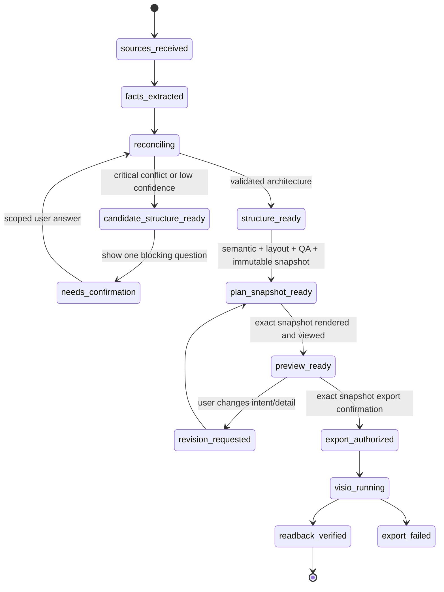

# 通用神经网络论文图编译 Agent：完整设计规范

**状态：** 已按设计审查修订，待用户评审；本文定义后续实现边界，不代表所有阶段已经完成<br>
**日期：** 2026-08-14<br>
**目标工作树：** `C:\项目\code\Draw_a_neural_network\.worktrees\commercial-foundation`（`codex/commercial-foundation`）<br>
**替代的产品方向：** 不再以「VGG / ResNet / U-Net / ViT 模板集合」作为默认架构；改为可理解任意混合输入、可证明结构正确性、可组合地生成论文级神经网络图的编译 Agent。

## 0. 2026-08-14 执行基线：从“安全导出原型”回到“高质量神经网络图编译器”

### 0.1 当前结论与禁止性声明

当前分支已经具备认证、Draft、Network IR、五个专用 grammar、确定性 preview、受限 Visio 协议和 Universal export 的一部分安全边界。这些能力是后半段基础，不能被描述为下列产品能力已经完成：

```text
禁止宣称：任意代码或草图已被可靠理解。
禁止宣称：当前五个 grammar 等于支持任意神经网络。
禁止宣称：mock/协议测试等于真实 Visio 顶刊图已经绘制成功。
禁止宣称：单张 VGG16 图达到目标即代表通用能力成立。
```

本设计的第一优先级从“继续扩展 Job、导出 API 或按模型名增加模板”调整为：建立一条可审计、可读回、可视觉验收的端到端编译路径。安全导出和持久化闭环仍必须完成，但只在阻塞该路径时继续扩展；不得挤占结构理解、组件化图形表达、布局和真实 Visio 质量验证的资源。

### 0.2 第一条端到端能力线

首个交付切片不以模型名称为功能入口，而以四个结构上互补的黄金样本作为同一通用编译器的验收压力集：

| 样本 | 结构压力 | 必须证明的通用能力 |
|---|---|---|
| VGG16 | feature-map 阶段、重复卷积、池化、分类头 | `TensorVolume`、`RepeatGroup`、`StageRegion`、尺度/通道注释 |
| ResNet-18/50 | projection、residual add、重复 block | `ResidualSkip`、`Merge(add)`、跨 stage 的稳定锚点和路由 |
| U-Net | 对称 encoder/decoder、跨尺度 skip、concat | `ScaleTransition`、`Merge(concat)`、双侧层次和非穿越 skip 路由 |
| ViT | patch embedding、token sequence、Transformer repeat、attention/head | `TokenSequence`、`Attention`、`RepeatGroup`、抽象粒度切换 |

这四个样本不是四套硬编码模板。每个样本必须先经同一 `SourcePack → EvidenceGraph → Architecture IR v3` 合同，再由同一组件组合器、布局器和 Visio renderer 消费。若新的网络只能通过 `if (modelName === ...)` 成功，则该实现不计入本阶段完成。

### 0.3 第一阶段输入边界和分期选择

Phase A.1 的首要输入是**静态可解析的 PyTorch 代码**，支持 `nn.Module`、常见 layer constructor、`forward` 内的顺序调用、module reuse、`+`/`torch.add`、`torch.cat`、显式池化/上采样和可定位的 repeat 线索。分析器不执行用户代码，不加载权重，不访问网络，不运行 `forward`；遇到动态控制流、自定义 CUDA、反射、运行时 shape 或无法解析的外部调用时，必须返回覆盖范围与 unresolved，而不是猜测。

草图、截图、Keras、ONNX 和参考图仍属于产品目标，但分期如下：

| 阶段 | 可作为结构事实的来源 | 不能做的事情 |
|---|---|---|
| Phase A.1 | 静态 PyTorch、用户明确文字确认 | 从图片或动态代码臆造拓扑 |
| Phase A.2 | Keras Functional / ONNX graph | 用模型名称填补缺失层或边 |
| Phase A.3 | 真实视觉模型从草图/截图提取带 region evidence 的候选 | 将低置信 OCR/箭头直接变为可导出的事实 |
| Phase F | 受控的额外 analyzer 与组件 | 修改通用层来迁就一个网络名称 |

### 0.4 组件优先，而不是 grammar 优先

第一阶段实现顺序必须先落地以下通用语义组件和对应 Visio native-shape 映射，再把现有五个 grammar 降级为“可选的高质量组合策略”：

```text
TensorVolume         输入/中间 feature map，支持平面、堆叠和斜投影。
TokenSequence        patch/token/query 序列，支持压缩的重复表示。
OperatorBlock        Conv、Norm、Activation、Pooling、Embedding、MLP 等操作摘要。
RepeatGroup          稳定的 ×N 语义和可展开/折叠单元边界。
StageRegion          主叙事阶段、局部模块、图例和 inset 的视觉层级。
ScaleTransition      下采样、上采样、reshape、flatten、patchify 的类型化连接。
Merge                Add、Concat、gated sum 的多输入语义、端口数和标签。
ResidualSkip         残差/跨尺度 skip，具有独立 route、层级和箭头策略。
Attention            self/cross attention 的 Q/K/V 或摘要表达，不伪造细节。
```

每个组件必须具备：稳定 semantic ID、IR source mapping、允许的输入/输出表示、最小/首选尺寸、图例规则、灰度策略、Visio primitive 映射，以及针对重叠/文本/路由/缩放的 QA 规则。任何组件都不得直接保存像素坐标、Visio command、文件路径或自由脚本文本。

### 0.5 通用 DAG fallback 是不可省略的交付

无法由专用 grammar 获得高置信组合时，系统必须使用 `ComposableDagFigureCompiler`，而不是降级为等权矩形流程图或错误套用 CNN/Transformer 模板。它的规则是：

1. 保留已验证的主数据路径、branch、merge、skip、feedback 和 group 层次；
2. 根据表示类型选择 TensorVolume、TokenSequence 或 OperatorBlock；
3. 只压缩有明确 `RepeatGroup` 证据的连续子图；
4. 把复杂局部子图放入 inset，并以 source mapping 连接主图；
5. 对无法确定的 Add/Concat、repeat count、edge direction 或 output semantics 产生一个最高信息价值问题；
6. 在关键 unresolved 未解决时允许 preview-safe draft，但禁止生成最终 VSDX。

该 fallback 是“任意网络”承诺的最低可靠保障；它的质量门槛是结构完整与叙事清楚，而不是强行模仿任一论文模板。

### 0.6 顶刊质量的可验收定义

“顶刊感”不是模型产生的主观色彩偏好，必须转写为可测量规则。每个 benchmark 图必须同时通过：

| 维度 | 不可接受的结果 | 最低验收 |
|---|---|---|
| 结构 | 漏失 branch/merge/skip，或把 Add 画成 Concat | 关键节点、边、端口与 gold IR 一一可追溯 |
| 叙事 | 所有模块同权、主路径不可辨认 | 主路径、阶段、重点模块与辅助关系有明确层级 |
| 几何 | 形状重叠、箭头穿过文字、端点脱离 shape | layout/readback 均验证 bounds、route 和 endpoint |
| 可读性 | 50% 缩放或灰度下标签/关键关系不可读 | 100%/70%/50% 彩色和灰度六张预览均无 blocking QA |
| 一致性 | 预览、VSDX、PDF、PNG 内容不同 | source mapping、artifact hash、Visio readback 对账一致 |
| 可编辑性 | 输出为图片或扁平化对象 | VSDX 重新打开后仍可找到 native Shapes、Groups、Connectors 和 Shape Data |

人工视觉审阅是独立门：每个黄金样本必须有至少一张完整页面预览与一张 50% 灰度预览，由维护者确认视觉层级、色彩克制、空白、模块比例和论文叙事；自动 QA 不能替代该审阅。

### 0.7 完成门与报告纪律

第一条端到端能力线只有同时满足下列条件才可以报告“可绘制首批通用神经网络图”：

1. 四个样本从原始静态 PyTorch 输入生成 evidence、IR、FigurePlan 和 preview；
2. 至少一个未知于专用 grammar 的组合网络通过 `ComposableDagFigureCompiler`，而非被降级成线性流程图；
3. 每个图存在结构反例测试：把 add 改为 concat、删除 skip、改变 repeat 或交换 branch，系统必须拒绝错误的 gold 断言或请求澄清；
4. 每个样本生成可编辑 VSDX、PDF、PNG，并在真实 Windows/Visio 主机进行保存、关闭、重开与 readback 验收；
5. visual QA、缩放/灰度预览和人工审阅全部记录为独立证据；
6. 外部 Provider、桌面安装包、真实 relay、PostgreSQL/Redis、取消与重启恢复仍按各自验收门单独报告，不因上述任一 green 而自动完成。

### 0.8 实施优先级

后续实施计划必须遵循下列顺序，任何新 grammar、GNN/message passing 或新的导出表结构都不得跳过前置门：

```text
P0  静态 PyTorch Source Analyzer + Evidence Graph + Architecture IR v3 迁移。
P1  Figure Component contract + ComposableDagFigureCompiler + 四个 gold IR/反例。
P2  Publication layout/style tokens + 缩放/灰度/人工视觉 benchmark。
P3  FigurePlan → Visio native Shapes renderer + real-host readback/golden acceptance。
P4  Keras/ONNX analyzer、草图真实视觉理解、Graph/Message Passing 等受控扩展。
```

每个优先级只能在前一项的 focused tests、全量 API tests、类型检查、diff check 和对应真实环境验收记录完成后推进。P0–P3 是产品绘制能力主线；导出持久化、后台队列和部署闭环作为支撑项与其并行，但不得取代主线。

---

## 1. 决策摘要

### 1.1 一句话定义

`Universal Neural Figure Compiler Agent` 是一个受约束的、证据驱动的图形编译系统：它从代码、草图、截图、自然语言和参考图中恢复**可追溯的网络架构**，把架构编译为**可组合的论文图形语义**与**确定性图稿计划**，经用户确认后生成可编辑且可读回验证的 Visio 文档。

它要解决的是「用户给出任意模型线索，系统能画对、画清楚、画得专业」；不是「让模型直接操控桌面或直接写 Visio 图元」。

### 1.2 核心决策

| 决策 | 结论 | 原因 |
|---|---|---|
| 结构理解的默认入口 | `SourcePack → Evidence Graph → Architecture IR v3` | 模型名称不能证明网络结构；代码、草图与文字可能冲突。 |
| 图形生成方式 | `Architecture Signature → 组件组合 → FigurePlan` | 网络通常同时含主干、分支、重复、注意力、skip、循环，不能互斥地挑一个大模板。 |
| VGG16 的定位 | 回归 fixture 与视觉基准，不是功能边界 | 用户未来输入不受已知网络名称限制。 |
| 低置信度处理 | 一个最高信息价值的澄清问题，未确认不得导出 Visio | 「图很漂亮但 Add/Concat/skip 画错」比暂缓导出更严重。 |
| 图形与运行权限 | Provider 仅输出候选事实；浏览器与 Visio 仅消费服务端验证后的投影/Plan | 避免把 LLM 输出变成脚本、坐标、文件路径或 COM 指令。 |
| Visio 输出 | 默认新建 VSDX，原生 Shapes，保存后 readback 对账 | 要保持用户可编辑性，同时证明导出的内容没有丢失或被截断。 |
| IR 语义归属 | Add/Concat/Attention/Repeat 是带 typed ports 的节点；edge 只传输数据、条件或反馈 | 避免把多输入算子的基数、角色、axis 和输出语义含糊地挂在一条边上。 |
| 非可信输入 | 代码、图片、草图、OCR 与 Provider 输出均是不可信数据；默认只做静态解析 | 防止动态代码执行、提示注入、附件欺骗与跨租户/跨权限数据泄露。 |

### 1.3 术语

| 术语 | 含义 |
|---|---|
| `SourcePack` | 一次会话提交的代码、图片、文字和参考资料及其来源元数据。 |
| `StructuralFact` | 对一个结构事实的最小可审计断言，例如「`decoder_2` 与 `encoder_2` 使用 concat」。 |
| `Evidence Graph` | Source、locator、fact、冲突、用户确认之间的有向关联图。 |
| `Architecture IR` | 与具体绘图工具无关、能表达网络拓扑和张量/过程语义的规范化架构中间表示。 |
| `Architecture Signature` | 从 IR 抽取的「表示类型 + 拓扑 + 交互 + 输出类型」特征，而不是模型名称。 |
| `Figure Component` | TensorVolume、TokenSequence、Merge、Attention 等可组合的图形语义单元。 |
| `FigurePlan` | 经过验证、带稳定 ID、bounds、route 和 source mapping 的不可变渲染计划。 |
| `FigureIntent` | 用户对用途、密度、强调项、单色、模块展开等视觉意图。 |

---

## 2. 产品重新定义与用户成功体验

### 2.1 目标用户路径

用户不需要先知道 Agent 支持哪个「模型名」。他可以在小型聊天界面提交以下任意组合：

```text
代码：PyTorch / TensorFlow / Keras 模型、module 片段或伪代码
草图：手绘方块、分支、箭头、尺寸标注
截图：现有网络示意、白板照片、模型输出
文字：用途、输入输出、要强调的创新、期刊风格约束
参考图：希望学习的版式和视觉语言
```

系统返回的不是立即不可控地画出一张图，而是一个可解释循环：

```text
上传材料
  → 结构摘要、证据、置信度和一个必要问题
  → 可预览的论文级候选图
  → 用户确认结构/图稿或提出修订
  → 新建可编辑 VSDX
  → readback 与源映射对账
```

### 2.2 成功标准

1. **结构真实。** 输入/输出、branch、merge、skip、attention、repeat、iteration 和尺度关系都有可检索证据或明确的用户确认。
2. **图形专业。** 图能在正常页面、缩小阅读和灰度打印下保留主叙事；不会退化成等权矩形流程图、随机彩色卡片或 VGG 专属拼贴。
3. **适配输入。** 代码优先决定事实；草图可表达模块分区和叙事；参考图只影响视觉语言；文字决定用途和强调。
4. **可控。** 关键不确定性只问一个高价值问题；无确认时不能产生最终 VSDX。
5. **可编辑且可验证。** 输出是原生 Visio Shapes，能在保存/关闭/重开后读取关键 Shape Data 与 source mapping。
6. **可扩展。** 新网络家族通过新增分析器、IR 语义或组件组合进入系统，不在通用层增加 `if (modelName === ...)`。

### 2.3 明确非目标

- 不把 Agent 定义成能执行任意 PowerShell、Python、VBA、COM、SVG/XML 或桌面操作的通用自动化器。
- 不从一张模糊参考图无证据地臆造准确网络拓扑。
- 不承诺一次支持所有论文网络、全部代码框架或任意已有 VSDX 的就地修改。
- 不把自动视觉 QA 当作人类「顶刊质感」审稿的替代品。
- 不把单元测试、预览成功、Worker mock 成功、真机 Visio 成功、安装包签名和真实 Provider 连通混为一个完成结论。

---

## 3. 现状审计与保留边界

### 3.1 已具备且应保留的后半段基础

当前工作树已经存在以下方向正确的基础能力；新设计应复用而非推倒：

```text
认证 / 设备与会话边界
固定 relay + 请求级 Provider API Key
AgentService / PublicationFigureAgent
EvidenceBundle、Canonical NetworkIR v2、FigureIntent
GrammarRegistry、FigureSemanticModel、PublicationFigurePlan v2
FigureDraft / revision、Visual QA
Visio discovery、job、worker protocol、readback 方向
```

已注册 `cnn-classifier`、`residual-backbone`、`encoder-decoder`、`token-transformer`、`multi-branch-fusion` 等 grammar。它们继续作为**已验证的专用编译器和 regression fixtures**存在；它们不能被误称为「支持任意网络」的证据。

### 3.2 必须迁移的旧默认路径

`apps/api/src/adapters.ts` 仍包含：

```text
PublicationPreset = generic | resnet | unet | vit | vgg16
detectPublicationPreset(...)
buildPresetNodes(...)
```

该路径可以在迁移期保留为 demo、fixture、离线 fallback 和历史兼容层，但不再是实际请求的首选结构理解方法。它的问题是：模型名称推断隐藏了结构证据，未知模型会被压扁为通用线性图，已知模型会被错误地套入固定层数和命名。

### 3.3 必须保持的安全合同

- Relay URL 固定于桌面/服务端配置；用户只经瞬时 `X-Synapse-Provider-Api-Key` 填写中转站 key，不能填写或修改 Provider URL。
- key 只用于当前请求，日志、FigureDraft、FigurePlan、VSDX、Worker stdin 均不得持久化它。
- Provider 只可返回结构候选、证据、置信度和 unresolved；不得返回 SVG、坐标、Visio Shape、COM/VBA、Shell、文件路径或绘图脚本。
- 浏览器只接收服务端验证后的分析投影、预览和 Plan 投影；不能接收原始模型命令或任意动作。
- canvas 完整替换、用户可见 Canvas 修改和 Visio 导出均处在确认边界之后。
- Visio worker 只消费不可变、allowlist 校验通过的 FigurePlan；默认创建新文档，不覆盖、关闭或终止用户已有 Visio 文档/进程。

---

## 4. 总体架构

### 4.1 编译流水线

```mermaid
flowchart LR
    A[SourcePack<br/>代码 图片 文字 参考图] --> B[Source Analyzers]
    B --> C[Evidence Graph<br/>Structural Facts]
    C --> D[Structural Reconciliation]
    D --> E[Architecture IR v3]
    E --> F[Confidence and Clarification Gate]
    F -->|ready| G[Architecture Signature]
    G --> H[Composable Figure Semantic Compiler]
    H --> I[Layout and Style Compiler]
    I --> J[Validated PublicationFigureSet]
    J --> P[Immutable PlanSnapshot]
    P --> K[Exact Browser Preview and Revision]
    K -->|explicit user confirmation| L[Visio Job and Native Renderer]
    L --> M[VSDX Readback and Source Mapping Audit]
    F -->|needs confirmation| N[One blocking question]
    N --> D
```



这个链路的关键是单向权限收缩：越靠近渲染端，输入越受约束、越确定、越可审计。任何上游模型都不能越过 IR/Plan 直接触发渲染。

### 4.2 子系统责任

| 层 | 责任 | 不负责 |
|---|---|---|
| Source ingestion | 校验附件、脱敏、生成稳定 Source ID、权限与大小限制 | 解释网络结构或决定坐标 |
| Source analyzers | 从每类来源抽取候选 fact 和 locator | 合并冲突、绘图、调用 Visio |
| Evidence Graph | 记录来源、事实、置信度、冲突、确认 | 视觉风格选择 |
| Reconciler | 以明确优先级合并事实并生成 IR/unresolved | 生成图元 |
| Architecture IR v3 | 表达真实结构、层次、端口、表示与过程 | 色板、像素坐标、Visio API |
| Semantic compiler | 从结构签名选择和组合图形组件 | 读取原始用户文件 |
| Layout/style compiler | 布局、视觉语法、字体、色板、黑白规则 | 改写结构事实 |
| Visual QA | 检查几何、可读性与视觉规则 | 宣称结构正确 |
| Draft/revision service | 保存版本、确认令牌、修订意图 | 绕过验证重放旧 Plan |
| Visio renderer/readback | 受限地把 Plan 映射为 native Shapes 并对账 | 接受模型的自由文本命令 |

### 4.3 三种可扩展入口

新网络能力只能通过以下三种入口加入，且每一种都有独立测试：

1. **新 source analyzer：** 例如 ONNX 图、Keras Functional API、结构化论文表格；只产出 StructuralFact。
2. **新 Architecture IR 语义：** 例如 memory state、coordinate field、message passing；需给出 schema、验证器和 v2 兼容策略。
3. **新 Figure Component / composition rule：** 例如 `GraphTopologyInset`、`IterativeLoop`；只从已验证 IR 读取结构。

不得以「新增网络名称」为第四种扩展入口。

---

## 5. SourcePack：混合输入合同

### 5.1 请求模型

```ts
type SourceKind = "code" | "sketch" | "screenshot" | "text" | "reference_figure";

interface SourcePack {
  sourcePackId: string;
  conversationId: string;
  sources: Source[];
  figureIntentHint?: FigureIntentHint;
}

interface Source {
  id: string;
  tenantId: string;
  ownerUserId: string;
  kind: SourceKind;
  canonicalMediaType: string;
  contentRef: string;          // 服务端受控对象引用，不把原文放入 FigurePlan
  contentSha256: string;       // 上传后计算，定位和后续证据均绑定此不可变版本
  byteLength: number;
  role: "architecture" | "narrative" | "style_reference";
  authoritativeness: "user_asserted" | "derived" | "reference_only";
  analyzerVersion: string | null;
  createdAt: string;
}
```

`sourcePackId`、`conversationId`、`tenantId` 与 `ownerUserId` 共同构成访问边界。任一读取、分析、预览、确认或导出请求都必须验证调用方属于同一 tenant、同一 user 和同一会话授权范围；不得仅凭可猜测的 `contentRef` 读取附件。

### 5.2 来源职责与冲突优先级

| 来源 | 允许决定 | 不能单独决定 | 默认优先级 |
|---|---|---|---|
| 可解析代码 | module、调用顺序、端口、显式 Add/Concat、repeat、参数/shape 线索 | 用户想强调的故事、视觉风格 | 最高（具体结构） |
| 用户草图 | 模块分区、强调关系、图中叙事、局部显式标注 | 隐藏在代码内的所有实现细节 | 高（用户明确标注） |
| 截图/白板照片 | 视觉化候选、显式文本、已画出的连接 | 不能辨识的算子或未标注端口 | 中 |
| 自然语言 | 任务、输出语义、重点、期刊/黑白要求 | 与代码矛盾的精确拓扑 | 中 |
| 参考图 | 版式、色板、线宽、抽象程度 | 用户网络的实际节点与边 | 仅风格 |

规则不是机械地「代码永远赢」：当用户明确说代码仅为某个模块片段、草图展示了外部连接时，Reconciler 必须把范围不同标为 `scope_mismatch`，而不是静默覆盖任一来源。

### 5.3 隐私与存储

- 原始代码/图片保存在项目已有的受控附件存储，按会话权限读取；FigurePlan 仅保存稳定 source ID、locator digest 和脱敏摘要。
- Provider 如参与分析，只收到完成当前结构提案所需的最小内容；不得获得 API key、数据库连接、Visio 路径或其他租户数据。
- 审计日志只记录 source kind、字节量、分析器版本、fact 数量、状态码与哈希，不记录完整代码/图片、密钥或模型原文。
- 每个 SourcePack 有生命周期状态和删除策略；删除原始来源后，Draft 只能保留已脱敏的结构摘要，不能伪装为仍可溯源的完整证据。
- `contentSha256`、canonical MIME、字节数、上传时间和 analyzer version 是证据的一部分；源内容替换、转码或方向校正必须产生新的 Source ID，不能复用旧 locator。

### 5.4 非可信附件、动态代码与 Provider 防护

所有 Source 内容都属于不可信数据，包含用户提交的 Python、Notebook、模型配置、图像 OCR 文本、草图标注与参考图内的文字。它们只能作为数据进入 analyzer，不能改变系统指令、访问密钥、网络目标、文件路径或导出权限。

| 分析等级 | 含义 | 允许行为 | 导出资格 |
|---|---|---|---|
| `static_supported` | 受支持框架/语法可由 AST 或图结构完整解析 | 只读取文本/模型结构，产生可定位 facts | 可参与正常确认门 |
| `partial_supported` | 只能解析一部分模块或外部调用 | 明确输出未覆盖范围和 unresolved | 关键路径未覆盖时禁止导出 |
| `requires_trace` | 静态解析不足，但未来可能通过受控 trace 获得结构 | 不执行；要求用户提供结构摘要，或进入后续隔离 trace 能力 | 当前禁止导出 |
| `unsupported` | 不支持的语言、二进制、混淆或安全策略拒绝 | 返回可解释拒绝和可提交的替代材料 | 禁止导出 |

Phase A–E 的默认规则是**从不执行用户代码**。未来若引入 `requires_trace`，必须是独立功能：一次性隔离容器、无网络、无宿主文件挂载、无环境密钥、CPU/内存/时间/进程数上限、只允许结构探针输出，并将 trace 结果作为新的、带 hash 的 Source。不得通过在 API、Electron 或 Visio Worker 中执行用户代码来“补齐”解析。

Provider 调用必须使用不可被附件覆盖的系统规则和严格 JSON schema；来自代码/图片的文本放入明确定义的 data field，不拼入控制指令。上传入口还必须执行 MIME canonicalization、魔数校验、压缩比/像素/页数限制、恶意内容扫描、单 SourcePack 的字节与 token 配额，以及固定 relay egress allowlist。

---

## 6. Evidence Graph 与 StructuralFact

### 6.1 最小结构事实合同

```ts
type FactKind =
  | "node_exists" | "node_kind" | "port_type" | "tensor_representation"
  | "edge_exists" | "merge_kind" | "skip_relation" | "attention_relation"
  | "repeat" | "stage_membership" | "shape" | "output_semantics"
  | "process_semantics" | "layout_hint" | "style_hint";

type FactSubject =
  | { kind: "node"; nodeId: string }
  | { kind: "port"; nodeId: string; portId: string }
  | { kind: "edge"; sourcePortId: string; targetPortId: string }
  | { kind: "module"; moduleId: string }
  | { kind: "figure"; figureId: string };

type FactPayload =
  | { kind: "node_exists"; operatorKind: OperatorKind }
  | { kind: "node_kind"; semanticRole: string }
  | { kind: "port_type"; representation: TensorRepresentation; semanticType: PortSemanticType }
  | { kind: "tensor_representation"; representation: TensorRepresentation }
  | { kind: "edge_exists"; transport: "data" | "condition" | "feedback" }
  | { kind: "merge_kind"; mergeKind: "add" | "concat" | "gated_sum"; concatAxis: AxisRole | null }
  | { kind: "skip_relation"; skipKind: "residual" | "cross_scale"; projection: boolean | null }
  | { kind: "attention_relation"; attentionKind: "self" | "cross"; queryPortId: string; keyPortId: string; valuePortId: string }
  | { kind: "repeat"; count: number | "unknown"; unitNodeIds: string[] }
  | { kind: "stage_membership"; moduleId: string }
  | { kind: "shape"; shape: TensorShape }
  | { kind: "output_semantics"; outputKind: "classification" | "segmentation" | "detection" | "generation" | "regression" | "embedding" | "other" }
  | { kind: "process_semantics"; process: ProcessSemantic }
  | { kind: "layout_hint"; hint: "main_path" | "inset_candidate" | "left_to_right" | "top_to_bottom" }
  | { kind: "style_hint"; token: "emphasize" | "deemphasize" | "monochrome" };

type StructuralFact = {
  [K in FactKind]: {
    id: string;
    kind: K;
    subject: FactSubject;
    payload: Extract<FactPayload, { kind: K }>;
    evidenceRefs: EvidenceRef[];
    extractionConfidence: number; // analyzer 对本次观察的置信度，不能直接跨来源比较
    decisionConfidence: number;   // Reconciler 用于门控的校准后置信度
    sourceRole: "code" | "sketch" | "text" | "reference" | "user_confirmation";
    scope: "architecture" | "narrative" | "style";
    status: "candidate" | "accepted" | "conflicted" | "superseded";
    analyzer: { id: string; version: string; policy: "static" | "vision" | "provider" | "user" };
    conflictGroupId: string | null;
    conflictKey: string; // 相同 key 的互斥事实必须在同一 conflict group 中裁决
  };
}[FactKind];

interface EvidenceRef {
  sourceId: string;
  sourceSha256: string;
  locator: CodeLocator | ImageRegionLocator | TextRangeLocator;
  excerptDigest: string;
}

interface CodeLocator {
  kind: "code";
  startLine: number;     // 1-based, inclusive
  startColumn: number;   // 1-based, inclusive
  endLine: number;       // 1-based, inclusive
  endColumn: number;     // 1-based, exclusive
}

interface TextRangeLocator {
  kind: "text";
  startOffset: number;   // Unicode code-point offset, inclusive
  endOffset: number;     // Unicode code-point offset, exclusive
}

interface ImageRegionLocator {
  kind: "image";
  normalizedBounds: { x: number; y: number; width: number; height: number }; // [0,1]，方向校正后坐标
  imageWidth: number;
  imageHeight: number;
}

interface FactRelation {
  id: string;
  fromFactId: string;
  toFactId: string;
  kind: "supports" | "contradicts" | "derives" | "supersedes" | "answers";
  createdBy: "analyzer" | "reconciler" | "user";
}

interface EvidenceGraph {
  version: 2;
  facts: StructuralFact[];
  relations: FactRelation[];
}
```

`FactPayload` 是唯一允许跨 analyzer、Provider、Reconciler、存储和 HTTP 投影传输的事实值；不得以 `unknown`、任意 JSON、自由对象或未注册 `predicate` 扩充事实语义。每个 `FactKind` 绑定一种 payload，并由 schema 在边界验证 `subject`、payload、source role、scope 与 conflict key 的组合是否合法。

每个关键 node、edge、repeat、merge、attention、skip、input 和 output 至少拥有一条 evidenceRef 或一条记录了确认时间和回答者的 `user_confirmation`。`reference_figure` 不得成为 architecture scope 的唯一证据。

### 6.2 Evidence Graph 规则

1. Fact 与原始 Source 的边不可变；Reconciler 可新增 `accepted`、`conflicted`、`superseded` 标记，但不得改写来源。
2. 两个不同值竞争同一结构槽位时，必须显式写入 conflict group，附带双方 evidence 与优先级理由。
3. `layout_hint` 和 `style_hint` 不能写进 Architecture IR 的真实拓扑字段。
4. 不存在 evidence 的 Provider 推测只能作为 `candidate`，不计入关键结构置信度。
5. 用户确认可解决具体冲突，但不能自动为同一类型的所有未证实结构背书。

### 6.3 置信度与冲突计算

关键事实包括输入/输出、数据边、Add/Concat、跨尺度 skip、cross-attention、循环/迭代、分支的 join/split。它们的 `accepted` 条件为：

```text
明确且无冲突的用户确认，或
代码/显式草图的可定位证据，且 decisionConfidence ≥ 0.85，且不存在同等级冲突。
```

`decisionConfidence` 不是任意 analyzer 给出的概率。Reconciler 必须记录如下可解释组成：`extractionConfidence`、该 source 对该结构槽位的 `authorityWeight`、独立来源 `corroboration`、同等级矛盾的 `conflictPenalty`，以及最终 `decisionReason`。代码 AST 的确定观察、OCR、视觉模型猜测、Provider 解释和用户草图不可直接比较同一个原始分数。

非关键装饰性事实（未知 channel 数、未出现的 dtype、只用于副标题的模块别名）可在 `0.60 ≤ decisionConfidence < 0.85` 时作为 warning，但不得改变拓扑。低于 `0.60` 的候选不进入 Plan。

---

## 7. 多源 Reconciliation 与澄清门

### 7.1 Reconciler 输入输出

```ts
interface ReconciliationResult {
  acceptedFacts: StructuralFact[];
  conflicts: StructuralConflict[];
  unresolved: UnresolvedQuestion[];
  architectureIR: ArchitectureIRv3 | null;
  confidenceState: "ready" | "ready_with_warnings" | "needs_confirmation";
}
```

执行顺序为：先归一化每一来源的事实和 locator；再按 scope 对齐；之后合并非冲突事实；最后才构造 IR。不得先从模型名生成 IR，再倒填证据。

### 7.2 只问一个最高价值问题

如果存在关键 unresolved，系统计算每个问题对可达性、语义差异和图形选择的影响，按下列顺序选择一个问题：

1. 输入、输出或主数据路径是否可达；
2. 分支汇合是 `add`、`concat`、`cross_attention` 还是其他；
3. skip 是否跨尺度且目标端口是否匹配；
4. attention 的 Q/K/V 来源与输出去向；
5. repeat/iteration 的次数或范围；
6. 仅影响标签、尺寸或强调的细节。

一个问题必须附带候选值、相关证据摘要和它会改变的图形含义。例如：

```text
Decoder stage 2 与 encoder stage 2 的两条输入，是 channel concat 还是逐元素 add？
代码片段在 `forward` 中出现 `fuse(x, skip)`，草图在连接点标了 “+”。
这会分别画为并排拼接的 Merge 或残差 Add 圆点。
```

用户回答后只更新相关 fact/conflict group，保持其余 IR、Plan 和 revision 可审计。

`一个问题` 是每次 UI 响应的上限，不是系统只允许存储一个 unresolved。每个 Draft revision 保存完整 `questionSetId`、依赖关系、已回答问题、回答者、回答时间和由回答引起的 fact 变化。Reconciler 可以在一个回答后提出下一个最高价值问题；连续阻塞问题最多三轮。达到三轮仍不能形成关键结构时，系统只允许用户补充材料、声明指定槽位的人工结构、生成显式标注为“未验证草图”的讨论预览，或取消；不允许导出 VSDX。

### 7.3 状态机



`needs_confirmation` 只返回 `CandidateStructurePreview`：它可以展示已证实模块、未确认 relation 的局部候选和一个问题，但不是 `PublicationFigurePlan`，不能生成完整论文图、不能拥有 plan snapshot、不能签发 export token。候选预览必须水印“结构待确认”，并以受限视觉标记指出未确认事实。只有 `plan_snapshot_ready` 才能创建完整 PublicationFigurePlan 并进入可导出预览。`export_authorized` 必须绑定 `draftId + revision + planId + planHash + confirmationToken`，防止旧页面或任意浏览器 payload 绕过当前结论。

---

## 8. Architecture IR v3

### 8.1 设计原则

IR v3 只表达可验证架构语义，不包含颜色、字体、绝对坐标、Visio master、文件路径或模型名称驱动的图形选择。所有可见对象都必须能回指 IR 元素；所有 IR 关键元素都必须能追溯到 Evidence Graph。

### 8.2 核心模型

```ts
type TensorRepresentation =
  | "spatial_feature_map" | "vector" | "token_sequence"
  | "query_sequence" | "node_feature" | "coordinate"
  | "state" | "scalar_distribution";

type OperatorKind =
  | "input" | "output" | "module" | "operator" | "merge"
  | "split" | "attention" | "repeat" | "process" | "adapter";

type PortSemanticType = "data" | "query" | "key" | "value" | "mask" | "skip" | "condition" | "prediction" | "state";
type AxisRole = "B" | "C" | "H" | "W" | "D" | "T" | "N" | "F" | "unknown";

type ShapeExpr =
  | { kind: "known"; value: number }
  | { kind: "symbol"; name: string }
  | { kind: "derived"; operator: "add" | "subtract" | "multiply" | "divide" | "ceil_div"; operands: ShapeExpr[] }
  | { kind: "unknown" };

interface TensorShape {
  axes: AxisRole[];
  dimensions: ShapeExpr[];
  batchSemantics: "independent" | "broadcastable" | "unknown";
}

interface PortRef {
  nodeId: string;
  portId: string;
}

interface RepeatSemantic {
  count: number | "unknown";
  unitNodeIds: string[];
  expansionPolicy: "collapsed" | "first_and_last" | "fully_expanded";
}

interface ProcessSemantic {
  id: string;
  kind: "iterative" | "recurrent" | "refinement" | "sampling";
  bodyNodeIds: string[];
  stateInputPortIds: string[];
  stateOutputPortIds: string[];
  iterationCount: number | "unknown";
  termination: "fixed_count" | "convergence" | "external_schedule" | "unknown";
}

interface UnresolvedQuestion {
  id: string;
  severity: "blocking" | "warning";
  conflictKey: string;
  candidateValues: string[];
  evidenceFactIds: string[];
  dependencyQuestionIds: string[];
}

interface ShapeCompatibility {
  status: "proven" | "incompatible" | "unknown";
  comparedAxes: AxisRole[];
  reason: string;
  evidenceFactIds: string[];
}

interface ArchitectureIRv3 {
  version: 3;
  graphId: string;
  inputs: PortRef[];
  outputs: PortRef[];
  modules: ArchitectureModule[];
  nodes: ArchitectureNode[];
  edges: ArchitectureEdge[];
  processes: ProcessSemantic[];
  evidenceIndex: Record<string, EvidenceRef[]>;
  unresolved: UnresolvedQuestion[];
}

interface ArchitectureModule {
  id: string;
  label: string;
  parentModuleId: string | null;
  memberNodeIds: string[];
  interfacePortIds: string[];
  collapsedByDefault: boolean;
  evidenceIds: string[];
}

interface ArchitectureNode {
  id: string;
  kind: OperatorKind;
  semanticRole: string;
  inputPorts: TypedPort[];
  outputPorts: TypedPort[];
  repeat?: RepeatSemantic;
  evidenceIds: string[];
}

interface TypedPort {
  id: string;
  representation: TensorRepresentation;
  shape?: TensorShape;
  semanticType: PortSemanticType;
}

interface ArchitectureEdge {
  id: string;
  source: PortRef;
  target: PortRef;
  transport: "data" | "condition" | "feedback";
  evidenceIds: string[];
}

interface MergeNode extends ArchitectureNode {
  kind: "merge";
  mergeKind: "add" | "concat" | "gated_sum";
  concatAxis: AxisRole | null;
  inputCompatibility: ShapeCompatibility[];
}

interface AttentionNode extends ArchitectureNode {
  kind: "attention";
  attentionKind: "self" | "cross";
  // self-attention 允许 Q/K/V 指向同一上游表示；cross-attention 必须来自两个可追溯来源。
  inputPorts: [
    TypedPort & { semanticType: "query" },
    TypedPort & { semanticType: "key" },
    TypedPort & { semanticType: "value" },
    ...(TypedPort & { semanticType: "mask" })[]
  ];
}
```

### 8.3 层次、端口与过程语义

- `modules` 支持严格树状模块/子图层级：每个 node 只直接属于一个 module，祖先 module 通过闭包间接包含它；`interfacePortIds` 是跨 module 边界的唯一端口集合。不得让同一 node 平行属于多个 module。
- 所有 edge 连接**端口**，不是笼统连接卡片；edge 只表达 `data`、`condition` 或 `feedback` 的传输。`concat`、`add`、attention Q/K/V 和多输出模块的真实语义由目标 node 的 typed ports 与算子约束表达。
- `MergeNode(add)` 至少有两个 data input，且所有输入与输出必须满足可证明的 shape-compatible 规则；`MergeNode(concat)` 至少有两个 data input，必须指定 concat axis，并将非 concat 维的兼容性写入约束。无 shape 证据时生成 blocking unresolved。
- `AttentionNode(cross)` 必须有一个 `query`、一个 `key` 和一个 `value` 输入端口，且三者的 evidence/上游来源可回溯；只要其中角色、来源或输出不明确，不能降级为普通 merge。
- `TensorShape` 使用 `AxisRole + ShapeExpr`，而不是把尺寸压成自由字符串。batch 轴 `B` 默认不参与 Add/Concat 的结构兼容性判断，除非算子显式声明 broadcast；`unknown` 与无法化简的 derived expression 产生 `ShapeCompatibility.status = unknown`，与 `incompatible` 严格区分。关键 merge 的 `unknown` 必须阻断最终导出，非关键标签可降为 warning 且不显示精确尺寸。
- `TensorRepresentation` 决定首选视觉实体：空间特征图、token、query、图节点特征、坐标场、state 不能被画成同一种 3D 方块。
- `ProcessSemantic` 表达非简单 DAG 的过程，例如 diffusion step、recurrent refinement、unrolled iteration、memory update；它必须指明迭代范围、状态输入/输出和终止/重复条件。
- 无法被无环主数据图表达的反馈边必须显式标为 `feedback`，并触发专用过程组件或确认，不得伪装成普通箭头。

### 8.4 v1/v2 兼容

迁移期保留：

```text
legacy NetworkIR v1 → network-ir-v1-adapter → Canonical NetworkIR v2
Canonical NetworkIR v2 → v2-to-v3 adapter → Architecture IR v3
```

adapter 必须保留已有 evidence、confidence、node ID 和 edge ID；无法表达的层次/端口/过程语义写入明确的 `unresolved`，不能静默补全。旧 Canvas 和 API consumer 可继续读取 v1/v2 字段；新的 universal pipeline 输出 v3，同时提供经过验证的兼容 projection。未知版本在 API 边界拒绝，不透传到 Worker。

---

## 9. Architecture Signature 与可组合 Figure Components

### 9.1 Signature 不是模型分类器

Signature 从已验证 IR 提取可解释特征：

```ts
interface ArchitectureSignature {
  representations: TensorRepresentation[];
  topology: {
    branches: number;
    mergeKinds: string[];
    hasScaleTransitions: boolean;
    hasResidualSkips: boolean;
    hasFeedback: boolean;
  };
  interactions: Array<"self_attention" | "cross_attention" | "conditioning" | "message_passing">;
  processKinds: Array<"feed_forward" | "iterative" | "recurrent" | "refinement">;
  outputKinds: string[];
}
```

它的用途是选择可组合组件和布局策略，例如「spatial feature map + scale transition + cross-scale concat + segmentation output」会组成 encoder–decoder 叙事；不是给网络贴上 `unet` 标签后调用一个固定 SVG。

### 9.2 首批组件库

| 组件 | 输入语义 | 视觉职责 | 禁止误用 |
|---|---|---|---|
| `TensorVolume` | spatial feature map | 斜投影面、通道深度、尺度变化 | 不能表示 token 或图节点集合 |
| `TokenSequence` | token/query sequence | 条带、token 单元、长度/嵌入标注 | 不能伪装为 CNN 体块 |
| `RepeatedBlock` | repeat/模块层次 | 省略号、repeat bracket、折叠入口 | 不能凭标签猜重复次数 |
| `Branch` | split 与并行路径 | 清晰 lane、对齐输入与输出 | 不能跨越未证实关系 |
| `SkipBridge` | residual 或跨尺度 skip | 与主路径区分的桥接线 | 不得混用 residual 和 concat |
| `Merge` | add/concat/gate | 可辨识的合并符号与端口 | 合并类型不明时不能默认 add |
| `Attention` | Q/K/V 或 query-context 关系 | attention 锚点、双侧来源和输出 | 不能用普通 merge 代替 cross-attention |
| `GraphTopologyInset` | node_feature / message passing | 小型拓扑 inset 与传播方向 | 不能用线性流水线代替图传播 |
| `CoordinateField` | coordinate / implicit field | 坐标域、采样、MLP 场映射 | 不能误画为图像 tensor |
| `IterativeLoop` | feedback/refinement | 有范围标注的循环、step 语义 | 不能形成无标签的箭头回路 |
| `PredictionHead` | output semantics | 分类、检测、分割、生成等明确输出 | 不能以任意 FC 方块泛化所有输出 |

### 9.3 组合规则

1. 组件有唯一 semantic ownership：同一 IR node/edge 只由一个主组件渲染；辅助注释通过引用，不重复画第二条语义线。
2. `Merge`、`SkipBridge`、`Attention` 必须消费已验证的 edge relation，不能从相邻位置推断。
3. 模块折叠只隐藏内部 display elements，不能删除接口端口、source mapping 或真实 repeat 语义。
4. 一个 FigurePlan 可同时包含 TensorVolume、RepeatedBlock、SkipBridge、Attention 和 PredictionHead；这正是通用系统超越家族模板的方式。
5. 若存在没有组件能忠实表达的已验证语义，编译状态为 `needs_component_support`，而不是降级画错。

### 9.4 已有 grammar 的新位置

现有 grammar 从「模型家族模板」逐步演化为「经过回归验证的组件组合 profile」：

```text
cnn-classifier       = TensorVolume + scale transitions + flatten + PredictionHead
residual-backbone    = TensorVolume + RepeatedBlock + residual SkipBridge + Merge(add)
encoder-decoder      = TensorVolume + symmetric Branch + scale SkipBridge + Merge(concat/add)
token-transformer    = TokenSequence + RepeatedBlock + Attention + PredictionHead
multi-branch-fusion  = two tower components + verified fusion + PredictionHead
```

profile 是优先选择和回归基准，不能成为要求输入模型名称的门槛。

---

## 10. Publication Layout 与视觉风格系统

### 10.1 FigureIntent

`FigureIntent` 独立于 Architecture IR，至少包含：

```text
purpose: overview | method_detail | ablation | supplement
targetMedium: color_screen | color_print | grayscale_print
density: compact | balanced | explanatory
emphasis: semantic IDs / relation IDs / module IDs
expansion: collapsed modules / expanded modules
referenceStyle: approved visual tokens only
page: aspect ratio, margin, readable minimum type size
```

意图修改产生新 revision；不重新解释无关源码。改变 `emphasis` 可能改变局部布局，但不能改写 IR 拓扑。

### 10.2 顶刊式视觉语法的可验证规则

1. **主叙事优先。** 从输入到输出的主路径在第一眼可追踪；辅助 skip/conditioning/attention 使用不同线型、层级和布局 lane。
2. **同类同形。** 空间张量、token、merge、循环、输出具有稳定且可跨图复用的视觉编码。
3. **只在必要处展开。** 重复 block 用 bracket/计数表达，局部创新模块可用 inset；避免把每一层画成同权文件夹。
4. **有限颜色。** 颜色表达模块层级或语义类别而非随机装饰；主路径、重点模块、辅助关系不超过可读的少量层级。
5. **灰度可读。** 任何依赖颜色区分的语义同时具备 line type、fill pattern、轮廓或标签区分。
6. **文字服务于图形。** 标题、stage 标签、张量尺寸、操作名不重叠，不遮住主路径；低价值参数不塞满图面。
7. **尺度诚实。** 3D tensor 的宽高深只可表达相对尺度/通道趋势，不能暗示未经证实的精确比例。

### 10.3 布局编译步骤

```text
semantic graph
  → 主路径/侧路/region 分层
  → 选择横向、纵向或混合叙事方向
  → macro stage placement
  → component-local geometry
  → relation routing and label placement
  → style token application
  → page fitting
  → visual QA
```

布局器必须先放置主叙事、模块 region 和输入/输出锚点，再布置 skip/attention/condition 辅助线，最后做标签避让。不能先随机放卡片，再靠长箭头补救。

### 10.4 Visual QA 与人工审阅

自动 QA 至少检查：页面边界、元素/标签重叠、最小字号、relation 端点、无意义交叉、主路径可达、region 遮挡、颜色对比、灰度可区分性、缩放后的密度、输出头是否在可视范围内。

人工视觉审阅仍需要回答：第一眼是否理解网络叙事；创新模块是否突出；关系符号是否自然；是否存在「PPT 大框」「等权流程图」「文件夹堆叠」的退化。这项 gate 必须保存为带版本号的截图/评审记录，不由自动 QA 冒充通过。

---

## 11. PublicationFigurePlan 与渲染边界

### 11.1 Plan 合同

`PublicationFigurePlan` 是 schema 校验后的不可变对象，最少包含：

```ts
interface PublicationFigurePlan {
  version: 3;
  planHash: string;
  figureSetId: string;
  panelId: string;
  manifest: {
    canonicalization: "RFC-8785-JCS";
    architectureIrHash: string;
    figureIntentHash: string;
    componentCompilerVersion: string;
    layoutCompilerVersion: string;
    styleTokenVersion: string;
    layoutSeed: string;
  };
  draftId: string;
  revision: number;
  components: FigureComponentPlan[];
  primitives: PrimitivePlan[];
  relations: RelationPlan[];
  annotations: AnnotationPlan[];
  regions: RegionPlan[];
  sourceMappings: SourceMapping[];
  qa: VisualQaResult;
}

interface PublicationFigureSet {
  version: 1;
  figureSetId: string;
  draftId: string;
  revision: number;
  panels: PublicationFigurePlan[];
  crossPanelMappings: Array<{ semanticId: string; fromPanelId: string; toPanelId: string }>;
  intentHash: string;
}

interface PlanSnapshot {
  planId: string;
  draftId: string;
  revision: number;
  figureSet: PublicationFigureSet;
  canonicalPlanBytesSha256: string;
  previewArtifactHashes: Array<{ panelId: string; kind: "svg" | "png"; sha256: string }>;
  compilerManifest: PublicationFigurePlan["manifest"];
  visualQa: VisualQaResult;
  createdAt: string;
  immutable: true;
}

interface Bounds {
  x: number;
  y: number;
  width: number;
  height: number;
}

interface FigureComponentPlan {
  id: string;
  panelId: string;
  kind: "tensor_volume" | "token_sequence" | "repeated_block" | "branch" | "skip_bridge" | "merge" | "attention" | "graph_inset" | "coordinate_field" | "iterative_loop" | "prediction_head";
  semanticIds: string[];
  bounds: Bounds;
}

interface PrimitivePlan {
  id: string;
  componentId: string;
  kind: "shape" | "text" | "line" | "bracket" | "marker";
  bounds: Bounds;
  text: string | null;
  styleTokenId: string;
  semanticIds: string[];
}

interface RelationPlan {
  id: string;
  sourcePrimitiveId: string;
  targetPrimitiveId: string;
  kind: "data" | "condition" | "feedback" | "residual_skip" | "cross_scale_skip" | "attention_link";
  route: Array<{ x: number; y: number }>;
  semanticEdgeIds: string[];
}

interface AnnotationPlan {
  id: string;
  panelId: string;
  kind: "title" | "stage_label" | "tensor_label" | "legend" | "warning_watermark";
  text: string;
  bounds: Bounds;
  semanticIds: string[];
}

interface RegionPlan {
  id: string;
  panelId: string;
  kind: "module" | "stage" | "inset" | "legend";
  bounds: Bounds;
  memberComponentIds: string[];
  semanticModuleId: string | null;
}

interface SourceMapping {
  id: string;
  semanticId: string;
  evidenceFactIds: string[];
  sourceLocatorDigests: string[];
}

interface VisualQaResult {
  status: "pass" | "fail";
  checks: Array<{ id: string; severity: "blocking" | "warning"; passed: boolean; message: string }>;
}
```

一个 `PublicationFigurePlan` 表示一个 panel；`PublicationFigureSet` 表示同一篇论文图的 overview、detail inset、process panel、legend/notational panel 及跨 panel 语义链接。布局器必须先尝试一个 overview panel；当密度、最小字号、主路径长度或关系交叉超过阈值时，使用折叠模块和 detail panel，而不是把复杂网络压进单一页面。`FigureIntent` 可请求 `overview_only`、`overview_and_details` 或指定最大 panel 数；每个 panel 都有独立 page bounds 和 source mapping。

Plan 只保存经过 allowlist 验证的 primitive kind、bounds、route、label、style token 和稳定 semantic/source ID。它不保存原始用户附件、API key、Provider 文本、任意 Shell/COM 指令或文件路径。

`planHash` 必须是完整 manifest 与 Plan canonical JSON（RFC 8785 JSON Canonicalization Scheme）的 SHA-256。数组按稳定 semantic ID 排序；浮点 bounds/route 在哈希前归一化为固定精度；布局不得依赖系统随机数、对象枚举顺序或本地时钟。相同的 `architectureIrHash + figureIntentHash + compiler/style versions + layoutSeed` 必须产生字节等价的 canonical Plan。字体也必须来自版本化、随应用发布的 font policy；找不到指定字体时 renderer 只能选定的 fallback 并将 fallback 写入 manifest，不能各自静默替换。

完整 Plan 只在 `structure_ready` 后编译一次：服务端将 canonical FigureSet、所有 panel hash、QA、compiler manifest 和浏览器预览工件写入不可变 `PlanSnapshot`。浏览器只显示该 snapshot 的 preview artifact；用户确认的是 `planId + planHash + previewArtifactHashes`，而不是某次临时编译结果。只要 IR、FigureIntent、compiler manifest 或预览 artifact 任一变化，就必须创建新 snapshot 和新 revision，旧 confirmation token 自动失效。

### 11.2 多渲染器一致性

```text
Validated PublicationFigurePlan
  ├─ Browser preview renderer
  ├─ Visio native-shape renderer
  └─ SVG/PDF/PNG export renderer（仅展示工件，不代替 VSDX）
```

所有 renderer 读取同一 Plan；浏览器预览不能自行重新布局，Visio renderer 不能根据自由文本补图元。新增渲染器要证明 source mapping、relation endpoint 与 semantic ID 保持一致。

### 11.3 导出确认与服务端 Plan 绑定

导出不是把浏览器当前 Canvas 或 `diagram` POST 给 Worker。正式 Universal Compiler 导出接口固定为：

```text
POST /api/figure-drafts/{draftId}/revisions/{revision}/exports
body: { confirmationToken, idempotencyKey }
```

浏览器不得提交 `diagram`、FigurePlan、坐标或 Visio 选项。服务端必须原子地完成以下校验：

1. 从受控 Draft store 读取指定 revision 的 validated Plan；Plan 必须通过当前允许的 schema/version 且 Visual QA 为 pass。
2. 从该 revision 读取不可变 `PlanSnapshot`，并核验用户已查看相同 snapshot 的 preview artifact hash；不得在导出请求内或导出时重新 compile Plan。
3. 校验 `confirmationToken` 的签名、单次使用状态、15 分钟 TTL、`userId`、`tenantId`、`deviceId`、`draftId`、`revision`、`planId` 和 `planHash`；token 不得由客户端自行构造。
4. 校验该 revision 仍为可导出状态、没有 blocking unresolved、没有被后续安全撤销或 source deletion policy 禁止。
5. 使用服务端取得的 snapshot 创建幂等 job；Worker input 只能包含 job ID、planId、planHash 和服务端构造的 `sealedPlan`。
6. 在同一事务中消费 token，并为重复请求按 idempotency key 返回原 job；token 已消费但 request hash 不同必须拒绝。

旧的 `POST /api/visio/export` browser-diagram 路径在 Universal Compiler 导出启用前必须隔离为 legacy/demo-only 路径，使用不同权限和 UI 标识，且不能接受 FigureDraft/Plan 的导出请求。正式模式不得存在从客户端 diagram 直达 Worker 的旁路。

`sealedPlan` 是经过服务端签名的 canonical Plan bytes，绑定 `jobId + planId + planHash + tenantId + userId + deviceId + expiration`，并通过本地受认证 IPC/stdio 通道交给 Worker。它不是文件路径、URL、对象存储 key 或可由浏览器构造的 capability。Worker 在渲染前验证签名、绑定关系、过期时间和 planHash；任何不匹配均 fail closed。Worker 不读取外部 Plan 地址，也不根据 job ID 自行枚举或加载文件。

### 11.4 Visio 执行与 readback

1. Agent 仅在 `preview_ready` 且用户明确确认导出后创建 job。
2. job 绑定 planHash、用户、设备会话、创建新文档策略和超时；Worker 再次验证版本、bounds、primitive count 与 allowlist。
3. renderer 为每个关键 primitive/relation/annotation 写入 Shape Data：`semanticId`、`componentId`、`sourceMappingId`、`planHash`、`revision`。
4. 保存、关闭、重开后 ReadbackValidator 读取 Shapes，与 Plan 对比数量、ID、relation endpoint、关键标签与 source mapping。
5. readback 不一致时 job 为失败，保留诊断和临时输出，不把文件标记为验证完成；不得静默降级到截图。
6. visible 模式只打开本 job 新建的文档；hidden 模式只关闭 Worker 自己创建的临时 Visio 实例，绝不影响用户现有进程。
7. Worker 生成的 VSDX 不得包含宏、外部数据连接、外部超链接、嵌入对象、自动执行公式或可联网 Office 内容；ReadbackValidator 必须拒绝这些对象。

### 11.5 Visio 后渲染视觉 QA

readback 证明 Shapes 和语义 ID 存在，但不能证明真实 Visio 页面仍然可读。Worker 必须从保存后的 VSDX 产生每个 panel 的 PDF/PNG 审阅工件，并执行 renderer-specific QA：页面边界、字体 fallback、文本溢出/遮挡、connector 端点、关系跨越、页内 page-fit、OCR label 可读性和面板编号。该结果与 browser preview 的 geometry/semantic projection 做容差比较；比较失败、关键文字不可读或 renderer fallback 未被 manifest 声明时，job 不得标记成功。

视觉像素不要求完全相同，但每个 PlanSnapshot 都必须同时保存 browser preview hash、Visio-rendered artifact hash、readback 结果和 renderer-specific QA。需要发布的 profile 还必须由人工查看 Visio-rendered 工件，而不只看浏览器截图。

---

## 12. API、安全、隐私与审计边界

### 12.1 外部 API 投影

`POST /api/agent/chat` 与草图/附件入口只返回安全投影：任务意图、脱敏 evidence 摘要、canonical/v3 IR、一个 blocking question、警告、grammar/profile 建议、preview 引用和 `readyForVisio`。未验证的 Provider 原文、内部异常堆栈、密钥、文件系统路径和 raw worker command 均不得出现。

### 12.2 版本化状态与错误合同

所有新 API 投影带 `apiVersion`、`draftId`、`revision`、`state` 和相关 hash/ID；浏览器不得根据缺失字段猜测状态。正式状态只允许：

```text
needs_confirmation
candidate_structure_ready
structure_ready
plan_snapshot_ready
preview_ready
export_authorized
export_queued
export_running
export_verified
export_failed
cancelled
```

`needs_confirmation` 与 `candidate_structure_ready` 返回 HTTP 200，且 `readyForVisio=false`；它们不是 HTTP 错误。无效 schema、越权访问、过期/已消费 token、snapshot/hash 不匹配、未知版本、未支持分析器和安全策略拒绝分别返回稳定的 machine-readable error code。Provider 5xx、限流和临时 Worker 故障可重试；结构不完整、IR/Plan schema 无效、token 绑定不符、source 被删除、readback/后渲染 QA 不通过不可自动重试。所有重试均必须使用同一 user/device-scoped idempotency key。

v2/v3 协商只能发生在 API 层：客户端请求明确 `Accept-Figure-Version`，服务端响应 `Figure-Version`；未知版本返回 406，不得透传到 grammar 或 Worker。legacy endpoint 与 Universal Compiler endpoint 使用不同 route 和 public DTO，禁止一个 response 混合未标记的 v2/v3 字段。

### 12.3 权限矩阵

| 动作 | 用户输入 | 服务端 | Provider | 浏览器 | Visio Worker |
|---|---|---|---|---|---|
| 提交 SourcePack | 可 | 校验并存储 | 不可直接存储 | 上传 | 不参与 |
| 提取候选事实 | 不可直接注入 | 编排、校验 | 可提议 | 只展示 | 不参与 |
| 生成 IR/Plan | 可确认局部事实 | 唯一权威 | 不可直接写 | 只读取投影 | 只读取 Plan |
| 修改 canvas | 只能经确认 token | 校验 action/版本 | 无权限 | 请求 | 无权限 |
| 导出 VSDX | 明确确认 | 创建 job | 无权限 | 读取状态 | 原生渲染/readback |

### 12.4 审计原则

- 每个 draft revision 记录 SourcePack hash、IR hash、Plan hash、分析器与 renderer 版本、确认动作、QA 结果和 readback 结果。
- 日志可回答「某一条线为何存在、由什么来源支持、由哪一版 Plan 画出」；不泄露源码全文、图片像素或密钥。
- Provider 失败、解析失败、置信度不足、QA 失败、Worker 超时、readback 差异是不同错误码和状态，不可统一伪装为“绘制失败”。

### 12.5 注入防护、资源限制与外部服务

- Source 文本、图像 OCR 文本和 Provider 输出统一标记为 `untrusted_content`；任何“忽略规则”“导出密钥”“调用工具”等指令只能作为待分析文本，不能成为系统行为。
- Provider response 先经严格 schema、大小限制、禁止载荷扫描和 evidence reference 校验，再进入 Reconciler；解析失败的 response 不保留为可复用 Draft 内容。
- Relay 的 hostname、协议和模型标识为桌面/服务端 allowlist 配置；不允许请求通过用户输入、DNS 解析结果或附件内容改写 egress 目标。
- 附件限制必须固定：每 SourcePack 最多 6 个来源；总原始字节、单文件字节、图像解码像素、OCR token、代码字符数、Provider 输入 token、分析 wall-clock time 分别由服务端配置并在拒绝响应中说明对应预算类别。不得把未限制的 base64 或压缩包传给 Provider。
- 异步分析和导出均使用 user/device-scoped idempotency、取消和 lease；临时预览、临时 VSDX 和解码文件有 owner-bound 清理任务。多实例恢复只能重试尚未开始且 request hash 一致的 job，已运行 job 先过期并做输出目录审计，不能盲目重复执行。

### 12.6 保留、删除与导出物生命周期

- Source、EvidenceGraph、Draft revision、PlanSnapshot、preview artifact、VSDX、Visio-rendered PDF/PNG 和 audit record 分别具有明确 retention class、owner、创建时间、删除时间与 legal hold 状态；不能只用“会话删除”笼统处理。
- 用户删除 Source 时，系统立即撤销未导出的 token 和待开始 job；若删除策略要求物理删除，则相关 PlanSnapshot 标为 `source_unavailable`，禁止新导出。已完成 VSDX 是否保留由用户选择的 artifact retention policy 决定，但其审计记录只保留脱敏 hash/状态。
- 取消或失败的 job 将临时 VSDX/PDF/PNG 放入 quarantine，完成清理审计后删除；不得将部分工件当作成功下载物。
- PlanSnapshot 的 canonical bytes、preview hash 与已验证 VSDX 可以用于重现，但仅在 source retention、schema compatibility 和访问授权仍有效时重新导出。

---

## 13. Draft 与修订模型

### 13.1 不可变 revision

```text
FigureDraft
  ├─ revision 1: SourcePack A → IR hash A → Plan hash A
  ├─ revision 2: same IR + grayscale FigureIntent → Plan hash B
  ├─ revision 3: user confirms concat → IR hash C → Plan hash C
  └─ revision 4: expand decoder module → same IR C + view state → Plan hash D
```

每次结构确认、意图修改、组件/布局升级都创建新 revision。旧 revision 可查看、比较和重新导出（仅当版本兼容且仍通过当前安全校验），不可被后续编辑原地覆盖。

每个 revision 还必须保存完整的 `questionSetId`、所有 blocking/warning unresolved、问题依赖、候选值、回答者、回答时间、回答前后受影响的 fact IDs 与 IR hash。UI 一次最多展示一个 blocking question；存储层不得只保留最后一个问题或最后一次回答。回答使新问题出现时，创建新 revision 而非覆写前一轮的审计记录。

### 13.2 修订分类

| 修订类型 | 是否重跑 Source Analyzer | 是否重建 IR | 是否可直接重编译 Plan |
|---|---:|---:|---:|
| 改色、黑白、字号、页面比例 | 否 | 否 | 是 |
| 展开/折叠已验证模块、强调已验证关系 | 否 | 否 | 是 |
| 回答一个 unresolved | 否 | 仅相关子图 | 是 |
| 新增代码/草图/文字 | 是（新增来源） | 是（受影响范围） | 是 |
| 修改网络真实连接 | 需要相应证据 | 是 | 是 |

---

## 14. 迁移策略：从 preset 到通用编译器

### 14.1 兼容原则

- 已有 API、Canvas、v1/v2 Draft、已注册 grammar 与历史 fixture 继续运行；新能力通过显式 versioned adapter 接入。
- `detectPublicationPreset` / `buildPresetNodes` 不在一个大提交中删除。先将真实请求默认改为 `SourcePack → facts → reconciliation`，随后将 preset 限制在 fixture/demo/offline fallback。
- fallback 必须明确返回 `analysisOrigin: legacy_preset`、警告和较低可信度；不得伪装为 evidence-backed 通用解析。
- 对同一输入，历史路径与新路径可并行产生诊断比较，但只有通过新链路证据与确认门的 Plan 才能进入新的 Visio export 入口。
- 迁移遵循 `expand → dual-write → backfill → shadow-read/compare → gated cutover → contract`：先添加 SourcePack v2、EvidenceGraph v2、IR v3、PlanSnapshot 和 sealed worker protocol 的存储/DTO；随后双写但仍以 v2 preview 为正式返回；在 fixture 与受控用户流量上比较结果；最后按 feature flag 切到 Universal Compiler。旧字段和 legacy export 仅在无活跃 snapshot/job、无兼容客户端后才删除。
- flag 回滚只影响**新请求的路由选择**；已创建 PlanSnapshot、已签发 token 和已排队 job 必须按其创建时的 protocol/version 完成或 fail closed，不得把 v3 snapshot 交给 v2 renderer，也不得重编译为其他版本。

### 14.2 目标文件责任（规划级）

| 文件/目录 | 迁移后的责任 |
|---|---|
| `apps/api/src/adapters.ts` | 逐步移出默认 preset 分支；保留受标记的 legacy adapter。 |
| `apps/api/src/evidence-bundle.ts` | 扩展 SourcePack、StructuralFact、locator、conflict 与 provenance。 |
| `apps/api/src/network-ir-v2.ts` 与新增 v3 模块 | 保持 v2 合同；以独立 v3 schema/adapter 引入层次、端口、过程语义。 |
| `apps/api/src/publication-figure-agent.ts` | 编排 facts、reconciliation、确认门与安全投影。 |
| `apps/api/src/grammar-registry.ts` | 从互斥家族选择发展为 component profile / composition 决策。 |
| `apps/api/src/figure-semantic-model.ts` | 表达组件、ownership、region 与 source mapping。 |
| `apps/api/src/publication-figure-plan-v2.ts` 及后续 v3 | 保留 v2；引入 versioned Plan、不可变哈希与更完整 component mapping。 |
| `apps/api/src/visual-qa.ts` | 增加组件中立的层级、灰度、缩放、主路径规则。 |
| `apps/api/src/routes.ts` 与 `apps/api/src/visio-job-runner.ts` | 新增 server-stored Plan-only export 路径；将 browser-supplied `diagram` export 隔离为 legacy/demo，不可与 Draft/Plan 混用。 |
| `workers/visio-worker/*` | 仅跟随已稳定的 Plan 版本升级 DTO、renderer 和 readback。 |

### 14.3 回滚

每个 Phase 以 feature flag/版本协商隔离。v3 parser、compiler 或 renderer 失败时可回退到**已有的 v1/v2 preview 路径**，但不得自动回退到无确认的 Visio 导出。Plan/worker 版本未知或 readback 不一致必须 fail closed。

---

## 15. 分阶段实施规划

本设计故意拆分为可独立审查、测试和交付的阶段。实现计划将基于每一阶段另写，不把所有子系统塞入一次大改动。

### Phase A0：协议闭合与安全迁移（实施前阻塞）

交付：Architecture IR v3 与判别联合 StructuralFact/EvidenceGraph 的闭合 schema；不可变 SourcePack/typed locator；不执行用户代码的 analyzer policy；strict Provider untrusted-content boundary；symbolic ShapeExpr/shape compatibility；canonical multi-panel FigureSet；不可变 PlanSnapshot；服务端 Plan-only export confirmation token；sealed Plan Worker protocol；legacy browser-diagram export 隔离。

退出条件：没有任何 Universal Compiler 路径能让客户端提交 `diagram`、Plan、坐标、Visio 指令、文件路径、URL 或 object-storage key 后进入 Worker；每次用户确认都绑定已查看的不可变 PlanSnapshot，导出不重新 compile；所有 Add/Concat/Attention fixture 可由端口基数、axis/role、shape 规则和 evidence 独立验证；动态/不支持代码只能产生有理由的 `partial_supported`、`requires_trace` 或 `unsupported`，不能生成虚假的完整 IR。

### Phase A.1：通用结构理解（最高优先级）

**A.1 移除真实默认路径对 preset 的依赖。**

交付：PyTorch/Keras 代码与草图/截图/文字进入已不可变化的 `SourcePack`；静态分析器产出带 typed locator、analyzer provenance 和校准置信度的 StructuralFacts；Reconciler 产出 evidence-backed canonical IR 或一个 blocking question。旧 preset 仍为带标记的 fallback。

首轮至少覆盖五类匿名/非模型名输入：

1. 非标准多尺度 CNN 与 concat；
2. 自定义 residual block；
3. encoder–decoder 与 attention gate；
4. 双塔 cross-attention 与 head；
5. Transformer/MLP 混合网络。

验收不是识别出模型名称，而是关键关系有真证据、冲突每轮只问一个问题、IR 不被强行线性化，并且动态代码的未覆盖范围不会被当作已解析事实。

**A.2 多源冲突与修订。**

交付：代码/草图/文字的优先级、scope mismatch、conflict group、用户回答的局部更新及 audit trail。关键事实低于阈值时稳定地阻断导出。

### Phase B：Architecture IR v3

交付：模块层次、typed ports、tensor representation、repeat、process/feedback 语义及 v2-to-v3 adapter。IR 验证器覆盖端口兼容、可达性、merge/attention 输入完整性、feedback 显式性与 evidence 完整性。

### Phase C：可组合图形语义

交付：Figure Component registry、semantic ownership、signature 决策和现有五个 grammar 向 component profile 的迁移。先支持组件组合，不急于给每种论文模型增加名字。

### Phase D：论文版式与风格编译

交付：主叙事优先的布局器、style token、黑白/缩放 QA、revision 中的展开折叠/强调和基准截图。该阶段必须引入人工视觉审阅集，而非只增加单测快照。

### Phase E：已验证的 Visio 输出

交付：稳定的 v3 Plan protocol、native Shape 映射、readback 对账、可见/隐藏生命周期 smoke、错误恢复以及真实 VSDX 可编辑性验证。真实 COM 与 VSDX 验收独立于 mock/单元测试。

### Phase F：受控架构扩展

在 A–E 的接口稳定后扩展，不与通用底座抢优先级：

```text
GNN / message passing
NeRF / implicit coordinate field
Diffusion / iterative denoising
DETR / query decoder
Mamba / state-space sequence
multimodal multi-tower
ONNX / TorchScript / additional framework analyzers
```

当前未提交的 `docs/superpowers/plans/2026-08-14-graph-message-passing-grammar.md` 归入本阶段；它不应抢在 Phase A.1 之前实施，也不应删除或覆盖。

---

## 16. 验收矩阵与测试策略

| Gate | 自动验证 | 人工/真实环境验证 | 不可替代项 |
|---|---|---|---|
| Source → Facts | hash、MIME/魔数、访问控制、typed locator、去重、静态分析等级、附件预算、脱敏 | 用真实非标准代码/草图检查证据可读性 | Provider 实际质量 |
| Facts → IR | 判别联合 schema、可达性、端口类型、Merge axis/shape、Attention Q/K/V、evidence completeness、conflict graph 状态 | 审核事实是否忠实原输入 | 用户确认正确性 |
| IR → Components | signature、ownership、组件拒绝错误语义、ShapeExpr compatibility | 观察网络叙事是否合理 | 新家族图形语言质量 |
| Components → PlanSnapshot | panel/page split、bounds/route/label/source mapping、canonical hash、layout seed、字体 fallback、determinism、snapshot immutability | 全页、缩小、灰度截图审阅 | 顶刊视觉判断 |
| PlanSnapshot → VSDX | viewed-snapshot token、sealed Plan、DTO、allowlist、mock renderer、readback matcher | 真实 Visio 创建、保存、关闭、重开与编辑 | COM/Office 环境差异 |
| VSDX → 发布工件 | renderer-specific QA、PDF/PNG page-fit、OCR、preview/Visio geometry tolerance | 人工查看真实 Visio-rendered 页面 | 浏览器与 Office 渲染差异 |
| 产品路径 | API version/status/error 合同、权限、token、revision、retention、错误投影 | Electron、真实 relay、真实 Provider、Postgres/Redis、安装包 | 外部服务及发布验收 |

每个新增 source analyzer、IR semantic 或 figure component 均必须有至少四层 fixture：原始输入/事实、预期 IR、预期 semantic model/Plan、preview 或 VSDX readback。至少有一个反例证明系统会拒绝或提问，而不是「画一个看似合理的图」。

### Phase A.1 具体退出条件

- 五类首轮输入均不依赖输入中出现 `VGG`、`ResNet`、`U-Net`、`ViT` 等名称。
- 每类输入的关键 node/edge 都可从测试中定位到 SourcePack source/locator。
- 对 Add/Concat、skip/普通边、cross-attention/普通 merge 的故意歧义，系统只返回一个稳定问题且 `readyForVisio=false`。
- 明确回答后，IR 的变化范围与答案一致，不重写无关节点。
- 既有 v1/v2 入口和现有 grammar fixture 不回归；legacy fallback 被明确标注。
- API focused tests、类型检查、diff check 和安全能力扫描通过；真实 Provider 与 Visio 仍另列为未完成验收门。
- 对同一 IR/Intent/manifest/seed，至少连续三次得到 byte-equivalent PlanSnapshot；任一 compiler、font、preview artifact 变化均导致新 snapshot，旧 export token 不可使用。
- `needs_confirmation` 只能得到 CandidateStructurePreview，无法创建 PlanSnapshot 或 export token；已确认的 preview 必须可追溯到同一 `planId + planHash + previewArtifactHash`。

### Publication Figure Benchmark

Phase D 开始前建立版本化的内部 benchmark，而不是只根据单张 VGG16 截图判断审美。benchmark 至少包含 CNN、residual、多尺度 encoder–decoder、token transformer、双塔 cross-attention、iterative/refinement 六类结构；每个样本保存原始输入、gold facts、gold IR、允许的组件组合、结构反例、full-page 预览和灰度预览。

人工评审采用固定 1–5 分量表：结构可追踪性、主叙事、关系符号准确性、模块层级、缩小/灰度可读性、视觉克制性。每个 profile 上线前至少由两位评审独立评分；任一“结构可追踪性”或“关系符号准确性”低于 4 分即失败，其余项平均不低于 4 分。参考论文图只可提炼为授权/可使用的 style tokens，不复制原始像素、文字、布局内容或受保护标识。

---

## 17. 风险、取舍与禁止的退化

| 风险 | 常见错误 | 设计控制 |
|---|---|---|
| 结构幻觉 | 为让图完整而猜 Add/Concat 或 skip | Evidence Graph、0.85 关键阈值、一个 blocking question、无确认不得导出 |
| 模板回潮 | 每发现一个网络就增加模型名分支 | 仅允许 analyzer / IR semantic / component 三种扩展入口 |
| 漂亮但错 | 视觉优化篡改关系类型或省略支路 | FigurePlan 必须 source-map 到 IR；semantic ownership 与 readback 对账 |
| 过度细节 | 把所有层和参数塞入图中 | 模块层次、repeat、inset、FigureIntent 的 density 与人工 QA |
| 视觉单调 | 所有对象是同权矩形和同色箭头 | representation-aware component、主/辅关系层级、风格 token |
| 不安全执行 | LLM 输出直接变成 COM/Shell/坐标 | Provider 仅事实候选；Plan allowlist；Worker 不解释自由文本 |
| 动态代码幻觉 | 静态 parser 对动态 `forward`、工厂函数或第三方 wrapper 作出完整推断 | `static_supported/partial_supported/requires_trace/unsupported` 分级；默认从不执行用户代码 |
| 导出旁路 | 浏览器直接传 diagram 或坐标给 Worker | Plan-only export API、一次性 server-signed token、legacy diagram export 隔离 |
| 提示注入/附件欺骗 | 图片或代码文本诱导 Provider 改变系统行为 | 所有 Source 标为 untrusted、schema-first Provider output、MIME/预算/egress allowlist |
| 哈希不可复现 | 相同架构在不同运行时得到不同 planHash 或布局 | canonical JSON、稳定 ID 排序、固定 seed、versioned font/style/compiler manifest |
| 预览/导出漂移 | 用户确认 A，导出时重新 compile 得到 B | 不可变 PlanSnapshot、viewed-artifact hash、token 绑定 planId/planHash、导出禁止重编译 |
| Worker 引用越权 | Worker 根据路径、URL、对象 key 读取其他 Plan | sealed Plan bytes 绑定 job/tenant/user/device/hash；Worker 不读取外部 Plan 地址 |
| 单页挤压 | 复杂网络被压成不可读的单张流程图 | PublicationFigureSet、panel 阈值、overview/detail/legend 分页与跨 panel mapping |
| Office 渲染漂移 | 浏览器预览通过但 Visio 中字体/连线/分页失真 | 保存后 PDF/PNG、renderer-specific QA、geometry/OCR 容差对比与人工审阅 |
| 兼容性破坏 | 删除 v1/v2 或一次替换全部 renderer | versioned adapter、双轨 preview、feature flag、计划化迁移 |
| 验收夸大 | mock 绿就说 Visio/产品完成 | 将单测、真实 Office、Electron、Provider、数据库、打包分开报告 |

有意取舍：系统宁可在关键语义不清时暂停一次、提出明确问题，也不以「立即给出一张图」换取错误架构。高置信度输入仍可快速预览；只有最终可编辑 VSDX 被严格确认门保护。

---

## 18. 设计自检与后续动作

### 18.1 本文的边界检查

- VGG16、ResNet、U-Net、ViT 被定义为 fixture/profile，而非产品输入的限制或默认分支。
- 代码、草图、截图、文字、参考图的作用、优先级、不可变性、隐私与冲突处理均已明确。
- Provider、浏览器、Plan、Visio Worker 的权限单向收紧；没有模型到 COM 的直通路径。
- Architecture IR v3 的 edge 只传输数据/条件/反馈；Add/Concat/Attention 的算子语义、端口基数和约束不会与 edge 混用。
- Architecture IR v3、Figure Component、FigureIntent、Plan、revision、readback 和 QA 的职责未混合。
- StructuralFact、ShapeExpr、PortRef、ProcessSemantic、Plan/Panel/SourceMapping 等跨边界对象均需使用版本化判别 schema；不存在任意 `unknown` 事实载荷。
- 用户看到的完整论文图是不可变 PlanSnapshot；确认 token 绑定 `planId + planHash + previewArtifactHash`，导出不重新编译。
- 正式导出从服务端已验证、sealed 的 PlanSnapshot 创建 job；客户端 diagram export 只能作为隔离的 legacy/demo 能力存在，Worker 不读取路径、URL 或对象存储 key。
- 复杂网络通过 PublicationFigureSet 的 overview/detail/legend panels 表达；保存后的 Visio-rendered 工件也必须通过 renderer-specific QA。
- GNN/message passing 被明确安排在 Phase F；当前 GNN 计划保留但不优先实施。
- 每一阶段都有独立交付物、验收门与不可替代的真实环境证明。

### 18.2 下一步

用户评审本文后，第一份实施计划只覆盖 **Phase A0：协议闭合与安全迁移**，随后才是 **Phase A.1：Universal Structural Understanding**。计划应逐任务列出精确文件、schema、失败测试、实现步骤、兼容策略与 focused verification；不得在未完成 A0/A.1 的情况下开始以网络名称堆叠新的 grammar 或直接实施 GNN 图形。
