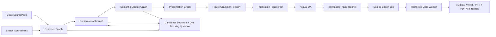

# 通用神经网络顶刊绘图 Agent：完整设计

## 1. 决策摘要

本项目的目标不是“能够绘制 VGG16 的 Visio 工具”，而是一个通用神经网络绘图 Agent：用户上传代码或草图后，Agent 先可靠地理解网络结构，再以可追溯、可展开、可编辑的方式拆分或合并网络模块，选择适合该结构的论文图视觉语法，最后在 Microsoft Visio 中生成可编辑、可保存、可重开和可原生回读的图。

VGG16、ResNet-50、U-Net 和 ViT 是首批黄金验收样例，不是模板名，也不是系统通过模型名称进行绘图的依据。所有绘制均由结构语义驱动；没有见过的模型必须依据其可证明的拓扑、端口和张量语义选择图语法，或回退到专业的通用模块 DAG，而不能伪造某个已知模型的结构。

系统采用以下总链路：

```text
代码 / 草图
  -> Source Evidence
  -> Evidence Graph
  -> Computational Graph
  -> Semantic Module Graph
  -> Presentation Graph
  -> Publication Figure Plan
  -> Visual QA + immutable PlanSnapshot
  -> sealed export job
  -> restricted Visio Worker
  -> editable VSDX + PNG/PDF + native readback
```

## 2. 产品目标与成功标准

### 2.1 用户目标

用户能够在一个紧凑的 Agent 工作流中：

1. 上传 PyTorch 代码或神经网络草图；
2. 查看 Agent 提取到的网络结构、证据和不确定性；
3. 要求“总览”“展开某个模块”“合并重复层”“显示 Skip Connection”等展示层变化；
4. 获得接近顶刊论文表达的预览；
5. 将经过确认的预览输出为原生可编辑的 Visio 文档；
6. 在同一 Visio 画布上局部修订，不不断新开文档。

### 2.2 完成定义

对于每个黄金样例，以下门必须全部通过后才能称为该样例完成：

1. 输入可产生可追溯的 Evidence Graph；
2. Architecture IR 具有有效端口、拓扑、张量语义和不确定性状态；
3. Semantic Module Graph 可展示拆分、合并、折叠和展开；
4. Figure Grammar Selector 不依赖模型名称即可选择正确语法或专业通用回退；
5. Figure Plan 通过语义、版式、印刷、灰度和证据 QA；
6. 预览与导出使用同一个不可变 PlanSnapshot；
7. Visio 输出为原生 Shape，保存、关闭、重开后仍可编辑并通过独立 readback；
8. 人工审查截图确认其网络叙事、层级、投影、标签、连接和留白符合目标图语法。

测试、TypeScript 编译、Figure Plan 验证和 VSDX readback 均是必要条件，但任何一个都不能单独替代人工视觉审查。

## 3. 当前架构审计

### 3.1 已有可复用底座

当前商业 worktree 已具备以下基础：

- `Architecture IR v3`：包含 typed ports、tensor representation、modules、repeat、merge、attention、evidence 和 unresolved；
- `Figure Component Graph`：包含 terminal、operator、merge、attention、repeat 等通用组件；
- `Composable DAG Figure Compiler`：可生成稳定的通用 DAG 布局和路由；
- `Composable Visual QA`：可校验边界、碰撞、端口、路由、对比度、灰度、文本和证据来源；
- `UniversalPreviewService`：区分 candidate structure 和 full preview；
- 受限 Visio Worker：拥有原生 Shape 绘制、会话所有权、保存/重开/readback 和恢复边界；
- VGG16 Agent-to-Visio 试验桥：证明真实 Agent 可调用 Worker 创建可编辑 VSDX。

### 3.2 当前缺口

以下能力尚未组成可交付产品，必须正视：

- 静态 PyTorch 分析仅支持可证明的线性 `forward` 链；branch、Add、Concat、skip、模块复用、动态控制流、复杂 shape 和草图尚未进入正式通用输入路径；
- 通用 DAG Compiler 目前主要是通用组件布局，并非 CNN、Residual、U-Net、Transformer 等论文视觉语法库；
- VGG16 到 Visio 的现有桥含 canonical VGG16 限制，不能成为 universal export；
- Figure Plan、PlanSnapshot、preview、export job 和 Worker 的通用 v3 路线尚未完成正式产品装配；
- 当前视觉 QA 尚未验证各图语法特有的语义关系，例如 feature map 的空间尺度、U-Net skip 对称性、QKV 端口、残差 Add 的来源；
- 草图输入没有正式的图元识别、箭头解析、OCR 证据、候选结构与用户确认链路。

### 3.3 迁移结论

VGG 专用 Figure Plan 和 bridge 必须降级为兼容/验收夹具：

- 可以复用其中经过验证的 Worker 会话、原生 Shape、保存、重开、readback 和 UTF-8 进程边界；
- 不可继续增加 VGG 节点名称、固定坐标或模型专用分支；
- 所有新的图形能力必须先进入通用 Figure Grammar Registry，再以 VGG16 作为 CNN grammar 的测试样例；
- 通用 v3 路线必须保持与 legacy v2 显式隔离，直到迁移验收完成。

## 4. 总体架构与信任边界



### 4.1 信任规则

| 边界 | 可接受输入 | 可输出 | 禁止行为 |
|---|---|---|---|
| Source Adapter | 有尺寸、类型、owner、hash 约束的 SourcePack | Evidence、unresolved、候选观察 | 执行用户代码、加载权重、联网、直接产生 Visio 命令 |
| Evidence/IR | 证据和用户确认 | 可验证图与不确定性 | 根据模型名称或视觉相似性猜测关键结构 |
| Semantic Normalizer | 有效 Computational Graph | Module Graph、折叠/展开映射 | 丢失原始节点、边或证据来源 |
| Grammar Compiler | render-ready Module/Presentation Graph | 受限 Figure Plan | 自由坐标、任意 SVG、脚本、COM 调用 |
| Browser | 安全公开 DTO、预览、确认 token | 用户修订意图 | 直接控制 Worker、指定路径、提交原始 Figure Plan |
| Worker | sealed plan、owner/device/job binding | VSDX/PNG/PDF/readback | 接收 LLM 文本、草图、代码、浏览器坐标或任意路径 |

### 4.2 结构状态机

```text
received
  -> analyzed
  -> candidate_structure | ready_for_normalization
candidate_structure
  -> needs_clarification
  -> ready_for_normalization (after user answer)
ready_for_normalization
  -> ready_for_preview
ready_for_preview
  -> snapshot_ready
snapshot_ready
  -> export_authorized
export_authorized
  -> exported | export_failed
```

任意 `blocking unresolved` 都只能进入 `candidate_structure` 或 `needs_clarification`，不能创建 PlanSnapshot，也不能导出 Visio。

## 5. 数据模型

系统使用四层图模型，每一层都有单一职责，且从后向前可追溯。

### 5.1 Evidence Graph

Evidence Graph 保存“为什么 Agent 相信这个结构”。每条事实至少包含：

```text
factId
sourceId
sourceHash
sourceKind = code | sketch | user_confirmation
locator = line/range | image region | OCR box | user response
observation
confidence
conflicts
```

代码事实包括声明、forward 调用、赋值、返回、模块参数和数据流；草图事实包括框、箭头、文本、尺寸、分区、颜色图例和 OCR 结果。Evidence Graph 不直接包含绘图坐标。

### 5.2 Computational Graph

Computational Graph 是尽可能无损的计算拓扑：

```text
nodes: atomic operators/modules
ports: typed inputs/outputs
edges: data | condition | feedback
tensors: representation, axes, symbolic dimensions
modules: source-level ownership hierarchy
evidenceIds: every fact's provenance
unresolved: blocking or warning questions
```

原子图必须区分下列语义，不能都变成普通 box：

- `add` 与 `concat`；
- `self-attention` 与 `cross-attention`；
- `data`、`skip`、`condition`、`mask`、`query`、`key`、`value`；
- spatial feature map、vector、token sequence、node feature、state；
- 已证明 shape、未知 shape 和不兼容 shape。

### 5.3 Semantic Module Graph

Semantic Module Graph 是对原始图进行可逆归纳后的结构图。每个 module 必须保留：

```text
moduleId
semanticRole
memberNodeIds
interfacePorts
parentModuleId
repeatSemantic
collapsePolicy
evidenceIds
```

#### 5.3.1 合并规则

| 规则 | 前提 | 合并结果 |
|---|---|---|
| Conv Block | Conv 后接可证明的 Norm/Activation 且无外部分叉 | `conv_block` |
| Repeated Block | 同构子图串联，参数/证据满足重复模式 | `repeat_block × N` |
| Residual Block | 主路径与 shortcut 在 Add 汇合且 shape 兼容 | `residual_block` |
| Dense/Fusion Block | 多路特征在 Concat、gated sum 或 attention 融合 | `fusion_block` |
| Encoder/Decoder Stage | 下采样或上采样层级及跨层连接可证明 | `encoder_stage` / `decoder_stage` |
| Transformer Block | Attention、residual、norm、MLP 顺序可证明 | `transformer_block × N` |
| QKV Unit | query/key/value 端口和 attention 汇聚可证明 | `qkv_attention` |

合并只改变 Presentation 的默认粒度，不删除原始计算节点。

#### 5.3.1.1 归纳冲突与确定性规则

Semantic Normalizer 必须是确定性的，不能因遍历顺序或模型名称而产生不同模块图。每次 normalize 必须按以下合同执行：

1. 规则仅能匹配其成员节点组成的连通子图；所有跨出子图的边都必须显式成为 module interface port；
2. 同一原子节点在同一 Presentation revision 中只能属于一个已折叠 module；任何候选规则重叠时，先应用语义更强且边界更完整的规则，例如 `residual_block` 优先于其内部的 `conv_block`；
3. 同一优先级的多个候选按稳定的 canonical node/edge ID 顺序比较。只有参数、端口、拓扑和 evidence 均等价时才可归纳为 `repeat_block × N`；
4. 无法证明的重叠、外部分叉、shape 不兼容或 evidence 冲突必须保留原子节点并产出 unresolved，而不是选择视觉上“更像”的模块；
5. 每个 transform 都必须记录 `ruleId`、`ruleVersion`、member/interface IDs、输入 graph hash 和输出 graph hash，使 collapse/expand 可以重放和审计。

这些规则保证同一输入、同一版本和同一用户意图始终产生同一 Module/Presentation Graph，并使后续 diff、Snapshot 与 Visio 局部更新具有稳定身份。

#### 5.3.2 拆分与展开规则

用户可以对任意 module 请求：

- `overview`：只显示顶层 stage/module；
- `module_detail`：展开某个 module 的接口和成员模块；
- `operator_detail`：展开原子算子；
- `collapse_repeat`：显示 `×N`；
- `expand_repeat`：显示首尾或完整重复单元。

每次变换必须产出新的 Presentation Graph revision，并通过 `sourceComponentId -> moduleId -> memberNodeIds -> evidenceIds` 反查原始结构。

### 5.4 Presentation Graph

Presentation Graph 不是计算图副本，而是某一用户意图和细节级别下的可视模块图：

```text
presentationId
detailLevel
components
semantic ports
connections
source mappings
grammar candidates
layout constraints
annotations
```

它是 Figure Grammar Selector 的唯一输入。不同展示层可以对应同一 Computational Graph，例如总览、方法图、模块细节图和 Visio 文档图。

### 5.5 Publication Figure Plan

Figure Plan 是 renderer 可接受的唯一绘图合同：

```text
planVersion
grammarId / grammarVersion
coordinateSpace
semantic regions
allowed primitive groups
ports and connector routes
label and annotation tracks
style tokens
source mappings
visual QA report
planHash
```

模型、Provider、草图识别器和浏览器均不能直接生成 primitive 坐标或 Visio COM 调用。

## 6. 代码输入设计

### 6.1 安全原则

代码分析绝不执行、导入、实例化或联网访问用户 Python。它使用静态 AST、受限符号表和数据流分析，并对每条结构事实生成 code evidence。

### 6.2 支持层级

| 层级 | 范围 | 输出状态 |
|---|---|---|
| C0 | 线性 Module/forward 链 | ready 或 candidate |
| C1 | `nn.Sequential`、常见 Conv/Norm/Activation/Pool/Linear/Flatten | ready 或 candidate |
| C2 | Add、Concat、Split、Skip、分支和模块复用 | ready 或 candidate |
| C3 | Encoder/Decoder、Upsample、FPN、Residual/Dense blocks | ready 或 candidate |
| C4 | QKV、Attention、Transformer blocks、token 流 | ready 或 candidate |
| C5 | 动态控制流、未知 call、反射、动态 shape | candidate structure；必须澄清，不执行 |

### 6.3 不确定性处理

当代码存在复杂动态行为时，Agent 必须：

1. 保留已证明的上游/下游结构；
2. 将未知部分建模为 `custom_module` 或 `dynamic_branch`；
3. 标记其 source evidence；
4. 提出一个优先级最高、可回答的 blocking question；
5. 禁止将候选结构送入正式 Figure Plan/Visio export。

## 7. 草图输入设计

### 7.1 草图不是图片贴图

草图输入必须被重建为结构和原生 Visio Shape，不允许将原图片作为最终网络图嵌入。

### 7.2 Sketch Evidence Adapter

草图适配器至少提取：

- module rectangle、tensor plate、circle、merge symbol 等候选图元；
- arrow head、线段、分叉、汇聚、crossing；
- OCR 文本、重复次数、张量尺寸、操作名；
- page region、stage heading、legend；
- 每个观察的图像区域、置信度和冲突。

### 7.3 草图确认流程

如果箭头方向、Add/Concat 语义、尺寸或模块名称不明确：

```text
sketch evidence
  -> candidate structure preview
  -> dashed candidate region + one question
  -> user answer
  -> updated Evidence Graph and IR revision
  -> formal publication preview
```

候选区域在 Visio 中使用明确的待确认样式；确认后只更新该区域，不重新打开新的画布。

## 8. Figure Grammar Registry

顶刊论文图不存在一种通用外观。系统必须维护可版本化 Grammar Registry，每个 grammar 包含：

```text
grammarId
semantic applicability predicate
supported detail levels
allowed primitives
layout constraints
label policy
style token set
semantic QA rules
fallback policy
gold fixtures
```

### 8.1 首批 Grammar

#### G1: CNN Tensor Plate

适用：连续 CNN 主干、空间分辨率逐层变化、通道变化、分类 head。

- primitive：input tile、feature-map slab stack、downsample frustum、flatten ribbon、vector/dense layer、score/output layer；
- 规则：所有 tensor slab 使用统一投影，空间尺寸单调映射，pool 是两个 stage 的几何关系，不是独立方块；
- 样例：VGG16、AlexNet、简单 CNN。

#### G2: Residual Backbone

适用：主路径与 Add shortcut，重复 residual stage。

- primitive：CNN slab、residual arc、projection shortcut、Add merge、repeat badge；
- 规则：每个 shortcut 必须可追溯到 Add 的两个输入端口，跨 stage projection 必须可见；
- 样例：ResNet-18/50、WideResNet。

#### G3: Encoder–Decoder

适用：下采样、bottleneck、上采样、跨层 skip/concat。

- primitive：encoder stage、decoder stage、down/up transition、skip bridge、concat/fusion node、prediction head；
- 规则：层级对应关系、skip source/target 和 concat/add 语义必须明确；
- 样例：U-Net、FPN、SegNet。

#### G4: Transformer / ViT

适用：Patch/Token、QKV、self/cross attention、MLP、Norm、Residual、repeat。

- primitive：patch/token sequence、Q/K/V fork、attention unit、residual merge、encoder/decoder repeat stack；
- 规则：QKV 端口语义不能退化成三条普通线，token 流与 spatial feature map 必须使用不同表示；
- 样例：ViT、Transformer Encoder、cross-attention fusion。

#### G5: General Provenance DAG

适用：任何没有足够语义证据匹配专用 grammar 的图。

- primitive：module panel、typed port、merge/split、hierarchical region、candidate region；
- 规则：保持专业分层、证据可追溯、候选明确，但不伪称为某种已知论文结构；
- 样例：未知自定义模型、混合模型、候选结构。

G5 在首版只接受无 feedback 的有向无环 Presentation Graph。包含 recurrent state、feedback 或无法消解的循环的结构必须保持 `candidate_structure`，不能绕过现有 DAG 编译器的 cycle/feedback 拒绝规则。状态空间与循环网络将在独立的 State/Recurrence grammar、端口语义和 QA 通过后再成为 render-ready 输入。

### 8.2 后续 Grammar

GNN、检测/多尺度 head、多模态双塔、扩散过程、递归/状态空间模型应在前五类稳定后分别开发，并各自拥有黄金样例和视觉 QA。

## 9. 布局与顶刊视觉规则

### 9.1 统一规则

- 结构优先于装饰：读者必须先看到输入、主路径、分支/融合和输出；
- 一个图只使用一个明确的视觉坐标系统和投影系统；
- 主数据流比残差、辅助路径和注释更明显；
- 同一语义使用同一图形和颜色，不同语义必须可通过形状、线型或灰度区分；
- 文本位于 annotation track，连接线不可穿越文本；
- 颜色低饱和、可打印，并提供灰度区分；
- 任何模块的尺寸、深度、重复标记都必须来自结构语义，不能由随机视觉偏好决定；
- 图元、标签、连线和图例必须使用最少而足够的信息密度。

### 9.2 版式求解

布局系统按 grammar 使用约束求解，而不是统一 `cursorX + gap`：

```text
Topology rank constraints
+ semantic stage constraints
+ grammar-specific alignment/symmetry constraints
+ label and connector clearance
+ page aspect / print margin constraints
= deterministic Figure Plan geometry
```

例如：CNN 以 stage anchor 约束 pool；U-Net 以 encoder/decoder 对称约束 skip；Transformer 以 QKV fork、attention merge、repeat stack 约束。

## 10. Visual QA 与人工验收

### 10.1 基础 QA

- IR、端口、拓扑、shape compatibility 和 evidence reference；
- 页面边界、边距、组件/标签碰撞；
- 连线端点、穿越组件、穿越标签和路由异常；
- 字体尺寸、对比度、灰度 signature、线宽；
- deterministic output 和 source mapping。

### 10.2 Grammar-specific QA

| Grammar | 必须额外验证 |
|---|---|
| CNN | spatial size 单调性、tensor projection 一致性、pool 两端归属、classifier 收束 |
| Residual | Add 输入来源、shortcut 路由、stage projection 语义 |
| U-Net | encoder/decoder 层级对齐、skip source/target、Concat/Add 类型 |
| Transformer | Q/K/V 端口、attention type、residual/Norm/MLP 顺序、token representation |
| General DAG | candidate watermark、unknown component、证据可追溯、无专用 grammar 伪装 |

### 10.3 人工视觉门

每个黄金样例都要保留 PNG 或 Visio 截图，并检查：

1. 两到三秒内能否理解总体结构；
2. 是否一眼看出主路径、分支和输出；
3. tensor/sequence/graph 表示是否符合对应 grammar；
4. 是否存在矩形回退、投影不一致、孤立 pool、连线穿字、乱码、过密标签；
5. 是否可作为论文方法图或架构总览图继续编辑。

## 11. Visio 输出架构

### 11.1 Renderer 边界

Visio Worker 只消费 sealed Publication Figure Plan，不消费：

- 原始代码、草图、Provider 文本；
- 浏览器传入的 COM 参数、任意坐标、路径、session id；
- 未通过 QA 或未绑定 Snapshot 的图。

### 11.2 原生 Shape 要求

所有输出均为原生 Visio Shape：

- rectangle、freeform polygon、line/connector、text、group、shape data；
- 每个 primitive 带 `planId`、`componentId`、`source mapping` 和 `primitiveId`；
- 禁止以 PNG/SVG 截图取代可编辑网络结构；
- 所有 JSON Lines 输入输出必须为 UTF-8。

### 11.3 生命周期

```text
open/apply
  -> save checkpoint
  -> applyDiff on same identity and same page
  -> native readback
  -> explicit close(save | discard)
```

用户局部修改或 Agent revision 只能对同一个 owner/device/workflow 的画布执行 `applyDiff`，不能每一次操作都打开新的 Visio 画布。

### 11.4 稳定会话、恢复与并发合同

“不反复新开画布”不能只依赖 UI 约定，必须成为 Worker 协议可验证的状态机。每个活跃 Visio 会话都绑定：

```text
ownerId + deviceId + workflowId + document identity + page identity
+ plan schema/version + latest checkpoint + readback revision
```

- 同一个绑定在任一时刻只有一个串行的 Worker actor 可以执行 `apply`、`applyDiff`、`save` 或 `close`；并发请求按 revision 比较，陈旧请求必须拒绝，不能覆盖更新后的图。
- 每个导出或修订命令必须携带 `jobId`、`idempotencyKey`、`PlanSnapshot hash` 与期望的 readback revision。重复提交只能返回同一个已知结果，绝不能再次创建文档或重复添加 Shape。
- `apply` 成功的定义是：原生 Shape 写入、checkpoint 保存、native readback 与 sealed plan 对账均成功；仅 COM 调用返回成功不构成成功。
- Worker 在每个状态转换后写入不包含原始代码/草图的 recovery manifest。进程、Visio 或网络中断后，只能根据 manifest、文档身份、page identity、checkpoint 和 readback hash 恢复；任一项不一致时进入 `recovery_required`，由用户明确选择重新打开、恢复或放弃，禁止猜测性续画。
- 取消、超时、进程崩溃、文件锁、保存失败和协议版本不兼容都必须以稳定的 machine-readable error code 返回，并保留最后一个可读 checkpoint；它们不能静默降级为 PNG、截图或新的空白文档。
- sealed plan 与 Worker 之间必须进行 `planSchemaVersion`/`rendererVersion` 能力协商。未知 grammar primitive 或不兼容的协议版本必须 fail closed，不能忽略字段后继续绘制。

系统记录最小化运行审计：snapshot/job/worker version、状态转换、耗时、错误码、文档和 readback hash。审计记录不保存原始 SourcePack、Provider 凭证、绝对路径或 COM 原始异常文本。

## 12. API、权限与持久化

### 12.1 SourcePack

每个输入均封装为不可变 SourcePack：

```text
sourceId
ownerId
deviceId
contentType
sourceKind
byteCount
sha256
retentionClass
createdAt
```

代码和草图内容不进入公开 DTO、普通审计日志或 Visio Worker。

### 12.2 公开结果

公开 API 只返回经白名单投影后的：

- 状态；
- 有界证据摘要；
- 安全的 IR/Presentation Graph；
- 一个 blocking question；
- warning；
- preview/snapshot/export 的安全标识。

内部 Evidence Graph、源文件、绝对路径、Worker session、Provider 凭证和未投影诊断不得返回浏览器。

### 12.3 Snapshot 与导出绑定

PlanSnapshot 包含：

```text
planId
planHash
source hashes
IR hash
module graph hash
grammar id/version
visual QA report hash
preview artifact hashes
draft revision
owner/device binding
```

任何 IR、语法、视觉、源输入或确认答案变化都必须生成新 revision 和新 snapshot。导出绝不重新编译未确认的草稿。

### 12.4 命令与审计数据边界

公开 API 使用显式 command DTO，而不是将客户端对象透传给 Worker。每个 command 至少包含已认证的 owner/device、resource identity、expected revision、idempotency key 和允许的用户意图；服务端从受控存储中解析 PlanSnapshot 与 sealed export job。浏览器不能提交 primitive、坐标、路径、Worker 选择、恢复 manifest 或任意版本号。

审计查询只面向授权的 owner 或管理员角色，并返回经过白名单投影的状态、时间、错误码和 artifact hash。原始 SourcePack 的保留与删除遵从 `retentionClass`；删除源内容后，仍可保留不可逆 hash 和最小合规审计，但不能再从审计内容恢复代码或草图。

## 13. 黄金样例与测试矩阵

### 13.1 首批样例

| 样例 | 主要覆盖 | 必须验收 |
|---|---|---|
| VGG16 | CNN Tensor Plate、stage/repeat/pool/classifier | tensor scale、收缩、Unicode labels、Visio editability |
| ResNet-50 | residual、Add、stage projection | shortcut 语义、Add 输入、主干可读性 |
| U-Net | encoder/decoder、long skip、concat | 对称性、skip、fusion、分割 head |
| ViT | patch/token、QKV、attention、repeat | QKV、token 流、encoder stack |
| Unknown custom CNN | 未见模型和 candidate fallback | 无模型名依赖、候选问题、general DAG |
| Ambiguous sketch | 草图证据和用户确认 | 区域证据、候选样式、局部 revision |

### 13.2 每个样例的资产

每个黄金样例必须拥有以下分层资产：

- canonical Computational Graph fixture，以及 expected Module/Presentation Graph；这套 fixture 在 Phase A 就用于验证通用语义，不能依赖尚未实现的代码输入适配器；
- selected grammar 与选择理由；
- expected Figure Plan invariants；
- visual QA report；
- expected native readback；
- 人工审查截图与结论。

当某个输入适配器达到相应支持层级后，该样例还必须增加原始 SourcePack fixture、expected Evidence Graph 摘要和端到端 SourcePack-to-IR 断言。换言之，ResNet-50、U-Net、ViT 可以先作为 Phase A/B 的 canonical IR fixture；只有在 Phase E 支持其实际代码结构后，才能声称该代码输入已端到端支持。

## 14. 分阶段实现顺序

### Gate 0：现有预览的不可变绑定（M2.5）

当前路线图的可执行前置项是 M2.5。它不新增 VGG 特例、图语法或草图识别，而是将已通过 QA 的预览与不可变 PlanSnapshot 绑定：

1. snapshot identity 覆盖 IR、意图、manifest、grammar/version、QA 和预览 artifact hash；
2. candidate structure、未确认结构和 QA 失败图绝不创建 snapshot/export；
3. 所有 preview/export DTO 都使用白名单投影，并在视觉或结构 revision 变化时失效；
4. 为后续 Semantic Module Graph 预留 module/presentation graph hash，不允许导出路径重新编译草稿。

M2.5 接受后，下面的通用能力才可以接入这条稳定的 preview-to-export 链路。

### Phase A：通用语义核心

1. 完成 `Semantic Module Graph` 合同；
2. 实现可逆 normalize、collapse、expand、merge/split 变换；
3. 支持 Conv Block、Repeat、Residual、Fusion、Encoder/Decoder、Attention；
4. 为四个黄金样例写结构 fixture 和 failing tests。

### Phase B：Figure Grammar Registry

1. 定义 grammar registry、applicability predicate、fallback policy；
2. 实现 CNN、Residual、Encoder–Decoder、Transformer、General DAG 五类 grammar；
3. 将现有 Composable DAG Compiler 拆为通用拓扑/路由核心和 grammar compiler；
4. 扩展 grammar-specific visual QA。

### Phase C：统一 Preview 和 Snapshot

1. 将 Module/Presentation Graph 接入 UniversalPreviewService；
2. 将 Gate 0 已接受的 PlanSnapshot 合同扩展为覆盖 module/presentation graph hash，而不是重新定义或绕过 M2.5；
3. 确保 candidate structure 永不创建 snapshot/export；
4. 用黄金样例验证 preview 与 snapshot 等价。

### Phase D：通用 Visio Renderer

1. 定义 Worker 可接受的通用 Publication Figure Plan 投影；
2. 实现 grammar primitive 到 native Visio Shape 的 renderer；
3. 按 11.4 实现单 actor 会话、幂等命令、checkpoint/recovery、版本协商和可审计错误；
4. 复用现有 session、save/reopen/readback，并验证同画布 `applyDiff`；
5. 完成真实 Windows/Visio 的 VGG16、ResNet、U-Net、ViT 验收。

### Phase E：输入扩展

1. 将 PyTorch 支持从线性链扩展到分支、merge、reuse、attention；
2. 接入草图 Evidence Adapter 与候选确认流程；
3. 后续增加 Keras、ONNX、GNN、检测、多模态和生成模型。

## 15. 明确非目标

- 不执行、导入或运行用户模型；
- 不根据模型名称、未验证 Provider 文本或图像相似性猜测关键拓扑；
- 不让 LLM 直接控制 Visio COM、路径、会话或任意图形坐标；
- 不把草图或截图直接作为最终 VSDX 图；
- 不以单一 VGG 风格覆盖所有网络家族；
- 不把局部单元测试、mock 结果或单次成功导出称为通用产品完成；
- 不在通用 Figure Plan、PlanSnapshot 和真实 host acceptance 前扩展计费、商业策略或无关功能。

## 16. 本设计的下一步

本设计确认后，第一份实施计划先完成当前路线图的 Gate 0 / M2.5：不可变 PlanSnapshot 与 preview-to-export 绑定；它不修改 Visio renderer，也不开始草图 OCR。

Gate 0 独立审查并接受后，第二份实施计划只覆盖 Phase A：`Semantic Module Graph`、可逆拆分/合并、四类黄金 IR fixture 和 candidate/unresolved 行为。

完成 Phase A 的独立审查后，才进入 Phase B 的 Figure Grammar Registry。这样可以确保“理解网络”和“画得专业”分别被验证，而不会再次把 VGG 专用坐标或临时视觉补丁误当成通用 Agent 能力。

用户接受本设计和对应设计日志后，必须在一次仅包含文档/路线图元数据的窄提交中，将 `docs/agent-program-state.json` 的 `program.architectureSpec` 指向本规格；在此之前，旧的 architectureSpec 仍是路线图记录的正式引用，不能把本文件误报为已接受实现合同。
