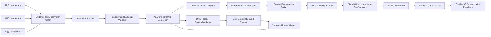

# 自适应通用神经网络绘图 Agent：重新设计

**状态：** 设计草案，等待用户审核后才进入实施计划。
**取代：** `2026-08-19-universal-neural-figure-agent-design.md` 中“网络家族 Grammar 决定能否绘制”的路线。
**不取代：** 证据追溯、不可变 Snapshot、密封导出、Worker 最小权限、同画布更新、原生 Shape/readback 等安全与稳定性边界。

## 1. 设计目标

本产品的首要目标是：**用户给出一个此前从未见过的神经网络的提示、代码或草图后，Agent 无需人工为该模型编写模板或学习其模型名，就能直接生成结构正确、专业可读、可编辑的 Visio 图。**

“学习新网络”在本设计中不是把每个模型名称加入白名单，而是：

```text
理解新的结构组合
→ 复用已知的局部视觉思想
→ 对未知模块生成安全的通用表达
→ 从确认结果形成可复用模式
```

### 1.1 产品成功标准

产品必须同时达成以下目标：

1. **零模板直绘：** 任意拓扑明确的未知网络都能生成 General Publication Graph；不存在“没有对应模型 Grammar 所以不能画”的分支。
2. **多输入一致性：** 自然语言提示、代码和草图都收敛到同一份 `UniversalGraphSpec`，而不是三套互不兼容的绘图器。
3. **未知模块可表达：** 未见过的函数、层或子网络必须作为 `CustomOperator`/`CustomModule` 可视化，保留原始名称、接口、证据和不确定性；未知名称不阻断绘图。
4. **仅对未知拓扑追问：** 箭头、分支、合并或运行时控制流不明确时，Agent 只标记受影响局部并提出一个最高优先级问题；已明确部分立即可画。
5. **论文级默认质量：** 通用输出也必须有一致的视觉层级、布局、端口、连线、标签、重复表达、灰度可读性和留白；顶刊感不是模型白名单的副产品。
6. **受控持续学习：** 新组合先形成 owner-scoped `PatternCandidate`；只有经过确认、测试和审查的模式才提升为共享 `PatternLibrary`，不会被一次错误输入污染。
7. **稳定可编辑 Visio：** 图由原生 Shape 构成，使用同一个文档/页面会话进行局部 `applyDiff`，并完成保存、关闭、重开和独立 readback。

### 1.2 非目标

- 不执行、导入、实例化或联网运行用户代码；
- 不要求先识别模型名称才允许绘制；
- 不把用户草图或参考图作为最终 VSDX 的图片贴图；
- 不让 LLM、浏览器、原始代码或草图直接提交 Visio COM 指令、任意路径或自由坐标；
- 不在未确认的局部模式上自动修改全局共享知识库；
- 不承诺从无法静态确定的动态运行时逻辑中猜出真实拓扑。

## 2. 核心决策：绘制资格与视觉增强解耦

旧设计的问题是把“识别出 CNN/Residual/U-Net/Transformer 等家族”与“能否生成专业图”耦合。新设计明确分成两层：

```text
任意有效 UniversalGraphSpec
→ Universal Visual Composer
→ 一定生成 General Publication Graph

可识别局部模式
→ Adaptive Pattern Library / Presentation Profile
→ 在不改变结构的前提下增强表达
```

因此：

- `CNN Tensor Plate`、`Residual`、`Encoder–Decoder`、`Transformer` 变成**可选视觉策略**，不是支持清单；
- 未知整网可以由已知局部模式和 `CustomOperator` 组成；
- 未匹配任何高级模式时，仍输出专业的通用模块图；
- 新模式的产生不要求新增模型专用 TypeScript、C# 或 Visio 模板代码，而是在受限的 Pattern DSL 内生成候选组合。

## 3. 目标架构



### 3.1 组件职责

| 组件 | 单一职责 | 不能做什么 |
|---|---|---|
| Input Adapter | 从提示、代码或草图提取观察、证据和局部图事实 | 直接绘制或控制 Visio |
| Evidence Graph | 记录结构为何可信、来自哪里、哪里冲突 | 存储页面坐标或任意 COM 参数 |
| UniversalGraphSpec | 表达任意网络的节点、端口、边、层级、证据和不确定性 | 强迫每个节点归入已知模型家族 |
| Adaptive Semantic Composer | 发现局部模式、重复、分支和候选模块；保持未知模块 | 因为名称未知而删除或拒绝结构 |
| Universal Visual Composer | 使用通用视觉原语和布局约束把任何有效图变成专业图 | 根据模型名称套固定画布 |
| Presentation Profile | 对 tensor、token、residual、encoder/decoder 等特征做可选增强 | 决定图是否可以生成 |
| Pattern Library | 存储已验证的结构模式和声明式视觉配方 | 存储任意用户代码、路径、凭证或未审查 LLM 输出 |
| Visio Worker | 将 sealed plan 映射为原生 Shape 并回读 | 接收原始输入、自由坐标或浏览器命令 |

## 4. UniversalGraphSpec：任何新网络的共同语言

`UniversalGraphSpec`（UGS）是新的通用绘图合同。它不是“模型 IR 的简化版”，而是能够保留未知结构、未知算子和用户声明的有证据图。

### 4.1 最小数据模型

```text
graphId
revision
sourceIds / sourceHashes
nodes[]
ports[]
edges[]
groups[]
evidence[]
topologyConfidence
unresolved[]
```

每个节点至少包含：

```text
nodeId
kind = input | output | operator | custom_operator | container | state
label
semanticHints[]
inputPorts[] / outputPorts[]
attributes[]
shapeClaim = proven | symbolic | unknown
operationKnowledge = known | inferred | custom
evidenceIds[]
```

每条边至少包含：

```text
edgeId
sourcePort / targetPort
relation = data | skip | merge | condition | feedback | candidate
knowledge = proven | declared | candidate
evidenceIds[]
```

`declared` 表示用户在提示或确认中明确给出的结构；它与代码静态证明同样可以支持绘制。`candidate` 只能进入候选预览，不能进入不可变 Snapshot 或正式导出。

### 4.2 未知模块处理规则

下表是通用能力的核心合同：

| 情况 | UGS 表达 | 是否可直接绘制 |
|---|---|---:|
| 模块名未知但输入/输出明确 | `custom_operator` | 是 |
| 多路汇聚但名称未知 | `custom_operator` 或 `merge`，保留接口 | 是 |
| 参数或 shape 未知 | 节点保留，`shapeClaim=unknown` | 是 |
| 模块内部未知但外部端口明确 | 可折叠 `CustomModule` | 是 |
| 分支/箭头方向不明确 | `candidate` edge/region | 仅候选局部 |
| 动态控制流会改变拓扑 | `dynamic_region` + blocking unresolved | 仅已证明部分 |

**未知名称不是失败条件；未知拓扑才是需要澄清的条件。**

### 4.3 细节层级

同一 UGS 可以生成多个视图，不需要重新理解模型：

- `overview`：输入、主要 stage、主分支、输出；
- `architecture`：模块、分支、merge、skip、repeat；
- `operator_detail`：原子算子和端口；
- `evidence_detail`：显示代码行、草图区域和确认来源。

所有视图通过稳定 ID 回溯：

```text
visual component
→ UGS node/group/edge
→ evidence IDs
→ SourcePack locator
```

## 5. 三类输入如何直接生成 UGS

### 5.1 自然语言提示

Prompt Adapter 允许用户直接描述新网络，例如：

```text
输入经过局部纹理分支和全局上下文分支；
两路执行双向交叉注意力融合；
随后经过残差细化三次并输出分割结果。
```

Adapter 生成 schema-validated UGS：双支路、cross-attention fusion、repeat×3、segmentation head。LLM 的输出只能是有界 GraphSpec DTO，必须经过：

1. schema、ID、端口、无重复边和图大小校验；
2. prompt 片段到每条声明边/节点的 evidence mapping；
3. topology completeness 检查；
4. 仅在影响连接关系的缺失处提出一个问题。

若提示的拓扑已经明确，系统直接生成 renderable preview draft；用户不需要先提供模型名称。该 draft 只有在 Visual QA 通过、不可变 PlanSnapshot 创建、owner/device 绑定和 export authorization 完成后，才具有导出资格。

### 5.2 代码

Code Adapter 永远不执行用户 Python。它通过 AST、赋值关系、函数/模块调用和可证明的数据流构建 UGS。

与旧的“只接受线性 `self.<module>(x)` 链”不同，目标解析规则是：

- 任意可证明调用都先映射为一般 `operator` 或 `custom_operator`；
- 未注册的 `self.foo(x)`、`foo(x, y)` 或 `module(x)` 不会被拒绝，而是保留调用名、实参端口、返回变量和证据；
- 分支、tuple/list、Add、Concat、可静态证明的有界重复、模块重用和常见 attention 形成显式边或 group；无法证明迭代次数或运行时路径的循环不得静态展开；
- 不能静态确认的动态区块隔离为 `dynamic_region`，不伪造边；
- 代码适配器的覆盖率提升只改善结构精度，不决定基础图是否能画。

### 5.3 草图

Sketch Adapter 将框、箭头、文字、重复标记、张量尺寸、图例和分区提取为 observations，再组成 UGS。草图不是最终图片资产。

框名陌生时绘制为 `CustomModule`；箭头清晰时直接绘制；只有箭头方向、汇聚类型或跨层目标不清晰时才显示虚线候选局部。用户确认后仅更新受影响 region，并在同一 Visio 页面应用 diff。

## 6. Adaptive Semantic Composer：从新网络中学习组合

### 6.1 不是“识别模型”，而是识别可组合结构

Composer 的输入是 UGS，不读取模型名作为决策依据。它执行：

1. **局部模式检测：** 识别 Conv-Norm-Activation、split、merge、skip、repeat、QKV、token sequence、多尺度等子图；
2. **新组合归纳：** 将端口明确但语义陌生的连通子图归为 `CustomModule` 或 `CustomFusion`；
3. **重复发现：** 以 canonical topology/port/attribute signature 发现同构重复区域；
4. **可逆视图生成：** collapse/expand 只改变展示粒度，不删除 UGS 节点、边或证据；
5. **候选模式创建：** 当新组合在结构和视觉上可复用时，生成受限的 `PatternCandidate`。

### 6.2 PatternCandidate 与 PatternLibrary

```text
PatternCandidate
  ownerId / scope
  structuralSignature
  interfaceSchema
  semanticHints
  allowed Visual Primitive recipe
  evidence and confirmation references
  confidence
  version
```

PatternCandidate 默认只对该 owner/project 可见。它可以改善下一张同类图的表达，但不能自动影响其他用户或共享库。

提升为 `PatternLibrary` 的条件：

1. 模式拓扑、端口和视觉配方均通过 schema/QA；
2. 至少有用户确认或独立人工审查；
3. 有正例、冲突例和未知边界 fixture；
4. 配方只引用受限 Visual Primitive DSL，不能携带代码、路径、COM 或自由脚本；
5. 通过版本化发布与回归测试。

这使 Agent 能不断学习新的神经网络组合，同时保持可解释、可回滚和不会全局污染。

PatternCandidate 生命周期固定为：

```text
draft
→ confirmed | rejected
confirmed
→ promoted | deprecated
promoted
→ deprecated | superseded
```

每次状态变化必须记录 actor role、来源类型、理由、关联 UGS/Snapshot hash、审查结果和时间；拒绝的候选保留最小化摘要用于避免重复误判，但不能参与后续自动绘制。共享 Pattern 的升级、废弃或替代必须创建新版本，已有 Figure Plan/Snapshot 继续引用其原始 pattern version，不能被静默重写。

### 6.3 确定性与冲突

同一 UGS、同一 PatternLibrary version、同一展示意图必须生成相同 Presentation Graph。规则：

- 节点在同一折叠视图中只能属于一个 module；
- 结构更完整的模式优先于其内部弱模式；
- 同级候选按 canonical node/edge ID 和稳定 structural signature 决定；
- 无法证明的重叠或冲突保留原子节点，而不是根据外观猜测；
- 每个 transform 记录输入 hash、输出 hash、pattern ID/version、成员和接口。

## 7. Universal Visual Composer：任何结构都能画

### 7.1 通用视觉原语

所有 General Publication Graph 均只能由以下受限原语组合：

```text
Input / Output
GenericModule / CustomOperator / StageContainer
TensorSlab / VectorStack / TokenSequence / GraphFeature
Split / MergeAdd / MergeConcat / CustomFusion
SkipConnector / FeedbackConnector / RepeatBadge
AnnotationTrack / Legend / CandidateRegion
```

未知模块默认使用 `CustomOperator` 或 `CustomModule`，带可编辑标签和端口；它不会退化成没有连线语义的普通矩形。

### 7.2 默认布局

Universal Visual Composer 使用结构约束而不是固定 `cursorX + gap`：

```text
topological rank
+ main-flow prominence
+ branch and merge alignment
+ port ordering
+ repeat grouping
+ label / connector clearance
+ page and print constraints
= deterministic general publication layout
```

即使没有命中任何高级模式，图仍必须具备：主路径、分支、汇聚、重复、输入输出和自定义模块的可读层级。

### 7.3 Presentation Profile 仅做增强

Profile 从 UGS/Presentation Graph 的局部特征中选择，不从模型名选择：

| 观察到的结构特征 | 可选增强 |
|---|---|
| spatial tensor 尺寸变化 | TensorSlab、frustum、尺度标注 |
| shortcut → Add | residual arc、`⊕` merge、projection 标记 |
| down/up stages + long skip | 对称层级、skip bridge、fusion 端口 |
| Q/K/V + token flow | sequence strip、QKV fork、attention merge |
| 多输入汇聚 | dual/multi lane、CustomFusion、接口标签 |
| 无已知特征 | 高质量 General Publication Graph |

Profile 失败、缺失或版本不支持时必须回退到 General Publication Graph，不能拒绝有效 UGS。

## 8. Visio 输出和长期稳定性

新的通用路径必须使用：

```text
UGS hash + Presentation Graph hash + Figure Plan hash
→ immutable PlanSnapshot
→ sealed export job
→ Worker-compatible DTO
→ native Visio Shape
```

`assertCanonicalVgg16` 仅可保留在 legacy VGG 验收夹具中，绝不能位于通用 export 路径。

Worker 维持以下不变边界：

- 只接受服务端构造并密封的 Plan DTO；
- 一个 owner/device/workflow/document/page 同一时刻只有一个串行 actor；
- `applyDiff` 使用稳定 primitive/component IDs 更新同一个页面，不反复新建画布；
- 每个命令包含 expected revision、idempotency key、snapshot hash；
- 成功需要 native readback 与 sealed plan 对账；
- checkpoint、recovery manifest、协议版本协商和稳定错误码必须存在；
- 未知 primitive 或不兼容版本 fail closed。

## 9. 质量与不确定性策略

### 9.1 三类不确定性

| 不确定性 | 示例 | 处理 |
|---|---|---|
| operation uncertainty | `spectral_mixer` 未见过 | 画 CustomOperator，不阻断 |
| shape uncertainty | 缺少 tensor 尺寸 | 省略或标 `unknown`，不伪造 |
| topology uncertainty | 条件分支、箭头方向不明 | 候选局部 + 一个澄清问题，阻断该局部导出 |

### 9.2 Visual QA

所有图都要验证：

- 每个可见端口都有合法来源/目标；
- 组件、标签、边界、连线不碰撞或穿字；
- 主流、skip、candidate 的线型/灰度层级一致；
- 自定义模块的接口、名称和证据映射存在；
- 输出对同一 snapshot 是确定的；
- 不存在模型名称、专用节点 ID 或固定坐标依赖；
- 生成的原生 Shape 能通过保存、重开和 independent readback。

顶刊质量还需要人工审查：读者能否在数秒内识别主路径、创新模块、融合/跳连和输出；陌生模块是否被诚实且清晰地表达。

## 10. 验收目标

系统不能以“已支持 VGG16/ResNet/U-Net/ViT”作为主要完成标准。首批验收必须是零模板案例：

| 案例 | 输入 | 必须证明 |
|---|---|---|
| Unknown dual-stream fusion | 未见模块名的代码 | 直接生成双支路、汇聚和 CustomFusion；无需新增 renderer 代码 |
| Prompt-only novel model | 新结构提示 | 生成 schema-valid UGS、专业预览和可编辑 VSDX |
| Unknown repeated block | 代码或提示 | 识别重复并支持 `×N`/展开 |
| Custom encoder-like graph | 新组合代码 | 使用通用 stage/skip/fusion 组件，不要求命中 U-Net 模型名 |
| Clear sketch with unknown labels | 草图 | 箭头正确、未知框作为 CustomModule、同页更新 |
| Ambiguous sketch | 模糊箭头/merge | 已知区域可绘制，候选局部只问一个问题 |
| Dynamic topology | 动态控制流代码 | 不执行代码，不伪造结构，不允许错误导出 |

每个零模板案例都必须具有：SourcePack 或 prompt fixture、expected UGS、expected Presentation Graph、Figure Plan invariants、Visual QA、native readback 和人工截图结论。

额外验收条件：在新增上述案例时，除 fixture 和声明式 PatternCandidate 外，**不允许因为模型名称新增专用 renderer 分支、固定节点 ID 或固定页面坐标。**

## 11. 实施路线

### 11.1 与正式路线图的映射

R0–R5 是本规格定义的能力轨道，不自动改变 `docs/agent-program-state.json` 中 M2/M3 的正式状态。当前唯一正式焦点仍是 M2.5；在实施前必须在一次经过审查的路线图迁移中，把每个 R gate 映射为现有节点的验收扩展或新增依赖节点。没有这次迁移时：

- R0 只能作为当前 VGG 夹具回归修复，不得声称已推进通用能力；
- R1/R3/R4/R5 只能作为已批准设计，不能标记为 active/accepted；
- M2.5 的 Snapshot 实现必须绑定通用 UGS/Presentation/Figure Plan，而不能固化 legacy VGG DTO；
- `agent-program-state.json`、Implementation Record 和 Design Baseline 必须同步说明映射状态。

这项规则消除“规格说先做 R1、状态页说做 M2.5”的双重事实源问题。

### Gate R0：恢复工程真相

先修复当前 `conv-1` publication group 回归，使 canonical VGG16 bridge、execution snapshot 和 export route 的 API 测试恢复；该步骤只恢复现有夹具，不扩展 VGG 特例。

### Gate R1：UniversalGraphSpec 与 General Publication Graph

1. 定义 UGS schema、Evidence mapping、`CustomOperator`、topology/operation/shape 不确定性；
2. 让现有 Architecture IR v3 可无损投影到 UGS；
3. 实现通用图布局、端口、分支、merge、repeat、skip 和 CustomModule；
4. 让任意 renderable UGS 都能产生 General Publication Graph。

### Gate R2：通用 Snapshot 和导出资格

将当前 M2.5 实现为 UGS/Presentation/Figure Plan 的不可变绑定。所有 export 都必须消费该 snapshot；candidate topology 永远没有 export 资格。

### Gate R3：Adaptive Pattern Library

1. 实现结构 signature、局部模式发现、PatternCandidate 与 owner scope；
2. 实现受限 Pattern DSL 和 deterministic conflict resolution；
3. 添加用户确认、人工审查、提升、版本回滚和回归 fixture；
4. 将 CNN、Residual、Encoder–Decoder、Token/Attention 等作为初始模式，不作为模型白名单。

### Gate R4：三类输入直绘

1. Prompt-to-UGS；
2. 通用静态 Code-to-UGS，先覆盖任意调用、分支和自定义模块，再逐步提高精度；
3. Sketch-to-UGS；
4. 用零模板案例验证未知网络首次输入即可得到图。

### Gate R5：通用 Visio 和真实主机验收

1. 用通用 Figure Plan 替代 VGG 专用 bridge 的公共路径；
2. 完成同页面 applyDiff、save/reopen/readback/recovery；
3. 在真实 Windows/Visio 上运行所有零模板案例；
4. 将 VGG16 降为 regression fixture，不再作为系统中心。

## 12. 迁移规则

- 保留现有 VGG bridge、Worker 会话与 UTF-8/readback/recovery 代码作为兼容夹具和可复用基础；
- 不再向 `assertCanonicalVgg16`、VGG 节点名称、固定 stage 或固定坐标添加功能；
- 现有 `Architecture IR v3`、Figure Component Graph 和 Visual QA 通过适配层迁移到 UGS，不做破坏性替换；
- 旧的 family Grammar 迁移为 PatternLibrary 的初始版本化模式；
- 在 R5 验收前，不能声称已经支持“任意代码/草图到 Visio”。

## 13. 本规格的完成定义

本规格本身在满足以下条件后可进入实施计划：

1. 用户确认“未知结构直绘 + 模式学习”的目标优先级；
2. 用户接受未知模块可直接绘制、未知拓扑才澄清的边界；
3. 用户接受 PatternCandidate 默认 owner-scoped、提升共享库需要审查；
4. 路线图和实现计划以 R0–R5 为顺序，停止把模型家族支持数量作为第一 KPI。

在此之前，本文件是当前架构草案，不等同于通用 Visio 功能已经实现。

## 14. 开发治理与可追溯性

本规格遵循 [2026-08-20-agent-governance-traceability-design.md](2026-08-20-agent-governance-traceability-design.md)。其中定义：

- `agent-program-state.json` 仍是唯一的当前状态账本；
- Design Baseline 冻结某次设计、路线图和验证边界；
- Implementation Record 记录每个 gate 的实际实现、验证、失败和下一步；
- Operation History 只追加重要事件，不能被用作可变状态或敏感数据仓库。
