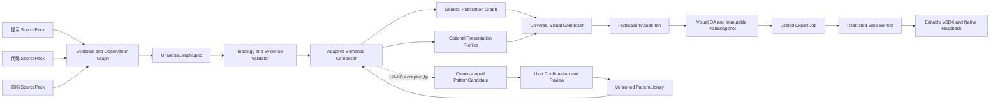

# 通用神经网络绘图 Agent：正式架构修订

**状态：** 修订设计草案，等待用户审核后才进入实施计划。
**取代：** 任何以模型名称、固定网络家族或预设模板决定绘制资格、布局或导出资格的路线。
**不取代：** 证据追溯、不可变 Snapshot、密封导出、Worker 最小权限、同画布更新、原生 Shape/readback 等安全与稳定性边界。

## 1. 设计目标

本产品的首要目标是：**用户给出一个此前从未见过的神经网络的提示、代码或草图后，Agent 无需人工为该模型编写模板或学习其模型名，就能直接生成结构正确、专业可读、可编辑的 Visio 图。**

“学习新网络”在本设计中不是把每个模型名称加入白名单，而是：

```text
理解新的结构组合
→ 复用已知的局部视觉思想
→ 对未知模块生成安全的通用表达
→ 从确认结果形成可复用模式
```

### 1.1 产品成功标准

产品必须同时达成以下目标：

1. **零模板直绘：** 任意拓扑明确的未知网络都能生成 General Publication Graph；不存在“没有对应模型 Grammar 所以不能画”的分支。
2. **多输入一致性：** 自然语言提示、代码和草图都收敛到同一份 `UniversalGraphSpec`，而不是三套互不兼容的绘图器。
3. **未知模块可表达：** 未见过的函数、层或子网络必须作为 `CustomOperator`/`CustomModule` 可视化，保留原始名称、接口、证据和不确定性；未知名称不阻断绘图。
4. **仅对未知拓扑追问：** 箭头、分支、合并或运行时控制流不明确时，Agent 只标记受影响局部并提出一个最高优先级问题；已明确部分立即可画。
5. **论文级默认质量：** 通用输出也必须有一致的视觉层级、布局、端口、连线、标签、重复表达、灰度可读性和留白；顶刊感不是模型白名单的副产品。
6. **受控持续学习：** 新组合先形成 owner-scoped `PatternCandidate`；只有经过确认、测试和审查的模式才提升为共享 `PatternLibrary`，不会被一次错误输入污染。
7. **稳定可编辑 Visio：** 图由原生 Shape 构成，使用同一个文档/页面会话进行局部 `applyDiff`，并完成保存、关闭、重开和独立 readback。

### 1.2 非目标

- 不执行、导入、实例化或联网运行用户代码；
- 不要求先识别模型名称才允许绘制；
- 不把用户草图或参考图作为最终 VSDX 的图片贴图；
- 不让 LLM、浏览器、原始代码或草图直接提交 Visio COM 指令、任意路径或自由坐标；
- 不在未确认的局部模式上自动修改全局共享知识库；
- 不承诺从无法静态确定的动态运行时逻辑中猜出真实拓扑。

## 2. 核心决策：绘制资格与视觉增强解耦

旧设计的问题是把局部结构特征识别与能否生成专业图耦合。新设计明确分成两层：

```text
任意 topology-complete UniversalGraphSpec
→ Adaptive Semantic Composer
→ General Publication Graph
→ Universal Visual Composer
→ 一定生成 General PublicationVisualPlan

可识别局部模式
→ Adaptive Pattern Library / Presentation Profile
→ 在不改变结构的前提下增强表达
```

因此：

- `CNN Tensor Plate`、`Residual`、`Encoder–Decoder`、`Transformer` 变成**可选视觉策略**，不是支持清单；
- 未知整网可以由已知局部模式和 `CustomOperator` 组成；
- 未匹配任何高级模式时，仍输出专业的通用模块图；
- 新模式的产生不要求新增模型专用 TypeScript、C# 或 Visio 模板代码，而是在受限的 Pattern DSL 内生成候选组合。

### 2.1 本次正式修订

本设计不再保留任何模型专用主链、首批目标、导出入口或回归前提。历史实现即使仍暂时存在，也只可作为隔离迁移对象，不能决定产品路线。

以下合同在实施前固定：

1. **唯一计划：** 新增 renderer-neutral 的 `PublicationVisualPlan`。浏览器预览、Visio Shape、导出文件、Visual QA、Snapshot、sealed export 与 readback 必须使用同一 canonical Plan；不得继续新增并行 Figure Plan DTO。
2. **资格状态：** topology-complete UGS 经过 QA 后可以正式预览、快照和导出；candidate、blocking、未获专项支持的 feedback/state 结构只能保留为候选局部或澄清状态，零快照、零导出。
3. **Profile 的权力：** Presentation Profile 只能增强局部 primitive、布局、标签和连接样式，绝不能增加、删除、重定向或猜测 UGS 拓扑；Profile 不匹配时必须回退到高质量 General 图。
4. **通用图不是矩形降级：** General 图必须具有端口锚点、主流/辅助流层级、branch/merge 对齐、repeat/collapse、connector route、annotation track、print/gray 规则和稳定 semantic ID。
5. **同页合同：** 每次 apply/applyDiff 都绑定 owner、device、workflow、document、page、snapshot hash、expected revision 和 readback revision；重复或陈旧请求不能新建画布。
6. **模式库后置：** PatternCandidate/PatternLibrary 只有在通用预览、通用 Plan、同页 Visio 更新和真实视觉验收稳定后才开始实现，不能成为基础绘制前提。

### 2.2 PublicationVisualPlan v1：唯一、严格、可渲染的计划合同

`PublicationVisualPlan`（PVP）是新主链唯一允许跨进程、跨 renderer、进入 Snapshot 的图形对象；它不是建议性的布局草稿，也不是浏览器专用 DTO。正式 PVP 必须恰好包含下列顶层对象，未知字段一律拒绝：

```text
identity              { schemaVersion, planId, canonicalHash }
eligibility           { kind, formalReasons[], blockingReasons[], qaStatus }
lineage               { ugsHash, gpgHash, sourceHashes[], composerHash, profileSetHash }
coordinateSpace       { id, origin, axes, unit, duPerInch, page, safeMargins }
regions[]             { regionId, bounds, role, zIndex }
primitiveGroups[]     { groupId, memberPrimitiveIds[], parentGroupId?, role }
primitives[]          { primitiveId, componentId, kind, regionId, bounds, zIndex, styleTokenIds[], label? }
ports[]               { portId, primitiveId, role, anchor, order, semanticPortId }
connectors[]          { connectorId, sourcePortId, targetPortId, relation, route, styleTokenIds[], zIndex }
annotations[]         { annotationId, targetIds[], bounds, text, role, styleTokenIds[] }
legend                { entries[], bounds?, styleTokenIds[] }
styleTokens           { tokenSetVersion, tokens[] }
profileApplications[] { applicationId, profileId, profileVersion, inputHash, outputHash, affectedIds[] }
sourceMappings[]      { visualId, ugsIds[], evidenceIds[] }
rendererRequirements  { protocolVersion, requiredCapabilities[], optionalCapabilities[] }
updateIdentity        { ownerId, deviceId, workflowId, documentId, pageId, expectedRevision }
```

PVP v1 的规范化和哈希规则固定如下：

1. 只接受 JSON 标量、对象和稠密数组；拒绝 `undefined`、`NaN`、`Infinity`、`-Infinity`、重复 ID、空 ID、稀疏数组及未声明字段。
2. 坐标空间固定为 `pvp-du-1`：左上为 `(0,0)`，X 向右、Y 向下；所有边界、端口偏移和 route 点均是非负整数 `du`，`1000 du = 1 inch`。页面、safe margin、bounds 均在该空间内，禁止 renderer 重新解释原点、单位或比例。
3. `primitiveId`、`portId`、`connectorId`、`annotationId`、`regionId`、`groupId` 必须全局唯一；一个 port 必须恰好属于一个 primitive，并以 `left|right|top|bottom` 与 `[0,1000]` 的整数 offset 定义锚点。connector 的首尾点必须分别等于 source/target port anchor；中间 route 为正交 polyline，除候选 feedback 外不得自交或穿过 primitive interior。
4. 所有有 ID 的数组按其 ID 的 UTF-16 code-unit 升序排列；同一 primitive 的 ports 按 `order`、再 `portId` 排列；route 点按路径顺序保留。对象属性按本节声明顺序投影，token/object map 的键按 UTF-16 code-unit 升序排列。
5. `canonicalHash` 为上述 canonical projection 的 UTF-8 JSON 的 SHA-256。`planId` 是稳定语义 ID，不能由随机 UUID、当前时间或 renderer 生成；相同 UGS、composer/profile 版本、展示意图和页约束必须生成相同 PVP hash。
6. `rendererRequirements.requiredCapabilities` 至少声明 PVP schema、primitive kind、orthogonal route、native text、group、Shape Data 与 readback 版本。renderer 在创建/更新任何 Shape 前必须完成 capability negotiation；版本或 primitive 不支持时返回稳定失败码，禁止降级成图片、自由 SVG 或错误的近似图。

`formal` 与 `candidate` 都可以序列化为 PVP，方便在浏览器显示可审计的差异；但 candidate 的 `eligibility.kind` 必须为 `candidate`，不能生成 formal artifact hash、Snapshot、export token 或 Worker job。`clarification` 没有 PVP，API 只返回受影响 region、证据和一个最高优先级澄清问题。`feedback`/state 只有在专门的 recurrence/state Profile、renderer capability 和 QA 都被版本化验收后才可能成为 formal；在此之前只能留在 candidate PVP。

### 2.3 统一术语、哈希与图状态

从本规格开始，公开设计与后续 DTO 只使用以下四层名称：

```text
UniversalGraphSpec (UGS)
→ General Publication Graph (GPG)
→ PublicationVisualPlan (PVP)
→ Renderer Artifact / Native Readback
```

旧文档中的 Presentation Graph、Figure Plan、Preview Plan 只允许作为迁移期内部适配器名称，不能再进入新的公开 DTO、Snapshot 或 Worker 协议。

PVP 必须有明确的图状态：

| PVP kind | 适用条件 | 浏览器 | Snapshot | Export |
|---|---|---:|---:|---:|
| formal | topology-complete、QA 通过、所有 primitive 受支持 | 正式预览 | 允许 | 允许 |
| candidate | 局部 candidate 或尚无 recurrence 支持的 feedback/state | 候选局部预览 | 禁止 | 禁止 |
| clarification | 关键拓扑 blocking | 返回澄清结果，不生成 PVP | 禁止 | 禁止 |

PVP v1 是严格 schema，不是字段清单。它必须定义：JSON 值域、禁止未知字段、数组的 UTF-16 code-unit 排序、重复 ID/稀疏数组/非有限数拒绝、固定坐标空间、primitive 与 port 的一对一身份关系、connector 的端点与 route 规则、style token 引用、renderer capability 要求和 canonical hash 投影。所有 renderer 都必须先检查 capability；不支持的 primitive 或版本只能 fail closed。

## 3. 目标架构



### 3.1 组件职责

| 组件 | 单一职责 | 不能做什么 |
|---|---|---|
| Input Adapter | 从提示、代码或草图提取观察、证据和局部图事实 | 直接绘制或控制 Visio |
| Evidence Graph | 记录结构为何可信、来自哪里、哪里冲突 | 存储页面坐标或任意 COM 参数 |
| UniversalGraphSpec | 表达任意网络的节点、端口、边、层级、证据和不确定性 | 强迫每个节点归入已知模型家族 |
| Adaptive Semantic Composer | 发现局部模式、重复、分支和候选模块；保持未知模块 | 因为名称未知而删除或拒绝结构 |
| Universal Visual Composer | 使用通用视觉原语和布局约束把任何有效图变成专业图 | 根据模型名称套固定画布 |
| Presentation Profile | 对 tensor、token、residual、encoder/decoder 等特征做可选增强 | 决定图是否可以生成 |
| Pattern Library | 存储已验证的结构模式和声明式视觉配方 | 存储任意用户代码、路径、凭证或未审查 LLM 输出 |
| Visio Worker | 将 sealed plan 映射为原生 Shape 并回读 | 接收原始输入、自由坐标或浏览器命令 |

## 4. UniversalGraphSpec：任何新网络的共同语言

`UniversalGraphSpec`（UGS）是新的通用绘图合同。它不是“模型 IR 的简化版”，而是能够保留未知结构、未知算子和用户声明的有证据图。

### 4.1 最小数据模型

```text
graphId
revision
sourceIds / sourceHashes
nodes[]
ports[]
edges[]
groups[]
evidence[]
topologyConfidence
unresolved[]
```

每个节点至少包含：

```text
nodeId
kind = input | output | operator | custom_operator | container | state
label
semanticHints[]
inputPorts[] / outputPorts[]
attributes[]
shapeClaim = proven | symbolic | unknown
operationKnowledge = known | inferred | custom
evidenceIds[]
```

每条边至少包含：

```text
edgeId
sourcePort / targetPort
relation = data | skip | merge | condition | feedback | candidate
knowledge = proven | declared | candidate
evidenceIds[]
```

`declared` 表示用户在提示或确认中明确给出的结构；它与代码静态证明同样可以支持绘制。`candidate` 只能进入候选预览，不能进入不可变 Snapshot 或正式导出。

### 4.2 未知模块处理规则

下表是通用能力的核心合同：

| 情况 | UGS 表达 | 是否可直接绘制 |
|---|---|---:|
| 模块名未知但输入/输出明确 | `custom_operator` | 是 |
| 多路汇聚但名称未知 | `custom_operator` 或 `merge`，保留接口 | 是 |
| 参数或 shape 未知 | 节点保留，`shapeClaim=unknown` | 是 |
| 模块内部未知但外部端口明确 | 可折叠 `CustomModule` | 是 |
| 分支/箭头方向不明确 | `candidate` edge/region | 仅候选局部 |
| 动态控制流会改变拓扑 | `dynamic_region` + blocking unresolved | 仅已证明部分 |

**未知名称不是失败条件；未知拓扑才是需要澄清的条件。**

### 4.3 细节层级

同一 UGS 可以生成多个视图，不需要重新理解模型：

- `overview`：输入、主要 stage、主分支、输出；
- `architecture`：模块、分支、merge、skip、repeat；
- `operator_detail`：原子算子和端口；
- `evidence_detail`：显示代码行、草图区域和确认来源。

所有视图通过稳定 ID 回溯：

```text
visual component
→ UGS node/group/edge
→ evidence IDs
→ SourcePack locator
```

## 5. 三类输入如何直接生成 UGS

### 5.1 自然语言提示

Prompt Adapter 允许用户直接描述新网络，例如：

```text
输入经过局部纹理分支和全局上下文分支；
两路执行双向交叉注意力融合；
随后经过残差细化三次并输出分割结果。
```

Adapter 生成 schema-validated UGS：双支路、cross-attention fusion、repeat×3、segmentation head。LLM 的输出只能是有界 GraphSpec DTO，必须经过：

1. schema、ID、端口、无重复边和图大小校验；
2. prompt 片段到每条声明边/节点的 evidence mapping；
3. topology completeness 检查；
4. 仅在影响连接关系的缺失处提出一个问题。

若提示的拓扑已经明确，系统直接生成 renderable preview draft；用户不需要先提供模型名称。该 draft 只有在 Visual QA 通过、不可变 PlanSnapshot 创建、owner/device 绑定和 export authorization 完成后，才具有导出资格。

### 5.2 代码

Code Adapter 永远不执行用户 Python。它通过 AST、赋值关系、函数/模块调用和可证明的数据流构建 UGS。

与旧的“只接受线性 `self.<module>(x)` 链”不同，目标解析规则是：

- 任意可证明调用都先映射为一般 `operator` 或 `custom_operator`；
- 未注册的 `self.foo(x)`、`foo(x, y)` 或 `module(x)` 不会被拒绝，而是保留调用名、实参端口、返回变量和证据；
- 分支、tuple/list、Add、Concat、可静态证明的有界重复、模块重用和常见 attention 形成显式边或 group；无法证明迭代次数或运行时路径的循环不得静态展开；
- 不能静态确认的动态区块隔离为 `dynamic_region`，不伪造边；
- 代码适配器的覆盖率提升只改善结构精度，不决定基础图是否能画。

### 5.3 草图

Sketch Adapter 将框、箭头、文字、重复标记、张量尺寸、图例和分区提取为 observations，再组成 UGS。草图不是最终图片资产。

框名陌生时绘制为 `CustomModule`；箭头清晰时直接绘制；只有箭头方向、汇聚类型或跨层目标不清晰时才显示虚线候选局部。用户确认后仅更新受影响 region，并在同一 Visio 页面应用 diff。

## 6. Adaptive Semantic Composer：从新网络中学习组合

### 6.1 不是“识别模型”，而是识别可组合结构

Composer 的输入是 UGS，不读取模型名作为决策依据。它执行：

1. **局部模式检测：** 识别 Conv-Norm-Activation、split、merge、skip、repeat、QKV、token sequence、多尺度等子图；
2. **新组合归纳：** 将端口明确但语义陌生的连通子图归为 `CustomModule` 或 `CustomFusion`；
3. **重复发现：** 以 canonical topology/port/attribute signature 发现同构重复区域；
4. **可逆视图生成：** collapse/expand 只改变展示粒度，不删除 UGS 节点、边或证据；
5. **候选模式创建：** 仅在 U6 的 PatternCandidate feature flag 已启用后，当新组合在结构和视觉上可复用时，生成受限的 `PatternCandidate`；U0–U5 一律跳过此项，不影响基础直绘。

#### 6.1.1 语义合成与 Profile 的权限边界

UGS 是不可变的源拓扑事实。`Adaptive Semantic Composer` 只能在不改写该事实的前提下创建可逆的显示层：display group、collapse/expand transform、repeat group、`CustomModule` 边界及其到 GPG component/interface 的映射。它不得新增、删除、重定向 UGS node、port、edge、evidence、knowledge 或 topology confidence；任何折叠都必须可由 source mapping 无损展开回原 UGS。

`Presentation Profile` 只可选择已经允许的 primitive kind、style token、layout constraint、label policy 和 connector styling。它不得改变 GPG membership、接口、拓扑、repeat count、source mapping、candidate/formal 资格或任何 UGS/GPG ID。Profile 未匹配、冲突、失效或 capability 不足时，必须完整回退到无 Profile 的 General 图，而不是换用模型名模板或改变结构。

每个 composer transform 和每个 Profile application 必须记录 `inputHash`、`outputHash`、版本、影响对象与稳定 identity，并进入 PVP 的 `lineage`/`profileApplications` 与后续 Snapshot provenance。由此可以判定任一视觉差异来自结构视图选择还是纯样式增强，二者不能混淆。

### 6.2 PatternCandidate 与 PatternLibrary

```text
PatternCandidate
  ownerId / scope
  structuralSignature
  interfaceSchema
  semanticHints
  allowed Visual Primitive recipe
  evidence and confirmation references
  confidence
  version
```

PatternCandidate 默认只对该 owner/project 可见。它可以改善下一张同类图的表达，但不能自动影响其他用户或共享库。

提升为 `PatternLibrary` 的条件：

1. 模式拓扑、端口和视觉配方均通过 schema/QA；
2. 至少有用户确认或独立人工审查；
3. 有正例、冲突例和未知边界 fixture；
4. 配方只引用受限 Visual Primitive DSL，不能携带代码、路径、COM 或自由脚本；
5. 通过版本化发布与回归测试。

这使 Agent 能不断学习新的神经网络组合，同时保持可解释、可回滚和不会全局污染。

PatternCandidate 生命周期固定为：

```text
draft
→ confirmed | rejected
confirmed
→ promoted | deprecated
promoted
→ deprecated | superseded
```

每次状态变化必须记录 actor role、来源类型、理由、关联 UGS/Snapshot hash、审查结果和时间；拒绝的候选保留最小化摘要用于避免重复误判，但不能参与后续自动绘制。共享 Pattern 的升级、废弃或替代必须创建新版本，已有 PVP/Snapshot 继续引用其原始 pattern version，不能被静默重写。

### 6.3 确定性与冲突

同一 UGS、同一 PatternLibrary version、同一展示意图必须生成相同 GPG。规则：

- 节点在同一折叠视图中只能属于一个 module；
- 结构更完整的模式优先于其内部弱模式；
- 同级候选按 canonical node/edge ID 和稳定 structural signature 决定；
- 无法证明的重叠或冲突保留原子节点，而不是根据外观猜测；
- 每个 transform 记录输入 hash、输出 hash、pattern ID/version、成员和接口。

## 7. Universal Visual Composer：任何结构都能画

### 7.1 通用视觉原语

所有 General Publication Graph 均只能由以下受限原语组合：

```text
Input / Output
GenericModule / CustomOperator / StageContainer
TensorSlab / VectorStack / TokenSequence / GraphFeature
Split / MergeAdd / MergeConcat / CustomFusion
SkipConnector / FeedbackConnector / RepeatBadge
AnnotationTrack / Legend / CandidateRegion
```

未知模块默认使用 `CustomOperator` 或 `CustomModule`，带可编辑标签和端口；它不会退化成没有连线语义的普通矩形。

### 7.2 默认布局

Universal Visual Composer 使用结构约束而不是固定 `cursorX + gap`：

```text
topological rank
+ main-flow prominence
+ branch and merge alignment
+ port ordering
+ repeat grouping
+ label / connector clearance
+ page and print constraints
= deterministic general publication layout
```

即使没有命中任何高级模式，图仍必须具备：主路径、分支、汇聚、重复、输入输出和自定义模块的可读层级。

### 7.3 Presentation Profile 仅做增强

Profile 从 UGS/GPG 的局部特征中选择，不从模型名选择：

| 观察到的结构特征 | 可选增强 |
|---|---|
| spatial tensor 尺寸变化 | TensorSlab、frustum、尺度标注 |
| shortcut → Add | residual arc、`⊕` merge、projection 标记 |
| down/up stages + long skip | 对称层级、skip bridge、fusion 端口 |
| Q/K/V + token flow | sequence strip、QKV fork、attention merge |
| 多输入汇聚 | dual/multi lane、CustomFusion、接口标签 |
| 无已知特征 | 高质量 General Publication Graph |

Profile 失败、缺失或版本不支持时必须回退到 General Publication Graph，不能拒绝有效 UGS。

## 8. Visio 输出和长期稳定性

新的通用路径必须使用：

```text
UGS hash + GPG hash + PVP hash
→ immutable PlanSnapshot
→ sealed export job
→ Worker-compatible DTO
→ native Visio Shape
```

任何基于固定拓扑、固定节点命名、固定层数或固定坐标的校验都必须退出公共 export 路径；通用路径只接受服务端构造且已密封的 PublicationVisualPlan。

Worker 维持以下不变边界：

- 只接受服务端构造并密封的 Plan DTO；
- 一个 owner/device/workflow/document/page 同一时刻只有一个串行 actor；
- `applyDiff` 使用稳定 primitive/component IDs 更新同一个页面，不反复新建画布；
- 每个命令包含 expected revision、idempotency key、snapshot hash；
- 成功需要 native readback 与 sealed plan 对账；
- checkpoint、recovery manifest、协议版本协商和稳定错误码必须存在；
- 未知 primitive 或不兼容版本 fail closed。

### 8.1 同一 Visio 页面 applyDiff、人工编辑与恢复合同

每个 Agent-owned Shape 必须写入不可伪造的 Shape Data：`pvpPlanId`、`componentId`、`primitiveId`、`snapshotHash`、`managedRevision` 与 `ownership=agent`。没有这些标记的 Shape，或带 `ownership=user-overlay` 的 Shape，都是 user-owned，Worker 永远不得删除、重排或覆盖它们。用户的标题、批注、图例补充和手工标记必须作为 overlay 独立保存，并绑定到 PVP revision/hash；它们不是对 UGS 或 PVP 本体的隐式改写。

Worker 在每次 diff 前都要 native readback。若 agent-owned Shape 的几何、文本、端口、连接或受管理 style 与上一次 accepted readback 不一致，必须进入 `conflict_required`，记录差异并停止该 primitive 的自动覆盖。用户可明确选择：放弃手改并重建 agent primitive、把该变更固化为受版本约束的 Overlay/Override、或取消本次更新；系统不得静默赢得冲突。

当新 PVP 删除 managed primitive 时，只能删除具有匹配 `primitiveId`/ownership 的 Shape。若有 user-owned annotation 或 connector 依附在该 primitive 上，Worker 必须保留 user Shape、报告其悬挂引用并进入 `conflict_required`，不能随 managed Shape 一同删掉。任何 command 部分失败都必须恢复至最近成功 checkpoint，写入 `recovery_required` manifest，保持当前 document/page 可见；绝不可通过新建空文档或空白页面伪装恢复成功。

`applyDiff` 的固定顺序是：

```text
validate owner/device/workflow/document/page, snapshot hash and expected revision
→ native readback baseline and ownership/conflict detection
→ add/update managed primitives
→ reconnect managed connectors
→ update managed labels and groups
→ retire/delete only removed, conflict-free managed primitives
→ save checkpoint
→ native readback and PVP reconciliation
→ renderer QA
→ commit managed revision
```

任一前置校验、capability negotiation、readback 对账或 renderer QA 失败时，序列在 checkpoint 前失败并返回稳定错误码；请求可安全重试，但不得创建新的 document/page。

### 8.2 新公共 API 与旧路由迁移合同

新 UI 只能使用如下 PVP route family；浏览器只能提交 revision、确认和意图，不能提交坐标、primitive 列表、COM 参数或待导出几何：

```text
GET  /api/figure-drafts/:draftId/revisions/:revision/publication-preview
     -> { kind: formal, pvp } | { kind: candidate, pvp, clarification? } | { kind: clarification, question, affectedRegionIds, evidence }

POST /api/figure-drafts/:draftId/revisions/:revision/publication-snapshots
     body: { expectedFormalPvpHash, previewConfirmationId }
     -> server-created immutable formal Snapshot only

POST /api/figure-drafts/:draftId/revisions/:revision/exports
     body: { snapshotId, target: "visio" | "svg" | "png", expectedSnapshotHash }
     -> sealed server-resolved export job only
```

所有 route 均执行既有 owner、device、authorization、idempotency 与 public DTO whitelist 边界。candidate/clarification 一律不能创建 Snapshot 或 export，且不能被 client 通过伪造 `formal` 字段提升。预览响应只投影必要的 PVP、资格、证据引用和澄清信息，绝不返回原始代码、草图 bytes、内部 Worker command、任意文件路径或 provider data。

迁移期内，以下旧路径只作为兼容性/只读路径存在，获得零新增能力，新 UI 不得调用，且它们不得绕过 PVP Snapshot/export gate：

```text
GET  /api/figure-drafts/:draftId/preview
GET  /api/figure-analyses/:analysisId/preview
POST /api/figure-drafts/:draftId/revisions/:revision/visio-exports
POST /api/legacy/visio-exports
```

每个 legacy response 必须标注 `deprecatedRoute=true` 和目标迁移 route；旧 export 入口在服务端仍需先解析并验证 formal PVP Snapshot，不能把旧 FigureDraft、专用 grammar plan 或浏览器 geometry 直接发往 Worker。只有 U5 通过真实主机、完整回归和迁移证据后，才能制定移除日期；移除前不能悄然改变旧图或旧文档。

## 9. 质量与不确定性策略

### 9.1 三类不确定性

| 不确定性 | 示例 | 处理 |
|---|---|---|
| operation uncertainty | `spectral_mixer` 未见过 | 画 CustomOperator，不阻断 |
| shape uncertainty | 缺少 tensor 尺寸 | 省略或标 `unknown`，不伪造 |
| topology uncertainty | 条件分支、箭头方向不明 | 候选局部 + 一个澄清问题，阻断该局部导出 |

### 9.2 Visual QA

所有图都要验证：

- 每个可见端口都有合法来源/目标；
- 组件、标签、边界、连线不碰撞或穿字；
- 主流、skip、candidate 的线型/灰度层级一致；
- 自定义模块的接口、名称和证据映射存在；
- 输出对同一 snapshot 是确定的；
- 不存在模型名称、专用节点 ID 或固定坐标依赖；
- 生成的原生 Shape 能通过保存、重开和 independent readback。

顶刊质量还需要人工审查：读者能否在数秒内识别主路径、创新模块、融合/跳连和输出；陌生模块是否被诚实且清晰地表达。

### 9.3 可执行的论文级视觉验收量表

结构正确性是二元硬门：任一 node/port/edge/source mapping/readback 不一致即失败，不计入评分。通过硬门后，浏览器 SVG、Visio PNG 与保存后重开 PNG 必须按同一量表进行 0–2 分评分；任何类别为 0 或总分低于 11/14 都不得获得 formal PVP 的视觉验收。

| 类别 | 0 分 | 1 分 | 2 分 |
|---|---|---|---|
| 两秒主路径可读性 | 无法快速辨认输入到输出 | 主路径可辨但分支干扰明显 | 输入、主链、输出和关键分支两秒内可辨 |
| 语义视觉保真 | 模块样式误导结构或把未知伪装为已知 | 结构诚实但层级表达一般 | tensor/token/merge/custom 语义清楚且不夸大证据 |
| 布局与交叉密度 | 大量碰撞、穿字或不必要交叉 | 局部拥挤但可读 | 对齐、留白、分支/merge、route 明确且交叉最小 |
| 字体与信息密度 | 标签不可读、溢出或遗漏接口 | 信息可用但层级弱 | 标签、尺寸、repeat、注释层级清楚且适合论文版面 |
| 彩色、灰度和印刷可读性 | 只靠颜色或低对比区分 | 灰度下局部难分 | 色盲安全、灰度线型/明度独立，打印后仍可读 |
| 创新/焦点可见性 | 关键模块和普通模块无区别 | 有标记但抢占主线 | 焦点被克制突出且不改变结构含义 |
| 跨 renderer 一致性 | SVG、Visio/readback 显著不同 | 仅轻微可接受差异 | 几何、文本、端口、连接和样式 token 对账一致 |

评分记录必须包含 fixture、PVP/Snapshot hash、renderer、导出模式、审查人角色、每项分数、结论和具体理由。candidate PVP 可以做诊断性评分，但不得把其结果记作 formal acceptance。

### 9.4 参考图治理与固定渲染条件

论文/顶刊图只能作为研究与规则提取参考，绝不能被复制、描摹后作为最终输出，亦不能作为无授权训练/素材库。每个 reference record 至少保存：引用信息、图的沟通目的、抽取的非表达性视觉规则（例如分支对齐或灰度层级）、许可证/使用说明、审查结论；输出必须由 PVP 原语重新生成并保留自身 source mapping。

自动验收固定输出以下三种 raster 条件，并保存配置与 hash：

```text
screen-color:       2400 × 1350 px, sRGB, 300 dpi
print-a4-landscape: 3508 × 2480 px, sRGB, 300 dpi
print-a4-gray:      3508 × 2480 px, grayscale, 300 dpi
```

每个 formal fixture 都要比较浏览器 SVG 投影、Visio 导出的 PNG 和保存/重开后的 PNG；不同 renderer 只能在已声明、量化且不影响量表的字体/抗锯齿容差内不同。

## 10. 验收目标

系统不能以任何特定模型支持数量作为完成标准。首批验收必须是零模板、按结构类型定义的现代 fixture matrix；模型名称只可出现在样例来源，不能成为 route、composer、profile 或 renderer 的选择条件。

| 结构族 | 正向 fixture 的最小结构断言 | 必须包含的输入 | 反例/候选 fixture |
|---|---|---|---|
| unknown custom spatial backbone | 陌生空间算子串联、stage、尺寸变化和 custom port | prompt、static code | 未知 shape 但端口完整 |
| residual multi-branch | split、projection/identity shortcut、Add 与主链 | prompt、static code、sketch | Add 目标或 shortcut 方向不明 |
| multi-scale encoder-decoder | down/up stage、跨尺度 skip、fusion | prompt、static code、sketch | 一条长 skip 目标不明 |
| hierarchical token network | token stage、patch/merge、层级 token 流 | prompt、static code | 动态 token route |
| query-driven multi-scale head | query、cross-attention、多个尺度输入、head | prompt、static code、sketch | query-source 未说明 |
| dual-tower cross-modal fusion | 两塔、异模态接口、双向/单向 fusion | prompt、static code、sketch | fusion 是 concat 还是 attention 不明 |
| conditional iterative graph | 明确有界 repeat/condition、state/feedback 标记 | prompt、static code | 运行时循环次数/分支决定 topology |
| graph message-passing/routing | graph feature、message edge、聚合/route | prompt、static code、sketch | 邻接/route 动态构建 |
| ambiguous sketch | 可证明区域、candidate region、一个澄清问题 | sketch | 模糊箭头、merge 与跨区连线 |

每个结构族的 fixture package 必须完整包含：

```text
1. UGS fixture：期待的节点、端口、边、group、evidence 和 eligibility；
2. 输入 fixture：prompt；static-code；草图（适用时）；候选/负例；
3. expected profile set：允许命中的 profile 与“不命中仍 formal”的 General fallback；
4. PVP invariants：schema/hash、整数坐标、port anchor、connector route、source mapping、ID 稳定性；
5. artifact：canonical SVG、VSDX、三种固定 PNG 与其 hash；
6. readback assertions：native Shape Data、文本、group、connector、document/page/revision 与 overlay preservation；
7. human review：第 9.3 节量表、审查决定、理由和 reference record。
```

正向 formal fixture 还必须证明：同一输入重复生成 hash 稳定；PVP diff 只更新同页被管理 Shape；关闭/重开后 readback 仍与 Snapshot 对账；取消/恢复不会创建空白文档。候选/负例必须证明：不会执行用户代码，不会生成 Snapshot/export/job，也不会把不明确拓扑伪造成 formal。

额外验收条件：在新增上述案例时，除 fixture 和声明式 PatternCandidate 外，**不允许因为模型名称新增专用 renderer 分支、固定节点 ID 或固定页面坐标。**

## 11. 实施路线

### 11.1 与正式路线图的映射

本规格定义的 U0–U6 是能力顺序，不自动改变 docs/agent-program-state.json 中 M2/M3 的正式状态。状态账本、Implementation Record、Design Baseline 和 Operation History 必须在有真实实现及验证证据后才同步更新，避免设计、状态页和实际代码出现三种事实。

### Gate U0：工程与安全基线

完成通用 immutable Snapshot 的完整性收尾。快照必须从服务端 canonical object 生成；candidate、blocking、feedback 与 QA 失败结构必须零写入、零导出。先修复/复审任何 snapshot TOCTOU：存储 key 必须由可信 canonical snapshot 导出，持久化对象必须是该 canonical snapshot 的 clone，而不是调用方可变 getter/object；增加 hostile accessor 回归，并证明拒绝输入不会留下记录。

**退出证据：** schema/canonicalization/security tests、拒绝后零记录证明、Snapshot readback hash、独立 review。

### Gate U1：统一 PublicationVisualPlan

1. 固化唯一 Plan 合同、canonicalization、版本协商与 renderer-neutral primitive DSL；
2. 将 General Publication Graph 编译为有 port anchors、connector routes、annotation tracks、style tokens 和 stable IDs 的通用计划；
3. 让 Visual QA、Snapshot 与浏览器投影均消费该计划。

**退出证据：** PVP parser/canonicalizer/property tests、formal/candidate/clarification matrix、capability-negotiation tests、同一语义输入稳定 hash、零旧 DTO 写入新 Snapshot。

### Gate U2：通用预览主链

1. UGS → General Graph → PublicationVisualPlan 成为默认预览路径；
2. 未知但拓扑明确的 custom graph 必须得到正式预览；
3. 模型名和家族匹配不再参与资格判断；
4. 旧的并行 renderer DTO 只允许存在于隔离迁移测试中。

**退出证据：** 第一批 unknown custom spatial、residual multi-branch、multi-scale encoder-decoder 和 dual-tower fixtures 的 UGS→GPG→PVP→SVG；visual-rubric 记录；新 UI/API route 调用证明。

### Gate U3：局部 Profile 与组合

实现空间尺度、残差、token/attention、encoder-decoder、多输入融合等可组合 profile，并证明每一个 profile 的失败、缺失或版本不兼容都无损回退到 General 图。

**退出证据：** profile application provenance/hash、冲突与回退 fixtures、无 Profile 的 PVP 与带 Profile 的 PVP 均保持相同 UGS/GPG source mapping。

### Gate U4：三类输入直绘

1. Prompt-to-UGS；
2. 通用静态 Code-to-UGS，先覆盖任意调用、分支和自定义模块，再逐步提高精度；
3. Sketch-to-UGS；
4. 用零模板案例验证未知网络首次输入即可得到图。

**退出证据：** 第 10 节全部 prompt/static-code/sketch/negative fixtures；证明静态代码从未执行；candidate 只预览、clarification 无 PVP、formal 能进入 Snapshot。

### Gate U5：通用 Visio 与真实主机验收

1. Worker 只消费 sealed universal plan；
2. 实现 allowlisted primitive 映射、同一 document/page applyDiff、save/reopen/readback、cancel/recovery；
3. 在真实 Windows/Visio 上运行所有零模板案例；
4. 每个案例保留 SVG、VSDX、PNG、readback 和人工视觉结论。

**退出证据：** 可见的同一 document/page session、真实 VSDX save/close/reopen、native Shape/connector/readback、手工 edit conflict、overlay preservation、cancel/recovery、三种 PNG 和视觉量表。仅完成 mock、协议单测或 Worker 启动都不能关闭本 gate。

### Gate U6：受控 PatternLibrary

只有 U0–U5 稳定后，才实现 owner-scoped PatternCandidate、确认、审查、提升和版本化回归。共享模式库不得自动从用户输入学习。

**退出证据：** owner isolation、confirmation/rejection、promotion review、rollback/version pinning、fixture replay 与审计记录；没有这些证据不得宣称“Agent 已自我学习”。

## 12. 迁移规则

- 保留 Worker 会话、UTF-8/readback/recovery 与可复用 geometry/connector 基础；
- 任何基于固定拓扑、固定节点名称、固定 stage 或固定坐标的历史路径只能隔离迁移，不能接入用户可见主链，也不得新增功能；
- 现有 `Architecture IR v3`、Figure Component Graph 和 Visual QA 通过适配层迁移到 UGS/GPG/PVP，不做破坏性替换；
- 旧的 family Grammar 只能在 U5 验收后，作为 PatternLibrary 的初始版本化模式迁移；
- 公开预览、Snapshot、export 以第 8.2 节 PVP route family 为唯一新入口；legacy preview/export route 只读、显式弃用，且不可绕过 formal PVP Snapshot；
- 在 U5 真实主机验收前，不能声称已经支持任意代码/草图到 Visio。

## 13. 本规格的完成定义

本规格本身在满足以下条件后可进入实施计划：

1. 用户确认“未知结构直绘 + 模式学习”的目标优先级；
2. 用户接受未知模块可直接绘制、未知拓扑才澄清的边界；
3. 用户接受 PatternCandidate 默认 owner-scoped、提升共享库需要审查；
4. 路线图和实现计划以 U0–U6 为顺序，停止把模型家族支持数量作为第一 KPI。

在此之前，本文件是当前架构草案，不等同于通用 Visio 功能已经实现。

## 14. 开发治理与可追溯性

本规格遵循 [2026-08-20-agent-governance-traceability-design.md](2026-08-20-agent-governance-traceability-design.md)。其中定义：

- `agent-program-state.json` 仍是唯一的当前状态账本；
- Design Baseline 冻结某次设计、路线图和验证边界；
- Implementation Record 记录每个 gate 的实际实现、验证、失败和下一步；
- Operation History 只追加重要事件，不能被用作可变状态或敏感数据仓库。
