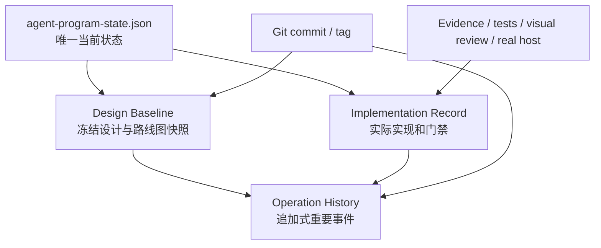

# Agent 开发治理、操作历史与可追溯性设计

**状态：** 已设计，等待用户审核后作为项目治理合同执行。
**适用范围：** `Universal Neural Figure Agent` 的设计、实现、验证、真实 Visio 验收和 Git 交付。
**当前架构规格：** `2026-08-20-adaptive-universal-neural-figure-agent-design.md`。

## 1. 目标

本设计解决一个运营问题：任何时刻都能够从仓库中回答以下问题，而无需依赖聊天记录或记忆。

```text
现在正式在做什么？
当前设计依据是什么？
某个能力实际做到哪里？
哪些测试、视觉审查、真实 Visio 验收已经完成？
哪个失败阻断了下一步？
某个提交、tag 或 Visio 结果对应哪份设计基线？
```

系统必须提供完整但不过度嘈杂的可追溯性：记录用户可理解的关键操作和结论，而不是保存所有终端输出、用户源代码或 Worker 内部细节。

## 2. 四类治理资产



| 资产 | 回答的问题 | 存储位置 | 更新规则 |
|---|---|---|---|
| Current State Ledger | 现在做什么、当前焦点、依赖、阻塞、接受状态 | `docs/agent-program-state.json` | 唯一可变当前状态；只在正式状态转换时更新 |
| Generated Roadmap | 人类可读当前状态 | `docs/ROADMAP.md` | 只由 ledger 自动生成，绝不手工编辑 |
| Design Baseline | 为什么做、依据什么设计、冻结了哪些不变量 | `docs/agent-governance/design-baselines/` | 只新增；已建立的 baseline 不修改 |
| Implementation Record | 实际实现到哪里、证据是否足够、下一步是什么 | `docs/agent-governance/implementation-records/` | 每个 gate 一份，可追加事实但不改写既有结论 |
| Operation History | 什么时候发生了什么关键事件 | `docs/agent-governance/operation-history/YYYY-MM.jsonl` | 只追加，一行一个受控 JSON 事件 |

Operation History 不取代 ledger；Implementation Record 不允许单方面把状态改成 accepted；Design Baseline 不替代 Git tag 或 release 证据。

## 3. 设计基线

### 3.1 设计基线的定义

Design Baseline 是某一时刻的不可变设计快照。它把“这次实现应该遵守什么”固定下来，使后续可以判断代码或测试是否偏离设计。

每个 baseline 文件必须包含：

```text
baselineId
status = draft | accepted | superseded
createdAt
specRefs and SHA-256 hashes
ledgerRef and SHA-256 hash
repository commit or working-tree marker
active work item / roadmap mapping status
invariants
acceptance matrix version
known risks
supersedes / supersededBy
```

### 3.2 不可变规则

- 创建后不得修改 baseline 文件；发现错误时创建新的 baseline，并通过 `supersedes` 关联；
- `accepted` baseline 必须指向一个已存在 Git commit；
- 未提交设计只能形成 `draft` baseline，必须显式标为 `working-tree`，不得伪称 release/tag 基线；
- baseline 中只保留仓库相对路径、hash、commit、受控摘要和证据链接，不保留原始 SourcePack、用户 ID、绝对路径、凭证、Worker session 或 Provider 文本；
- tag 只能引用已接受 baseline，且必须在 baseline 中记录 tag 与 commit 的对应关系。

## 4. 实现记录

### 4.1 工作项模型

一个 Implementation Record 对应一个 R gate 或一个正式路线图节点，不能同时覆盖不相关的能力。文件必须包含：

```text
recordId
workItem
roadmapNode / mapping status
baselineId
objective
in scope / out of scope
implementation status
allowed file/module boundary
commits
verification matrix
known failures and blockers
real-host / visual-review status
next action
```

### 4.2 实现状态

| 状态 | 含义 |
|---|---|
| `not_started` | 只有设计，没有开始实现 |
| `in_progress` | 已有实现，但必要门未完成 |
| `blocked` | 有明确、可复现的阻塞条件 |
| `awaiting_review` | 实现与自动化门完成，等待独立/用户/真实主机审查 |
| `accepted` | 只有 ledger 对应节点在证据齐全后才能使用 |
| `superseded` | 被新的 record/base line 取代，保留历史 |

记录必须把测试分为独立列：静态检查、单元/集成测试、Visual QA、原生 readback、真实 Windows/Visio、人工视觉审查。任何一列通过都不能替代其他列。

## 5. 操作历史

### 5.1 记录粒度

只记录影响用户认知、设计、交付、风险或状态的事件：

- baseline 创建、接受、取代；
- work item 开始、阻断、恢复、进入审查、接受；
- 设计决策、范围变更、路线图迁移；
- 测试矩阵完成、关键失败发现/修复；
- 真实 Visio 会话验收、保存/重开/readback 结果；
- commit、push、tag、release；
- 安全拒绝、恢复、取消等影响 artifact 正确性的事件。

不记录每条 shell 命令、原始测试输出、用户代码、图像、草图、token、路径、Worker session 或 Provider 数据。

### 5.2 JSONL 事件合同

每行一个 JSON 对象，键顺序固定：

```json
{
  "eventId": "op-2026-08-20-001",
  "at": "2026-08-20T01:10:01.073Z",
  "kind": "design_baseline_created",
  "workItem": "R1",
  "baselineId": "DB-2026-08-20-adaptive-universal-agent",
  "recordRef": "docs/agent-governance/implementation-records/current-roadmap.md",
  "refs": ["docs/superpowers/specs/2026-08-20-adaptive-universal-neural-figure-agent-design.md"],
  "commit": null,
  "outcome": "recorded",
  "summary": "Adopted unknown-network direct-draw architecture as a draft baseline."
}
```

字段规则：

- `eventId` 全局唯一，按日期顺序递增；
- `at` 为 UTC ISO-8601；
- `kind` 必须属于受控枚举；
- `workItem`、`baselineId`、`recordRef`、`commit` 可为 `null`，但不得出现未定义字段；
- `refs` 只能是仓库相对路径；
- `summary` 只能是受控、无敏感内容的单行摘要；
- `outcome` 为 `recorded | passed | failed | blocked | accepted | superseded`。

### 5.3 写入纪律

历史文件只追加。若发现事件摘要错误，追加 `history_correction` 事件指向旧 `eventId`，绝不重写旧行。一次提交若包含状态变化、baseline 或 implementation record，必须同时追加相应操作历史事件。

## 6. 当前状态与历史之间的关系

`agent-program-state.json` 仍然是唯一权威当前状态。这解决两类冲突：

```text
历史说“曾经完成”
≠ 当前仍然可用或已接受

实现记录说“测试通过”
≠ 真实 Visio 已验收
```

状态转换顺序固定：

```text
设计基线创建
→ Implementation Record 建立
→ 实现和证据
→ 独立审查/真实主机验收
→ ledger 状态变化
→ 自动生成 ROADMAP
→ 历史记录接受事件
```

任何顺序跳跃都必须以 `scope_change`、`blocked` 或 `superseded` 事件解释。

## 7. 迁移与验证

第一批资产：

1. `DB-2026-08-20-adaptive-universal-agent`：当前未知网络直绘设计的 draft baseline；
2. `current-roadmap.md`：R0–R5 的当前实现记录；
3. `2026-08.jsonl`：记录设计迁移、baseline 创建和当前测试阻塞；
4. 本治理规格。

验证要求：

- baseline 引用的设计文件和 ledger 文件存在，hash 与记录一致；
- JSONL 每一行可独立 JSON 解析，字段完全符合受控合同；
- Operation History 没有绝对路径、SourcePack、凭证、用户 ID 或多行摘要；
- Implementation Record 的 work item 与当前设计的 R0–R5 一致；
- ledger/ROADMAP 继续通过现有 `agent:verify-roadmap -- --strict`；
- 新历史资产不改变任何 M2/M3 的 accepted/planned 状态。

## 8. 设计接受条件

此治理设计接受后：

1. 每个新设计转向先创建/引用 Design Baseline；
2. 每个实施 gate 有一个 Implementation Record；
3. 关键结果、失败、commit、push、tag 和真实 Visio 验收追加 Operation History；
4. 进度汇报必须同时引用当前 ledger、对应 record、baseline 和最新验证，而不能只引用提交或聊天记录；
5. 基线、记录和历史遵守最小化数据原则，不能成为用户输入或运行日志的复制品。
